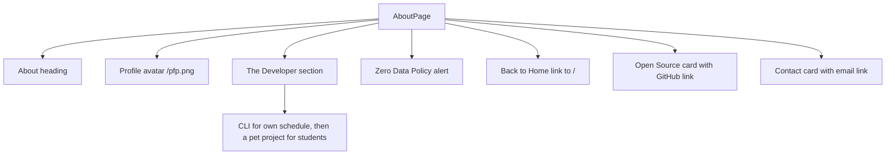

<!-- tyto-docs
tyto_docs: 1
kind: component
unit: frontend/src/app/about
title: About
status: current
written_at_commit: a38908d1c9a31566d4983f37fa3c050456dbd4a0
written_at: "2026-09-14T22:41:30.010Z"
research: frontend/src/app/about/DOCS/Research.md
sources: []
accepted:
  at: "2026-09-14T22:45:26.592Z"
  commit: a38908d1c9a31566d4983f37fa3c050456dbd4a0
  research_fingerprint: "sha256:a8f17f3ffcbd63ad0cd9f6372c0b623c1a090ad4f062f74785ad7ffb106bf62e"
  research_findings:
    - research.frontend-src-app-about.0ed6fab4
    - research.frontend-src-app-about.168ca24f
    - research.frontend-src-app-about.16b63a4a
    - research.frontend-src-app-about.814329c8
    - research.frontend-src-app-about.8af8843c
    - research.frontend-src-app-about.c2a091ec
    - research.frontend-src-app-about.c7bba336
    - research.frontend-src-app-about.ca8dc66a
    - research.frontend-src-app-about.d25948de
  critic_pass: critic.frontend-src-app-about.1
  sources:
    - path: frontend/src/app/about/page.tsx
      blob_sha: e57f4e5a2b32837ae06eebf1856f96ee3076245c
evidence: About.evidence.md
critic:
  attempts: 1
  findings: []
  review_complete: true
  sections_reviewed: 8
  sections_total: 8
  last_reviewed_document: "sha256:9cb65f3ba1d6fd0ea968c621fc54572c4042b654941ae38af06d9e090a2f3bc8"
  retired: []
-->

# About

<!-- tyto-docs:generated:status -->
> **Status: Current**
<!-- /tyto-docs:generated:status -->

## [Summary](About.evidence.md#summary)

The about unit owns the About page for the Tuks Schedule Generator service. It introduces the developer behind the tool, states the zero-data-policy, and links to the project's open-source repository and a contact email. The page is static and presentational, rendering fixed content with no data fetching (inference: the unit holds a single presentational component). <!-- ev:research.frontend-src-app-about.0ed6fab4 -->[1](About.evidence.md#research.frontend-src-app-about.0ed6fab4)

## [Purpose and boundaries](About.evidence.md#purpose-and-boundaries)

| | |
|---|---|
| Owns | The About page for the Tuks Schedule Generator service: a static, presentational page headed by the title 'About' that introduces the developer and links to the project's open-source repository and contact email. <!-- ev:research.frontend-src-app-about.0ed6fab4 -->[1](About.evidence.md#research.frontend-src-app-about.0ed6fab4) <!-- ev:research.frontend-src-app-about.814329c8 -->[2](About.evidence.md#research.frontend-src-app-about.814329c8) |
| Uses | next/link for the 'Back to Home' navigation link to '/'. <!-- ev:research.frontend-src-app-about.16b63a4a -->[3](About.evidence.md#research.frontend-src-app-about.16b63a4a) <!-- ev:research.frontend-src-app-about.c7bba336 -->[4](About.evidence.md#research.frontend-src-app-about.c7bba336) |
| Does not own | The Tuks Schedule Generator service itself — the schedule-management tool the developer built — which the page introduces but does not implement (inference: the unit holds a single presentational page). <!-- ev:research.frontend-src-app-about.0ed6fab4 -->[1](About.evidence.md#research.frontend-src-app-about.0ed6fab4) |

## [How it works](About.evidence.md#how-it-works)

AboutPage is a presentational React component defined in a single source file, frontend/src/app/about/page.tsx, and exported as the page's default export. <!-- ev:research.frontend-src-app-about.0ed6fab4 -->[1](About.evidence.md#research.frontend-src-app-about.0ed6fab4) It imports Link from 'next/link' and React from 'react'. <!-- ev:research.frontend-src-app-about.16b63a4a -->[3](About.evidence.md#research.frontend-src-app-about.16b63a4a)

The page is headed by an 'About' title. <!-- ev:research.frontend-src-app-about.814329c8 -->[2](About.evidence.md#research.frontend-src-app-about.814329c8) It displays a profile avatar image sourced from /pfp.png with alt text 'Michael Tomlinson'. <!-- ev:research.frontend-src-app-about.168ca24f -->[5](About.evidence.md#research.frontend-src-app-about.168ca24f) A 'The Developer' section states that the developer is a third-year computer science student who originally built the tool as a CLI to manage their own schedule and later made it available to the general student population as a pet project. <!-- ev:research.frontend-src-app-about.ca8dc66a -->[6](About.evidence.md#research.frontend-src-app-about.ca8dc66a) A 'Zero Data Policy' alert states that nothing is stored and that the user's data belongs to the user. <!-- ev:research.frontend-src-app-about.8af8843c -->[7](About.evidence.md#research.frontend-src-app-about.8af8843c)

A 'Back to Home' link navigates to '/'. <!-- ev:research.frontend-src-app-about.c7bba336 -->[4](About.evidence.md#research.frontend-src-app-about.c7bba336) An 'Open Source' card links to the GitHub repository at https://github.com/michaeltomlinsontuks/ScheduleGenerator. <!-- ev:research.frontend-src-app-about.c2a091ec -->[8](About.evidence.md#research.frontend-src-app-about.c2a091ec) A 'Contact' card provides an email link to michael@tomlinson.co.za. <!-- ev:research.frontend-src-app-about.d25948de -->[9](About.evidence.md#research.frontend-src-app-about.d25948de)

## [Interfaces](About.evidence.md#interfaces)

| Name | Input | Output | Guarantee |
|---|---|---|---|
| AboutPage (default export) | none — the component takes no props (inference) | A static About page | Renders the About page: developer introduction, zero-data-policy alert, and links to home, the GitHub repository, and email <!-- ev:research.frontend-src-app-about.0ed6fab4 -->[1](About.evidence.md#research.frontend-src-app-about.0ed6fab4) |

<!-- tyto-docs:generated:endpoints -->
<!-- No framework adapter is active, so no endpoints were extracted for this unit. -->
<!-- /tyto-docs:generated:endpoints -->

## Source files

<!-- tyto-docs:generated:file-table -->
<!-- This unit owns no source files. -->
<!-- /tyto-docs:generated:file-table -->

## [Dependencies](About.evidence.md#dependencies)

The page imports Link from 'next/link' and React from 'react'. <!-- ev:research.frontend-src-app-about.16b63a4a -->[3](About.evidence.md#research.frontend-src-app-about.16b63a4a)

| Dependency | Capability used | Why |
|---|---|---|
| next/link | Client-side navigation | Powers the 'Back to Home' link to '/' <!-- ev:research.frontend-src-app-about.c7bba336 -->[4](About.evidence.md#research.frontend-src-app-about.c7bba336) |
| react | JSX rendering | The page is written as a React component in JSX <!-- ev:research.frontend-src-app-about.16b63a4a -->[3](About.evidence.md#research.frontend-src-app-about.16b63a4a) |

<!-- tyto-docs:generated:module-graph -->
<!-- No module dependency graph is available for this unit. -->
<!-- /tyto-docs:generated:module-graph -->

## [Data model](About.evidence.md#data-model)

This page declares and references no entities (inference: the research records none for this unit). It renders static content only. <!-- ev:research.frontend-src-app-about.0ed6fab4 -->[1](About.evidence.md#research.frontend-src-app-about.0ed6fab4)

<!-- tyto-docs:generated:erd -->
<!-- This leaf unit has no descendant scope for a focused ERD. -->
<!-- /tyto-docs:generated:erd -->

## [Decisions and limitations](About.evidence.md#decisions-and-limitations)

The page is static: any change to the about content means editing the page source directly (inference: the unit holds a single presentational component). <!-- ev:research.frontend-src-app-about.0ed6fab4 -->[1](About.evidence.md#research.frontend-src-app-about.0ed6fab4) The profile image is served from /pfp.png, and the GitHub repository URL and contact email are hard-coded in the page. <!-- ev:research.frontend-src-app-about.168ca24f -->[5](About.evidence.md#research.frontend-src-app-about.168ca24f) <!-- ev:research.frontend-src-app-about.c2a091ec -->[8](About.evidence.md#research.frontend-src-app-about.c2a091ec) <!-- ev:research.frontend-src-app-about.d25948de -->[9](About.evidence.md#research.frontend-src-app-about.d25948de)

<!-- tyto-docs:generated:navigation -->
- **Schedule:** 22 of 30, wave 1
<!-- /tyto-docs:generated:navigation -->