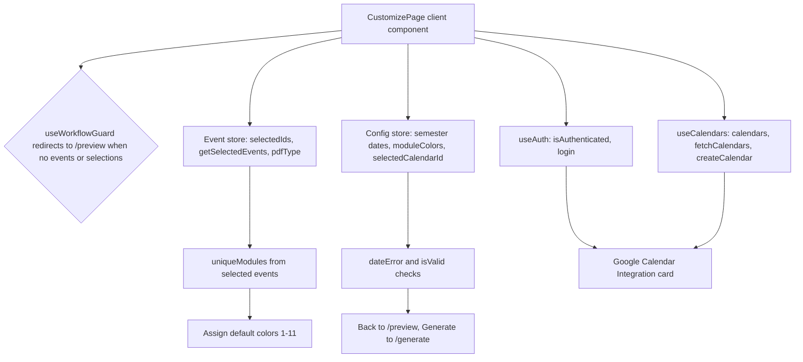

<!-- tyto-docs
tyto_docs: 1
kind: component
unit: frontend/src/app/customize
title: Customize
status: draft
written_at_commit: 9e531aefc4be744110e3c61ac04707666d32b071
written_at: "2026-09-15T11:42:09.431Z"
research: frontend/src/app/customize/DOCS/Research.md
sources: []
accepted: null
evidence: Customize.evidence.md
critic:
  attempts: 0
  findings: []
-->

# Customize

<!-- tyto-docs:generated:status -->
<!-- /tyto-docs:generated:status -->

## [Summary](Customize.evidence.md#summary)

The customize unit owns the configuration step of the Tuks Schedule Generator: the page where a user assigns colors to their modules, sets semester dates, and connects a Google Calendar before generating. A dependant can rely on a guarded, mode-aware configuration surface backed by the shared event and config stores and the calendar hooks. <!-- ev:research.frontend-src-app-customize.6756b08f -->[1](Customize.evidence.md#research.frontend-src-app-customize.6756b08f) <!-- ev:research.frontend-src-app-customize.fb217982 -->[2](Customize.evidence.md#research.frontend-src-app-customize.fb217982)

## [Purpose and boundaries](Customize.evidence.md#purpose-and-boundaries)

| | |
|---|---|
| Owns | The configuration step of the Tuks Schedule Generator: the CustomizePage client component in page.tsx that assigns colors to modules, sets semester dates, and connects a Google Calendar. <!-- ev:research.frontend-src-app-customize.6756b08f -->[1](Customize.evidence.md#research.frontend-src-app-customize.6756b08f) <!-- ev:research.frontend-src-app-customize.c6412755 -->[3](Customize.evidence.md#research.frontend-src-app-customize.c6412755) <!-- ev:research.frontend-src-app-customize.fb217982 -->[2](Customize.evidence.md#research.frontend-src-app-customize.fb217982) |
| Uses | The ModuleColorPicker, DateRangePicker, and CalendarSelector components from '@/components/customize', the Button, Card, and Alert components from '@/components/common', the event and config stores, and the useAuth, useCalendars, and useWorkflowGuard hooks. <!-- ev:research.frontend-src-app-customize.0eaf846f -->[4](Customize.evidence.md#research.frontend-src-app-customize.0eaf846f) |
| Does not own | The upload, preview, and generate steps, which live in sibling units under frontend/src/app and are not implemented here (inference: the unit holds only page.tsx). <!-- ev:research.frontend-src-app-customize.6756b08f -->[1](Customize.evidence.md#research.frontend-src-app-customize.6756b08f) |

## [How it works](Customize.evidence.md#how-it-works)

CustomizePage, the default export of frontend/src/app/customize/page.tsx, is a client component that invokes useWorkflowGuard('customize'), which redirects to the preview page when no events or selections exist. <!-- ev:research.frontend-src-app-customize.6756b08f -->[1](Customize.evidence.md#research.frontend-src-app-customize.6756b08f) <!-- ev:research.frontend-src-app-customize.6f4ed280 -->[5](Customize.evidence.md#research.frontend-src-app-customize.6f4ed280)

The page reads selectedIds, getSelectedEvents, and pdfType from the event store, and semesterStart, semesterEnd, moduleColors, and selectedCalendarId from the config store along with the setters setSemesterStart, setSemesterEnd, setModuleColor, and setSelectedCalendarId. <!-- ev:research.frontend-src-app-customize.5e283c25 -->[6](Customize.evidence.md#research.frontend-src-app-customize.5e283c25) <!-- ev:research.frontend-src-app-customize.32e11e57 -->[7](Customize.evidence.md#research.frontend-src-app-customize.32e11e57) It also obtains isAuthenticated, isAuthLoading, and login from useAuth, and calendars, isCalendarsLoading, calendarsError, fetchCalendars, and createCalendar from useCalendars. <!-- ev:research.frontend-src-app-customize.ff7d3a6c -->[8](Customize.evidence.md#research.frontend-src-app-customize.ff7d3a6c) <!-- ev:research.frontend-src-app-customize.0967392c -->[9](Customize.evidence.md#research.frontend-src-app-customize.0967392c)

uniqueModules is computed from the selected events' module names, deduplicated into a Set and returned as a sorted array. <!-- ev:research.frontend-src-app-customize.796f3745 -->[10](Customize.evidence.md#research.frontend-src-app-customize.796f3745) A useEffect assigns a default color to each unique module that does not already have one, rotating through color ids 1 through 11. <!-- ev:research.frontend-src-app-customize.5cb83107 -->[11](Customize.evidence.md#research.frontend-src-app-customize.5cb83107)

dateError is 'End date must be after start date' when both semester dates are set and the end date is not after the start date, and undefined otherwise. <!-- ev:research.frontend-src-app-customize.21254432 -->[12](Customize.evidence.md#research.frontend-src-app-customize.21254432) isValid requires at least one selected event; in lecture mode it additionally requires both semester dates to be set and no date error, while test and exam modes do not require semester dates. <!-- ev:research.frontend-src-app-customize.6aba5291 -->[13](Customize.evidence.md#research.frontend-src-app-customize.6aba5291)

A useEffect calls fetchCalendars when the user is authenticated and authentication is not loading. <!-- ev:research.frontend-src-app-customize.c5899d92 -->[14](Customize.evidence.md#research.frontend-src-app-customize.c5899d92) handleCreateCalendar creates a calendar through createCalendar and sets the selected calendar id to the new calendar's id, logging errors that are otherwise handled by the useCalendars hook. <!-- ev:research.frontend-src-app-customize.cceae229 -->[15](Customize.evidence.md#research.frontend-src-app-customize.cceae229)

The page title depends on the pdf type: 'Customize Your Lecture Schedule' for lecture, 'Customize Your Test Schedule' for test, 'Customize Your Exam Schedule' for exam, and 'Customize Your Calendar' otherwise; the subtitle is 'Assign colors to your modules and set your semester dates' for lecture mode and 'Assign colors to your modules' otherwise. <!-- ev:research.frontend-src-app-customize.c76b6e71 -->[16](Customize.evidence.md#research.frontend-src-app-customize.c76b6e71) <!-- ev:research.frontend-src-app-customize.738c8769 -->[17](Customize.evidence.md#research.frontend-src-app-customize.738c8769)

The component returns null until it has mounted, using an isMounted state flag set in a useEffect, to guard against hydration mismatches. <!-- ev:research.frontend-src-app-customize.739a2070 -->[18](Customize.evidence.md#research.frontend-src-app-customize.739a2070)

The page renders a centered header with the page title and subtitle, and a two-column grid whose left column holds a Card with the ModuleColorPicker and whose right column holds the DateRangePicker for lecture mode or an info Alert for test and exam modes, plus a Google Calendar Integration card. <!-- ev:research.frontend-src-app-customize.fb217982 -->[2](Customize.evidence.md#research.frontend-src-app-customize.fb217982)

The Google Calendar Integration card shows a CalendarSelector when authenticated and a 'Continue with Google' sign-in button that calls login when not. <!-- ev:research.frontend-src-app-customize.f5be4417 -->[19](Customize.evidence.md#research.frontend-src-app-customize.f5be4417)

The page renders a Back button that navigates to '/preview' and a Generate Calendar button that navigates to '/generate' and is disabled when the form is not valid. <!-- ev:research.frontend-src-app-customize.e5046c1e -->[20](Customize.evidence.md#research.frontend-src-app-customize.e5046c1e) In lecture mode, when the form is invalid and there is no date error, the page shows the message 'Please set both start and end dates to continue'. <!-- ev:research.frontend-src-app-customize.173537de -->[21](Customize.evidence.md#research.frontend-src-app-customize.173537de)

## [Interfaces](Customize.evidence.md#interfaces)

| Name | Input | Output | Guarantee |
|---|---|---|---|
| CustomizePage (default export of page.tsx) | none — the component takes no props (inference) | The configuration step page | Renders the mode-aware module color picker, semester date range, Google Calendar integration, and Back/Generate navigation <!-- ev:research.frontend-src-app-customize.6756b08f -->[1](Customize.evidence.md#research.frontend-src-app-customize.6756b08f) <!-- ev:research.frontend-src-app-customize.fb217982 -->[2](Customize.evidence.md#research.frontend-src-app-customize.fb217982) <!-- ev:research.frontend-src-app-customize.e5046c1e -->[20](Customize.evidence.md#research.frontend-src-app-customize.e5046c1e) |
| handleCreateCalendar | none — reads store state | Creates a calendar and selects it | Creates a calendar via createCalendar and sets the selected calendar id to the new calendar's id <!-- ev:research.frontend-src-app-customize.cceae229 -->[15](Customize.evidence.md#research.frontend-src-app-customize.cceae229) |
| handleBack | none | Navigates to '/preview' | Routes back to the preview step via the router <!-- ev:research.frontend-src-app-customize.1cf75697 -->[22](Customize.evidence.md#research.frontend-src-app-customize.1cf75697) |
| handleGenerate | none | Navigates to '/generate' | Routes to the generate step via the router <!-- ev:research.frontend-src-app-customize.1cf75697 -->[22](Customize.evidence.md#research.frontend-src-app-customize.1cf75697) |

<!-- tyto-docs:generated:endpoints -->
<!-- /tyto-docs:generated:endpoints -->

## Source files

<!-- tyto-docs:generated:file-table -->
<!-- /tyto-docs:generated:file-table -->

## [Dependencies](Customize.evidence.md#dependencies)

The page's imports are declared in frontend/src/app/customize/page.tsx. <!-- ev:research.frontend-src-app-customize.0eaf846f -->[4](Customize.evidence.md#research.frontend-src-app-customize.0eaf846f)

| Dependency | Capability used | Why |
|---|---|---|
| @/components/customize | ModuleColorPicker, DateRangePicker, CalendarSelector | Provide the module color picker, semester date range, and calendar selection controls <!-- ev:research.frontend-src-app-customize.0eaf846f -->[4](Customize.evidence.md#research.frontend-src-app-customize.0eaf846f) |
| @/components/common | Button, Card, Alert | Render the navigation buttons, cards, and info alerts <!-- ev:research.frontend-src-app-customize.0eaf846f -->[4](Customize.evidence.md#research.frontend-src-app-customize.0eaf846f) |
| @/stores/eventStore | selectedIds, getSelectedEvents, pdfType | Supplies the selected events and PDF type the page configures <!-- ev:research.frontend-src-app-customize.5e283c25 -->[6](Customize.evidence.md#research.frontend-src-app-customize.5e283c25) |
| @/stores/configStore | semesterStart, semesterEnd, moduleColors, selectedCalendarId and setters | Holds the semester dates, module colors, and selected calendar the page edits <!-- ev:research.frontend-src-app-customize.32e11e57 -->[7](Customize.evidence.md#research.frontend-src-app-customize.32e11e57) |
| @/hooks/useAuth | isAuthenticated, isAuthLoading, login | Drives the Google Calendar sign-in state <!-- ev:research.frontend-src-app-customize.ff7d3a6c -->[8](Customize.evidence.md#research.frontend-src-app-customize.ff7d3a6c) |
| @/hooks/useCalendars | calendars, isCalendarsLoading, calendarsError, fetchCalendars, createCalendar | Supplies the user's calendars and calendar creation <!-- ev:research.frontend-src-app-customize.0967392c -->[9](Customize.evidence.md#research.frontend-src-app-customize.0967392c) |
| @/hooks/useWorkflowGuard | workflow guard for 'customize' | Redirects to the preview page when no events or selections exist <!-- ev:research.frontend-src-app-customize.6f4ed280 -->[5](Customize.evidence.md#research.frontend-src-app-customize.6f4ed280) |

<!-- tyto-docs:generated:module-graph -->
<!-- /tyto-docs:generated:module-graph -->

## [Data model](Customize.evidence.md#data-model)

This unit declares no entities; it consumes the selected events and PDF type from the event store and the semester dates, module colors, and selected calendar from the config store, deriving uniqueModules from the selected events' module names. <!-- ev:research.frontend-src-app-customize.5e283c25 -->[6](Customize.evidence.md#research.frontend-src-app-customize.5e283c25) <!-- ev:research.frontend-src-app-customize.32e11e57 -->[7](Customize.evidence.md#research.frontend-src-app-customize.32e11e57) <!-- ev:research.frontend-src-app-customize.796f3745 -->[10](Customize.evidence.md#research.frontend-src-app-customize.796f3745)

<!-- tyto-docs:generated:erd -->
<!-- /tyto-docs:generated:erd -->

## [Decisions and limitations](Customize.evidence.md#decisions-and-limitations)

The page is a single client component that returns null until mounted to guard against hydration mismatches. <!-- ev:research.frontend-src-app-customize.739a2070 -->[18](Customize.evidence.md#research.frontend-src-app-customize.739a2070) It assigns a default color to each unique module that lacks one, rotating through color ids 1 through 11. <!-- ev:research.frontend-src-app-customize.5cb83107 -->[11](Customize.evidence.md#research.frontend-src-app-customize.5cb83107) Validation is mode-aware: lecture mode requires both semester dates and no date error, while test and exam modes require only a selected event. <!-- ev:research.frontend-src-app-customize.6aba5291 -->[13](Customize.evidence.md#research.frontend-src-app-customize.6aba5291)

<!-- tyto-docs:generated:navigation -->
<!-- /tyto-docs:generated:navigation -->
