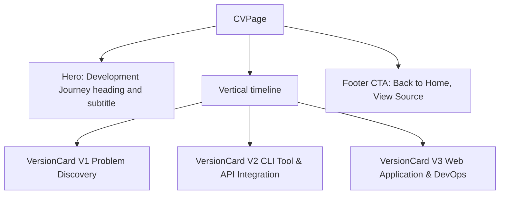

<!-- tyto-docs
tyto_docs: 1
kind: component
unit: frontend/src/app/cv
title: Cv
status: draft
written_at_commit: 0501ef831f61fbc488cb8209c936c59688725d94
written_at: "2026-09-15T11:04:58.335Z"
research: frontend/src/app/cv/DOCS/Research.md
sources: []
accepted: null
evidence: Cv.evidence.md
critic:
  attempts: 0
  findings: []
-->

# Cv

<!-- tyto-docs:generated:status -->
> **Status: Draft**
<!-- /tyto-docs:generated:status -->

## [Summary](Cv.evidence.md#summary)

The cv unit owns the 'Development Journey' page of the Tuks Schedule Generator: a client-rendered timeline that presents the project's evolution across three versions. A dependant can rely on a self-contained page that narrates the project's history through versioned cards, with navigation back to the home page and to the source repository. <!-- ev:research.frontend-src-app-cv.e0639369 -->[1](Cv.evidence.md#research.frontend-src-app-cv.e0639369) <!-- ev:research.frontend-src-app-cv.2eda6491 -->[2](Cv.evidence.md#research.frontend-src-app-cv.2eda6491) <!-- ev:research.frontend-src-app-cv.74f3a176 -->[3](Cv.evidence.md#research.frontend-src-app-cv.74f3a176)

## [Purpose and boundaries](Cv.evidence.md#purpose-and-boundaries)

| | |
|---|---|
| Owns | The 'Development Journey' page of the Tuks Schedule Generator: a client component that renders a hero section, a vertical timeline of three version cards describing the project's evolution, and a footer call-to-action. <!-- ev:research.frontend-src-app-cv.e0639369 -->[1](Cv.evidence.md#research.frontend-src-app-cv.e0639369) <!-- ev:research.frontend-src-app-cv.5d876d6d -->[4](Cv.evidence.md#research.frontend-src-app-cv.5d876d6d) <!-- ev:research.frontend-src-app-cv.2eda6491 -->[2](Cv.evidence.md#research.frontend-src-app-cv.2eda6491) <!-- ev:research.frontend-src-app-cv.74f3a176 -->[3](Cv.evidence.md#research.frontend-src-app-cv.74f3a176) |
| Uses | React for client component rendering and the Link component from next/link for navigation. <!-- ev:research.frontend-src-app-cv.e0639369 -->[1](Cv.evidence.md#research.frontend-src-app-cv.e0639369) |
| Does not own | The application's feature pages — upload, preview, generate, and the rest — which live in sibling units under frontend/src/app and are not implemented here (inference: the unit holds only page.tsx). <!-- ev:research.frontend-src-app-cv.e0639369 -->[1](Cv.evidence.md#research.frontend-src-app-cv.e0639369) |

## [How it works](Cv.evidence.md#how-it-works)

CVPage, the default export of frontend/src/app/cv/page.tsx, is a client component ('use client' directive) that imports React and the Link component from next/link. <!-- ev:research.frontend-src-app-cv.e0639369 -->[1](Cv.evidence.md#research.frontend-src-app-cv.e0639369) It renders a hero section headed by 'Development Journey' with a subtitle describing the evolution of the Tuks Schedule Generator. <!-- ev:research.frontend-src-app-cv.5d876d6d -->[4](Cv.evidence.md#research.frontend-src-app-cv.5d876d6d)

The page maps over the timelineData constant and renders a VersionCard for each section in a vertical timeline. <!-- ev:research.frontend-src-app-cv.2eda6491 -->[2](Cv.evidence.md#research.frontend-src-app-cv.2eda6491) timelineData holds three VersionSection entries describing the project's evolution: V1 'Problem Discovery' (Late 2024 to Early 2025, primary), V2 'CLI Tool & API Integration' (Late 2025, secondary), and V3 'Web Application & DevOps' (Late 2025 to Present, accent). <!-- ev:research.frontend-src-app-cv.651fd033 -->[5](Cv.evidence.md#research.frontend-src-app-cv.651fd033)

VersionCard renders a card with a color-derived left border and badge, a header showing the version badge, title, and period, and each content block as an optional heading followed by a bulleted list of items. <!-- ev:research.frontend-src-app-cv.96a7476a -->[6](Cv.evidence.md#research.frontend-src-app-cv.96a7476a)

The page ends with a footer call-to-action card offering 'Back to Home' and 'View Source' buttons that link to '/' and the GitHub repository respectively, with the repository link opening in a new tab. <!-- ev:research.frontend-src-app-cv.74f3a176 -->[3](Cv.evidence.md#research.frontend-src-app-cv.74f3a176)

## [Interfaces](Cv.evidence.md#interfaces)

| Name | Input | Output | Guarantee |
|---|---|---|---|
| CVPage (default export) | none — the component takes no props (inference) | The 'Development Journey' page | Renders the hero section, the vertical timeline of version cards, and the footer call-to-action <!-- ev:research.frontend-src-app-cv.5d876d6d -->[4](Cv.evidence.md#research.frontend-src-app-cv.5d876d6d) <!-- ev:research.frontend-src-app-cv.2eda6491 -->[2](Cv.evidence.md#research.frontend-src-app-cv.2eda6491) <!-- ev:research.frontend-src-app-cv.74f3a176 -->[3](Cv.evidence.md#research.frontend-src-app-cv.74f3a176) |
| VersionCard | section: VersionSection | A version card | Renders a color-derived card with the version badge, title, period, and content blocks <!-- ev:research.frontend-src-app-cv.96a7476a -->[6](Cv.evidence.md#research.frontend-src-app-cv.96a7476a) |

<!-- tyto-docs:generated:endpoints -->
<!-- No framework adapter is active, so no endpoints were extracted for this unit. -->
<!-- /tyto-docs:generated:endpoints -->

## Source files

<!-- tyto-docs:generated:file-table -->
<!-- This unit owns no source files. -->
<!-- /tyto-docs:generated:file-table -->

## [Dependencies](Cv.evidence.md#dependencies)

The page's imports are declared in frontend/src/app/cv/page.tsx, and its styling is built on Tailwind CSS with the daisyUI plugin. <!-- ev:research.frontend-src-app-cv.e0639369 -->[1](Cv.evidence.md#research.frontend-src-app-cv.e0639369)

| Dependency | Capability used | Why |
|---|---|---|
| next/link | Client-side navigation | The page links back to '/' and to the GitHub repository <!-- ev:research.frontend-src-app-cv.e0639369 -->[1](Cv.evidence.md#research.frontend-src-app-cv.e0639369) <!-- ev:research.frontend-src-app-cv.74f3a176 -->[3](Cv.evidence.md#research.frontend-src-app-cv.74f3a176) |
| React | Client component rendering | The page is a 'use client' component that renders the timeline <!-- ev:research.frontend-src-app-cv.e0639369 -->[1](Cv.evidence.md#research.frontend-src-app-cv.e0639369) |

<!-- tyto-docs:generated:module-graph -->
<!-- No module dependency graph is available for this unit. -->
<!-- /tyto-docs:generated:module-graph -->

## [Data model](Cv.evidence.md#data-model)

The unit declares the VersionSection interface, which models each timeline entry with version, title, period, color, and content fields, where color is one of 'primary', 'secondary', or 'accent' and content is an array of blocks each with an optional heading and a list of items. <!-- ev:research.frontend-src-app-cv.c374f011 -->[7](Cv.evidence.md#research.frontend-src-app-cv.c374f011)

<!-- tyto-docs:generated:erd -->
<!-- This leaf unit has no descendant scope for a focused ERD. -->
<!-- /tyto-docs:generated:erd -->

## [Decisions and limitations](Cv.evidence.md#decisions-and-limitations)

The page is a client component whose content is static: the timeline data is hard-coded in the timelineData constant rather than fetched or derived. <!-- ev:research.frontend-src-app-cv.e0639369 -->[1](Cv.evidence.md#research.frontend-src-app-cv.e0639369) <!-- ev:research.frontend-src-app-cv.651fd033 -->[5](Cv.evidence.md#research.frontend-src-app-cv.651fd033)

<!-- tyto-docs:generated:navigation -->
- **Schedule:** 29 of 43, wave 1
<!-- /tyto-docs:generated:navigation -->
