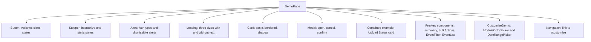

<!-- tyto-docs
tyto_docs: 1
kind: component
unit: frontend/src/app/demo
title: Demo
status: draft
written_at_commit: 7de17169b4d02f005b26e77c3f54b4d019ce63b9
written_at: "2026-09-15T08:43:51.809Z"
research: frontend/src/app/demo/DOCS/Research.md
sources: []
accepted: null
evidence: Demo.evidence.md
critic:
  attempts: 0
  findings: []
-->

# Demo

<!-- tyto-docs:generated:status -->
<!-- /tyto-docs:generated:status -->

## [Summary](Demo.evidence.md#summary)

The demo unit owns a single Next.js client page that showcases the common UI components — Button, Stepper, Alert, Loading, Card, and Modal — alongside the preview and customize components, wired to the event and config stores with mock data. A maintainer can rely on it as a manual review harness for the component library and store integration. <!-- ev:research.frontend-src-app-demo.76170512 -->[1](Demo.evidence.md#research.frontend-src-app-demo.76170512)

## [Purpose and boundaries](Demo.evidence.md#purpose-and-boundaries)

| | |
|---|---|
| Owns | A single demo page, page.tsx, a Next.js client component that exports the default DemoPage function and showcases the common UI, preview, and customize components for review. <!-- ev:research.frontend-src-app-demo.76170512 -->[1](Demo.evidence.md#research.frontend-src-app-demo.76170512) <!-- ev:research.frontend-src-app-demo.9e45057a -->[2](Demo.evidence.md#research.frontend-src-app-demo.9e45057a) |
| Uses | The common UI components (Button, Alert, Card, Loading, Modal), the Stepper layout component, the preview components (EventList, BulkActions, EventFilter), the customize components (ModuleColorPicker, DateRangePicker), the event and config stores, and the ParsedEvent type. <!-- ev:research.frontend-src-app-demo.76170512 -->[1](Demo.evidence.md#research.frontend-src-app-demo.76170512) |
| Does not own | The components, stores, and types it imports, which are implemented in their own units (inference: the unit holds only page.tsx). <!-- ev:research.frontend-src-app-demo.76170512 -->[1](Demo.evidence.md#research.frontend-src-app-demo.76170512) |

## [How it works](Demo.evidence.md#how-it-works)

The page is a client component that exports a default DemoPage function. <!-- ev:research.frontend-src-app-demo.76170512 -->[1](Demo.evidence.md#research.frontend-src-app-demo.76170512) It maintains local state for the modal open flag, the set of dismissed alerts, the current stepper step (restricted to 1-4), and the module filter. <!-- ev:research.frontend-src-app-demo.9e45057a -->[2](Demo.evidence.md#research.frontend-src-app-demo.9e45057a) It reads events, selected IDs, and the store actions setEvents, toggleEvent, selectAll, and deselectAll from the event store. <!-- ev:research.frontend-src-app-demo.ba0f1eed -->[3](Demo.evidence.md#research.frontend-src-app-demo.ba0f1eed)

On mount, DemoPage loads MOCK_EVENTS — a constant array of seven ParsedEvent mock events covering modules COS 214, STK 220, and WTW 220 — into the event store when the store is empty, and derives the sorted list of unique modules for the filter. <!-- ev:research.frontend-src-app-demo.8959102e -->[4](Demo.evidence.md#research.frontend-src-app-demo.8959102e) <!-- ev:research.frontend-src-app-demo.8b8222cb -->[5](Demo.evidence.md#research.frontend-src-app-demo.8b8222cb)

The page then renders one section per component. The Button section demonstrates variants (primary, secondary, ghost, outline), sizes (sm, md, lg), and states (loading, disabled). <!-- ev:research.frontend-src-app-demo.3225166b -->[6](Demo.evidence.md#research.frontend-src-app-demo.3225166b) The Stepper section pairs an interactive stepper, controlled by Previous and Next buttons clamped to steps 1-4, with static step states 1 through 4. <!-- ev:research.frontend-src-app-demo.bf339bf7 -->[7](Demo.evidence.md#research.frontend-src-app-demo.bf339bf7) The Alert section shows the four alert types (info, success, warning, error) and dismissible alerts with a reset button that clears the dismissed set. <!-- ev:research.frontend-src-app-demo.7e7a3a2d -->[8](Demo.evidence.md#research.frontend-src-app-demo.7e7a3a2d)

The Loading section shows the three sizes (sm, md, lg) both with and without accompanying text. <!-- ev:research.frontend-src-app-demo.e1627b11 -->[9](Demo.evidence.md#research.frontend-src-app-demo.e1627b11) The Card section shows a basic card, a bordered card, and a bordered card with a shadow and an action button. <!-- ev:research.frontend-src-app-demo.addc4b26 -->[10](Demo.evidence.md#research.frontend-src-app-demo.addc4b26) The Modal section pairs an 'Open Modal' button with a modal titled 'Example Modal' that offers Cancel and Confirm actions and closes via its onClose handler. <!-- ev:research.frontend-src-app-demo.502c8228 -->[11](Demo.evidence.md#research.frontend-src-app-demo.502c8228) A combined example composes Card, Alert, Loading, and Button into an 'Upload Status' card. <!-- ev:research.frontend-src-app-demo.54d4881d -->[12](Demo.evidence.md#research.frontend-src-app-demo.54d4881d)

The preview components section shows a summary card with total events, module count, and selected count, followed by BulkActions, EventFilter, EventList, and a 'Reset Mock Events' button that reloads MOCK_EVENTS into the store. <!-- ev:research.frontend-src-app-demo.b7b829de -->[13](Demo.evidence.md#research.frontend-src-app-demo.b7b829de) A navigation section links to the /customize page, labelled 'Go to Customize Page'. <!-- ev:research.frontend-src-app-demo.7781a80d -->[14](Demo.evidence.md#research.frontend-src-app-demo.7781a80d)

CustomizeDemo is a helper component that tests ModuleColorPicker and DateRangePicker, reading semester start, semester end, and module colors from the config store, validating that the end date is after the start date, and offering a 'Reset Config' button that calls the store's reset action. <!-- ev:research.frontend-src-app-demo.f6ae26b3 -->[15](Demo.evidence.md#research.frontend-src-app-demo.f6ae26b3)

## [Interfaces](Demo.evidence.md#interfaces)

| Name | Input | Output | Guarantee |
|---|---|---|---|
| DemoPage (default export) | none — the component takes no props (inference) | The demo page | Renders the component showcase sections, the preview components wired to the event store, and the customize components wired to the config store <!-- ev:research.frontend-src-app-demo.9e45057a -->[2](Demo.evidence.md#research.frontend-src-app-demo.9e45057a) |
| CustomizeDemo | uniqueModules: string[] | The customize components section | Tests ModuleColorPicker and DateRangePicker against the config store and validates the end date is after the start date <!-- ev:research.frontend-src-app-demo.f6ae26b3 -->[15](Demo.evidence.md#research.frontend-src-app-demo.f6ae26b3) |

<!-- tyto-docs:generated:endpoints -->
<!-- /tyto-docs:generated:endpoints -->

## Source files

<!-- tyto-docs:generated:file-table -->
<!-- /tyto-docs:generated:file-table -->

## [Dependencies](Demo.evidence.md#dependencies)

| Dependency | Capability used | Why |
|---|---|---|
| @/components/common (Button, Alert, Card, Loading, Modal) | Common UI primitives | The page demonstrates each component's variants, sizes, and states for review <!-- ev:research.frontend-src-app-demo.76170512 -->[1](Demo.evidence.md#research.frontend-src-app-demo.76170512) |
| @/components/layout (Stepper) | Stepper layout component | The page demonstrates interactive and static stepper states <!-- ev:research.frontend-src-app-demo.76170512 -->[1](Demo.evidence.md#research.frontend-src-app-demo.76170512) <!-- ev:research.frontend-src-app-demo.bf339bf7 -->[7](Demo.evidence.md#research.frontend-src-app-demo.bf339bf7) |
| @/components/preview (EventList, BulkActions, EventFilter) | Preview components | The page exercises the preview components with mock events <!-- ev:research.frontend-src-app-demo.76170512 -->[1](Demo.evidence.md#research.frontend-src-app-demo.76170512) <!-- ev:research.frontend-src-app-demo.b7b829de -->[13](Demo.evidence.md#research.frontend-src-app-demo.b7b829de) |
| @/components/customize (ModuleColorPicker, DateRangePicker) | Customize components | CustomizeDemo tests the customize components against the config store <!-- ev:research.frontend-src-app-demo.76170512 -->[1](Demo.evidence.md#research.frontend-src-app-demo.76170512) <!-- ev:research.frontend-src-app-demo.f6ae26b3 -->[15](Demo.evidence.md#research.frontend-src-app-demo.f6ae26b3) |
| event store | Events, selected IDs, setEvents, toggleEvent, selectAll, deselectAll | The preview section reads and mutates the event store <!-- ev:research.frontend-src-app-demo.ba0f1eed -->[3](Demo.evidence.md#research.frontend-src-app-demo.ba0f1eed) |
| config store | Semester start, semester end, module colors, reset | CustomizeDemo reads and resets the config store <!-- ev:research.frontend-src-app-demo.f6ae26b3 -->[15](Demo.evidence.md#research.frontend-src-app-demo.f6ae26b3) |
| @/types (ParsedEvent) | ParsedEvent type | MOCK_EVENTS and the event store are typed with ParsedEvent <!-- ev:research.frontend-src-app-demo.76170512 -->[1](Demo.evidence.md#research.frontend-src-app-demo.76170512) <!-- ev:research.frontend-src-app-demo.8b8222cb -->[5](Demo.evidence.md#research.frontend-src-app-demo.8b8222cb) |

<!-- tyto-docs:generated:module-graph -->
<!-- /tyto-docs:generated:module-graph -->

## [Data model](Demo.evidence.md#data-model)

The page declares no entities of its own; its only data is the MOCK_EVENTS constant array of seven ParsedEvent mock events. The event and config stores it reads and writes are owned by their own units. <!-- ev:research.frontend-src-app-demo.8b8222cb -->[5](Demo.evidence.md#research.frontend-src-app-demo.8b8222cb)

<!-- tyto-docs:generated:erd -->
<!-- /tyto-docs:generated:erd -->

## [Decisions and limitations](Demo.evidence.md#decisions-and-limitations)

The page seeds the event store with MOCK_EVENTS on mount only when the store is empty, and the 'Reset Mock Events' button reloads them, so the preview section always has deterministic data to display. <!-- ev:research.frontend-src-app-demo.8959102e -->[4](Demo.evidence.md#research.frontend-src-app-demo.8959102e) <!-- ev:research.frontend-src-app-demo.b7b829de -->[13](Demo.evidence.md#research.frontend-src-app-demo.b7b829de)

CustomizeDemo validates that the semester end date is after the start date and surfaces an error otherwise. <!-- ev:research.frontend-src-app-demo.f6ae26b3 -->[15](Demo.evidence.md#research.frontend-src-app-demo.f6ae26b3)

<!-- tyto-docs:generated:navigation -->
<!-- /tyto-docs:generated:navigation -->