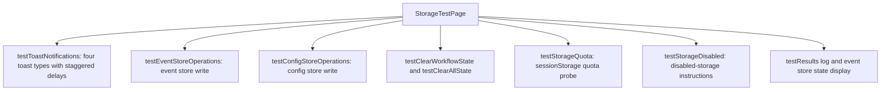

<!-- tyto-docs
tyto_docs: 1
kind: component
unit: frontend/src/app/demo/storage-test
title: Storage Test
status: draft
written_at_commit: f6ad691b935992530f243abbfa172846604749dc
written_at: "2026-09-15T02:43:53.557Z"
research: frontend/src/app/demo/storage-test/DOCS/Research.md
sources: []
accepted: null
evidence: Storage_Test.evidence.md
critic:
  attempts: 0
  findings: []
-->

# Storage Test

<!-- tyto-docs:generated:status -->
> **Status: Draft**
<!-- /tyto-docs:generated:status -->

## [Summary](Storage_Test.evidence.md#summary)

The storage-test unit owns a single demo page that exercises the session-state-persistence feature: it triggers toast notifications, writes to the event and config stores, clears workflow and all state, and probes sessionStorage quota and disabled-storage behaviour, recording each outcome in an on-page result log. A maintainer can rely on it as a manual harness for storage error handling. <!-- ev:research.frontend-src-app-demo-storage-test.97daf1d3 -->[1](Storage_Test.evidence.md#research.frontend-src-app-demo-storage-test.97daf1d3)

## [Purpose and boundaries](Storage_Test.evidence.md#purpose-and-boundaries)

| | |
|---|---|
| Owns | A single demo page, page.tsx, a Next.js client component that exports the default StorageTestPage function and demonstrates toast notifications and storage error handling for the session-state-persistence feature. <!-- ev:research.frontend-src-app-demo-storage-test.11b8801d -->[2](Storage_Test.evidence.md#research.frontend-src-app-demo-storage-test.11b8801d) <!-- ev:research.frontend-src-app-demo-storage-test.97daf1d3 -->[1](Storage_Test.evidence.md#research.frontend-src-app-demo-storage-test.97daf1d3) |
| Uses | The toast notification utilities (showErrorToast, showWarningToast, showSuccessToast, showInfoToast) from '@/utils/toast', the event and config stores, and the workflow and all-state clearing utilities from '@/utils/stateManagement'. <!-- ev:research.frontend-src-app-demo-storage-test.d9d2a95e -->[3](Storage_Test.evidence.md#research.frontend-src-app-demo-storage-test.d9d2a95e) |
| Does not own | The toast utilities, stores, and state-management helpers it exercises, which are imported from '@/utils' and implemented in their own units (inference: the unit holds only page.tsx). <!-- ev:research.frontend-src-app-demo-storage-test.11b8801d -->[2](Storage_Test.evidence.md#research.frontend-src-app-demo-storage-test.11b8801d) |

## [How it works](Storage_Test.evidence.md#how-it-works)

The page is a client component that exports a default StorageTestPage function. <!-- ev:research.frontend-src-app-demo-storage-test.11b8801d -->[2](Storage_Test.evidence.md#research.frontend-src-app-demo-storage-test.11b8801d) It keeps a testResults state array of timestamped strings, appended by addResult, and clearResults resets it to an empty array. <!-- ev:research.frontend-src-app-demo-storage-test.fcc2acd2 -->[4](Storage_Test.evidence.md#research.frontend-src-app-demo-storage-test.fcc2acd2)

Each test function drives one aspect of storage. testToastNotifications displays all four toast types (info, success, warning, error) with staggered delays and records a result line. <!-- ev:research.frontend-src-app-demo-storage-test.93113a28 -->[5](Storage_Test.evidence.md#research.frontend-src-app-demo-storage-test.93113a28) testEventStoreOperations sets a test event in the event store and records success or failure, showing a success toast on success. <!-- ev:research.frontend-src-app-demo-storage-test.6bcf8695 -->[6](Storage_Test.evidence.md#research.frontend-src-app-demo-storage-test.6bcf8695)

testConfigStoreOperations sets semester start and end dates and a module color in the config store, recording success or failure. <!-- ev:research.frontend-src-app-demo-storage-test.cdd6c67a -->[7](Storage_Test.evidence.md#research.frontend-src-app-demo-storage-test.cdd6c67a) testClearWorkflowState and testClearAllState clear workflow state and all state respectively, recording success or failure. <!-- ev:research.frontend-src-app-demo-storage-test.7f334e38 -->[8](Storage_Test.evidence.md#research.frontend-src-app-demo-storage-test.7f334e38)

testStorageQuota writes ten 1MB strings to sessionStorage, treats a QuotaExceededError as expected behavior, and removes the test keys in a finally block. <!-- ev:research.frontend-src-app-demo-storage-test.9a0c5fad -->[9](Storage_Test.evidence.md#research.frontend-src-app-demo-storage-test.9a0c5fad) testStorageDisabled records step-by-step instructions for testing disabled storage and shows an info toast pointing to the console. <!-- ev:research.frontend-src-app-demo-storage-test.1151c4eb -->[10](Storage_Test.evidence.md#research.frontend-src-app-demo-storage-test.1151c4eb)

The page renders buttons for each test, the current event store state (events count and selected count), a console log of test results, and testing tips. <!-- ev:research.frontend-src-app-demo-storage-test.86a3d1b0 -->[11](Storage_Test.evidence.md#research.frontend-src-app-demo-storage-test.86a3d1b0)

## [Interfaces](Storage_Test.evidence.md#interfaces)

| Name | Input | Output | Guarantee |
|---|---|---|---|
| StorageTestPage (default export) | none — the component takes no props (inference) | The demo page | Renders buttons for each test, the current event store state, a console log of test results, and testing tips <!-- ev:research.frontend-src-app-demo-storage-test.86a3d1b0 -->[11](Storage_Test.evidence.md#research.frontend-src-app-demo-storage-test.86a3d1b0) |
| testToastNotifications | none | A result line in testResults | Displays all four toast types with staggered delays <!-- ev:research.frontend-src-app-demo-storage-test.93113a28 -->[5](Storage_Test.evidence.md#research.frontend-src-app-demo-storage-test.93113a28) |
| testEventStoreOperations | none | A result line in testResults | Sets a test event in the event store, showing a success toast on success <!-- ev:research.frontend-src-app-demo-storage-test.6bcf8695 -->[6](Storage_Test.evidence.md#research.frontend-src-app-demo-storage-test.6bcf8695) |
| testConfigStoreOperations | none | A result line in testResults | Sets semester start and end dates and a module color in the config store <!-- ev:research.frontend-src-app-demo-storage-test.cdd6c67a -->[7](Storage_Test.evidence.md#research.frontend-src-app-demo-storage-test.cdd6c67a) |
| testClearWorkflowState / testClearAllState | none | A result line in testResults | Clear workflow state and all state respectively <!-- ev:research.frontend-src-app-demo-storage-test.7f334e38 -->[8](Storage_Test.evidence.md#research.frontend-src-app-demo-storage-test.7f334e38) |
| testStorageQuota | none | A result line in testResults | Writes ten 1MB strings to sessionStorage, treating a QuotaExceededError as expected <!-- ev:research.frontend-src-app-demo-storage-test.9a0c5fad -->[9](Storage_Test.evidence.md#research.frontend-src-app-demo-storage-test.9a0c5fad) |
| testStorageDisabled | none | A result line in testResults | Records instructions for testing disabled storage and shows an info toast <!-- ev:research.frontend-src-app-demo-storage-test.1151c4eb -->[10](Storage_Test.evidence.md#research.frontend-src-app-demo-storage-test.1151c4eb) |

<!-- tyto-docs:generated:endpoints -->
<!-- No framework adapter is active, so no endpoints were extracted for this unit. -->
<!-- /tyto-docs:generated:endpoints -->

## Source files

<!-- tyto-docs:generated:file-table -->
<!-- This unit owns no source files. -->
<!-- /tyto-docs:generated:file-table -->

## [Dependencies](Storage_Test.evidence.md#dependencies)

The page's imports are declared in frontend/src/app/demo/storage-test/page.tsx. <!-- ev:research.frontend-src-app-demo-storage-test.d9d2a95e -->[3](Storage_Test.evidence.md#research.frontend-src-app-demo-storage-test.d9d2a95e)

| Dependency | Capability used | Why |
|---|---|---|
| @/utils/toast | showErrorToast, showWarningToast, showSuccessToast, showInfoToast | The demo triggers all four toast types to exercise notification behaviour <!-- ev:research.frontend-src-app-demo-storage-test.d9d2a95e -->[3](Storage_Test.evidence.md#research.frontend-src-app-demo-storage-test.d9d2a95e) <!-- ev:research.frontend-src-app-demo-storage-test.93113a28 -->[5](Storage_Test.evidence.md#research.frontend-src-app-demo-storage-test.93113a28) |
| event store | Test event writes | testEventStoreOperations verifies event store persistence <!-- ev:research.frontend-src-app-demo-storage-test.d9d2a95e -->[3](Storage_Test.evidence.md#research.frontend-src-app-demo-storage-test.d9d2a95e) <!-- ev:research.frontend-src-app-demo-storage-test.6bcf8695 -->[6](Storage_Test.evidence.md#research.frontend-src-app-demo-storage-test.6bcf8695) |
| config store | Semester dates and module color writes | testConfigStoreOperations verifies config store persistence <!-- ev:research.frontend-src-app-demo-storage-test.d9d2a95e -->[3](Storage_Test.evidence.md#research.frontend-src-app-demo-storage-test.d9d2a95e) <!-- ev:research.frontend-src-app-demo-storage-test.cdd6c67a -->[7](Storage_Test.evidence.md#research.frontend-src-app-demo-storage-test.cdd6c67a) |
| @/utils/stateManagement | Workflow and all-state clearing | testClearWorkflowState and testClearAllState clear persisted state <!-- ev:research.frontend-src-app-demo-storage-test.d9d2a95e -->[3](Storage_Test.evidence.md#research.frontend-src-app-demo-storage-test.d9d2a95e) <!-- ev:research.frontend-src-app-demo-storage-test.7f334e38 -->[8](Storage_Test.evidence.md#research.frontend-src-app-demo-storage-test.7f334e38) |
| sessionStorage | Quota probe | testStorageQuota writes 1MB strings to sessionStorage to exercise quota errors <!-- ev:research.frontend-src-app-demo-storage-test.9a0c5fad -->[9](Storage_Test.evidence.md#research.frontend-src-app-demo-storage-test.9a0c5fad) |

<!-- tyto-docs:generated:module-graph -->
<!-- No module dependency graph is available for this unit. -->
<!-- /tyto-docs:generated:module-graph -->

## [Data model](Storage_Test.evidence.md#data-model)

The page declares no entities of its own; its only state is the testResults array of timestamped strings appended by addResult. The event and config stores it writes to are owned by their own units. <!-- ev:research.frontend-src-app-demo-storage-test.fcc2acd2 -->[4](Storage_Test.evidence.md#research.frontend-src-app-demo-storage-test.fcc2acd2)

<!-- tyto-docs:generated:erd -->
<!-- This leaf unit has no descendant scope for a focused ERD. -->
<!-- /tyto-docs:generated:erd -->

## [Decisions and limitations](Storage_Test.evidence.md#decisions-and-limitations)

testStorageQuota treats a QuotaExceededError as expected behavior rather than a failure, so the quota test passes when sessionStorage is full. <!-- ev:research.frontend-src-app-demo-storage-test.9a0c5fad -->[9](Storage_Test.evidence.md#research.frontend-src-app-demo-storage-test.9a0c5fad)

testStorageDisabled cannot run automatically; it records step-by-step instructions for testing disabled storage and points the tester to the console. <!-- ev:research.frontend-src-app-demo-storage-test.1151c4eb -->[10](Storage_Test.evidence.md#research.frontend-src-app-demo-storage-test.1151c4eb)

<!-- tyto-docs:generated:navigation -->
- **Schedule:** 23 of 30, wave 1
<!-- /tyto-docs:generated:navigation -->