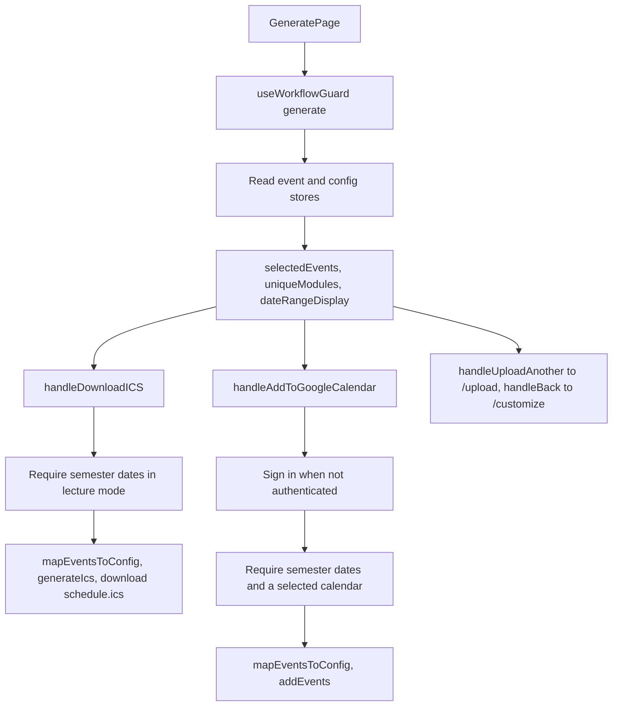

<!-- tyto-docs
tyto_docs: 1
kind: component
unit: frontend/src/app/generate
title: Generate
status: current
written_at_commit: 584eeb324f30cb33f7faa52f94e6526ceaa92a8d
written_at: "2026-09-15T07:45:16.890Z"
research: frontend/src/app/generate/DOCS/Research.md
sources: []
accepted:
  at: "2026-09-15T07:49:59.496Z"
  commit: 584eeb324f30cb33f7faa52f94e6526ceaa92a8d
  research_fingerprint: "sha256:8f0ff6f7c51ae1e27104cc7e9561e58927a45be299ec31f0981fcfea6932a489"
  research_findings:
    - research.frontend-src-app-generate.086b7cce
    - research.frontend-src-app-generate.0e728abf
    - research.frontend-src-app-generate.5fb38237
    - research.frontend-src-app-generate.60f6dab7
    - research.frontend-src-app-generate.8c50d72a
    - research.frontend-src-app-generate.8f6ab7aa
    - research.frontend-src-app-generate.9308e8e8
    - research.frontend-src-app-generate.98c279a7
    - research.frontend-src-app-generate.9df5d0df
    - research.frontend-src-app-generate.a8c47d82
    - research.frontend-src-app-generate.aa4a1844
    - research.frontend-src-app-generate.ac58fe31
    - research.frontend-src-app-generate.bcf12ca9
    - research.frontend-src-app-generate.c5f8430f
    - research.frontend-src-app-generate.dffc1987
  critic_pass: critic.frontend-src-app-generate.1
  sources:
    - path: frontend/src/app/generate/page.tsx
      blob_sha: 027f5fccc3097bf20383d071acaf1ecb7456d79a
evidence: Generate.evidence.md
critic:
  attempts: 1
  findings: []
  review_complete: true
  sections_reviewed: 8
  sections_total: 8
  last_reviewed_document: "sha256:39189602af5e277fe2f9e087ae3c5c08d06e0083426085eaf409424a9f48f1d1"
  retired: []
-->

# Generate

<!-- tyto-docs:generated:status -->
> **Status: Current**
<!-- /tyto-docs:generated:status -->

## [Summary](Generate.evidence.md#summary)

The generate unit owns the final step of the Tuks Schedule Generator: the page where a user reviews their configuration and exports the calendar. A dependant can rely on the page to present a summary of the selected events and modules, offer ICS download and Google Calendar sync, and enforce the workflow state the step requires. <!-- ev:research.frontend-src-app-generate.dffc1987 -->[1](Generate.evidence.md#research.frontend-src-app-generate.dffc1987) <!-- ev:research.frontend-src-app-generate.c5f8430f -->[2](Generate.evidence.md#research.frontend-src-app-generate.c5f8430f) <!-- ev:research.frontend-src-app-generate.5fb38237 -->[3](Generate.evidence.md#research.frontend-src-app-generate.5fb38237)

## [Purpose and boundaries](Generate.evidence.md#purpose-and-boundaries)

| | |
|---|---|
| Owns | The generate step of the Tuks Schedule Generator: the GeneratePage client component in page.tsx that reviews the user's configuration and offers the calendar output options. <!-- ev:research.frontend-src-app-generate.dffc1987 -->[1](Generate.evidence.md#research.frontend-src-app-generate.dffc1987) <!-- ev:research.frontend-src-app-generate.c5f8430f -->[2](Generate.evidence.md#research.frontend-src-app-generate.c5f8430f) |
| Uses | The event and config stores for the selected events and semester configuration, the useAuth and useWorkflowGuard hooks, the calendarService for ICS generation and Google Calendar sync, and the Button, Card, and Alert components from '@/components/common'. <!-- ev:research.frontend-src-app-generate.0e728abf -->[4](Generate.evidence.md#research.frontend-src-app-generate.0e728abf) <!-- ev:research.frontend-src-app-generate.60f6dab7 -->[5](Generate.evidence.md#research.frontend-src-app-generate.60f6dab7) <!-- ev:research.frontend-src-app-generate.aa4a1844 -->[6](Generate.evidence.md#research.frontend-src-app-generate.aa4a1844) <!-- ev:research.frontend-src-app-generate.ac58fe31 -->[7](Generate.evidence.md#research.frontend-src-app-generate.ac58fe31) <!-- ev:research.frontend-src-app-generate.5fb38237 -->[3](Generate.evidence.md#research.frontend-src-app-generate.5fb38237) <!-- ev:research.frontend-src-app-generate.a8c47d82 -->[8](Generate.evidence.md#research.frontend-src-app-generate.a8c47d82) <!-- ev:research.frontend-src-app-generate.8f6ab7aa -->[9](Generate.evidence.md#research.frontend-src-app-generate.8f6ab7aa) |
| Does not own | The upload and customize steps of the workflow, which live in sibling units; the page only navigates to '/upload' and '/customize' (inference: the unit holds only page.tsx). <!-- ev:research.frontend-src-app-generate.dffc1987 -->[1](Generate.evidence.md#research.frontend-src-app-generate.dffc1987) <!-- ev:research.frontend-src-app-generate.086b7cce -->[10](Generate.evidence.md#research.frontend-src-app-generate.086b7cce) <!-- ev:research.frontend-src-app-generate.98c279a7 -->[11](Generate.evidence.md#research.frontend-src-app-generate.98c279a7) |

## [How it works](Generate.evidence.md#how-it-works)

GeneratePage, the default export of frontend/src/app/generate/page.tsx, is a client component that first calls useWorkflowGuard('generate'), which redirects the user when the workflow requirements for the generate step are not met. <!-- ev:research.frontend-src-app-generate.dffc1987 -->[1](Generate.evidence.md#research.frontend-src-app-generate.dffc1987) <!-- ev:research.frontend-src-app-generate.5fb38237 -->[3](Generate.evidence.md#research.frontend-src-app-generate.5fb38237)

The page reads events, selectedIds, getSelectedEvents, reset, and pdfType from the event store, and semesterStart, semesterEnd, moduleColors, selectedCalendarId, and reset from the config store. <!-- ev:research.frontend-src-app-generate.60f6dab7 -->[5](Generate.evidence.md#research.frontend-src-app-generate.60f6dab7) <!-- ev:research.frontend-src-app-generate.aa4a1844 -->[6](Generate.evidence.md#research.frontend-src-app-generate.aa4a1844) From these it computes selectedEvents, uniqueModules as a sorted, deduplicated list of the selected events' module names, and dateRangeDisplay as the formatted semester date range or 'Not set' when either date is missing. <!-- ev:research.frontend-src-app-generate.bcf12ca9 -->[12](Generate.evidence.md#research.frontend-src-app-generate.bcf12ca9)

handleDownloadICS maps the selected events to EventConfig format via mapEventsToConfig, calls calendarService.generateIcs, and downloads the returned blob as a file named 'schedule.ics', requiring semester dates in lecture mode and reporting success or error status. <!-- ev:research.frontend-src-app-generate.a8c47d82 -->[8](Generate.evidence.md#research.frontend-src-app-generate.a8c47d82)

handleAddToGoogleCalendar signs the user in when not authenticated, requires semester dates in lecture mode and a selected calendar, maps events via mapEventsToConfig, calls calendarService.addEvents, and reports success or error, prompting re-authentication on 401 or unauthorized responses. <!-- ev:research.frontend-src-app-generate.8f6ab7aa -->[9](Generate.evidence.md#research.frontend-src-app-generate.8f6ab7aa)

handleUploadAnother clears all workflow and config state via clearAllState and navigates to '/upload', falling back to resetEvents and resetConfig if clearAllState fails. <!-- ev:research.frontend-src-app-generate.086b7cce -->[10](Generate.evidence.md#research.frontend-src-app-generate.086b7cce) handleBack navigates to '/customize' via the router. <!-- ev:research.frontend-src-app-generate.98c279a7 -->[11](Generate.evidence.md#research.frontend-src-app-generate.98c279a7)

The page renders a centered header titled 'Generate Your Calendar' with the subtitle 'Review your configuration and download your calendar', success and error status alerts, a Configuration Summary card showing the selected events count, module count, date range, and module color preview, two output option cards for Download ICS and Add to Google Calendar, and Back and Upload Another PDF navigation buttons. <!-- ev:research.frontend-src-app-generate.c5f8430f -->[2](Generate.evidence.md#research.frontend-src-app-generate.c5f8430f)

## [Interfaces](Generate.evidence.md#interfaces)

| Name | Input | Output | Guarantee |
|---|---|---|---|
| GeneratePage (default export) | none — the component takes no props (inference) | The generate step page | Renders the configuration summary and the Download ICS and Add to Google Calendar output options <!-- ev:research.frontend-src-app-generate.c5f8430f -->[2](Generate.evidence.md#research.frontend-src-app-generate.c5f8430f) |
| handleDownloadICS | none — reads store state | Downloads 'schedule.ics' or reports an error | Maps selected events to EventConfig, generates the ICS via calendarService, and requires semester dates in lecture mode <!-- ev:research.frontend-src-app-generate.a8c47d82 -->[8](Generate.evidence.md#research.frontend-src-app-generate.a8c47d82) |
| handleAddToGoogleCalendar | none — reads store state | Adds events to the selected Google Calendar or reports an error | Signs in when unauthenticated, requires semester dates in lecture mode and a selected calendar, and prompts re-authentication on 401 or unauthorized responses <!-- ev:research.frontend-src-app-generate.8f6ab7aa -->[9](Generate.evidence.md#research.frontend-src-app-generate.8f6ab7aa) |
| handleUploadAnother | none | Navigates to '/upload' | Clears all workflow and config state via clearAllState, falling back to resetEvents and resetConfig <!-- ev:research.frontend-src-app-generate.086b7cce -->[10](Generate.evidence.md#research.frontend-src-app-generate.086b7cce) |
| handleBack | none | Navigates to '/customize' | Routes back to the customize step via the router <!-- ev:research.frontend-src-app-generate.98c279a7 -->[11](Generate.evidence.md#research.frontend-src-app-generate.98c279a7) |

<!-- tyto-docs:generated:endpoints -->
<!-- No framework adapter is active, so no endpoints were extracted for this unit. -->
<!-- /tyto-docs:generated:endpoints -->

## Source files

<!-- tyto-docs:generated:file-table -->
<!-- This unit owns no source files. -->
<!-- /tyto-docs:generated:file-table -->

## [Dependencies](Generate.evidence.md#dependencies)

The page's imports are declared in frontend/src/app/generate/page.tsx. <!-- ev:research.frontend-src-app-generate.0e728abf -->[4](Generate.evidence.md#research.frontend-src-app-generate.0e728abf)

| Dependency | Capability used | Why |
|---|---|---|
| react | useMemo and useState | Keeps local state for generation and sync status <!-- ev:research.frontend-src-app-generate.0e728abf -->[4](Generate.evidence.md#research.frontend-src-app-generate.0e728abf) <!-- ev:research.frontend-src-app-generate.9df5d0df -->[13](Generate.evidence.md#research.frontend-src-app-generate.9df5d0df) |
| next/navigation | useRouter | Navigates to '/upload' and '/customize' <!-- ev:research.frontend-src-app-generate.0e728abf -->[4](Generate.evidence.md#research.frontend-src-app-generate.0e728abf) <!-- ev:research.frontend-src-app-generate.086b7cce -->[10](Generate.evidence.md#research.frontend-src-app-generate.086b7cce) <!-- ev:research.frontend-src-app-generate.98c279a7 -->[11](Generate.evidence.md#research.frontend-src-app-generate.98c279a7) |
| @/components/common | Button, Card, and Alert | Renders the status alerts, configuration summary, output option cards, and navigation buttons <!-- ev:research.frontend-src-app-generate.0e728abf -->[4](Generate.evidence.md#research.frontend-src-app-generate.0e728abf) <!-- ev:research.frontend-src-app-generate.c5f8430f -->[2](Generate.evidence.md#research.frontend-src-app-generate.c5f8430f) |
| @/stores/eventStore | events, selectedIds, getSelectedEvents, reset, pdfType | Supplies the selected events and PDF type the page summarizes and exports <!-- ev:research.frontend-src-app-generate.0e728abf -->[4](Generate.evidence.md#research.frontend-src-app-generate.0e728abf) <!-- ev:research.frontend-src-app-generate.60f6dab7 -->[5](Generate.evidence.md#research.frontend-src-app-generate.60f6dab7) |
| @/stores/configStore | semesterStart, semesterEnd, moduleColors, selectedCalendarId, reset | Supplies the semester dates, module colors, and selected calendar for the output options <!-- ev:research.frontend-src-app-generate.0e728abf -->[4](Generate.evidence.md#research.frontend-src-app-generate.0e728abf) <!-- ev:research.frontend-src-app-generate.aa4a1844 -->[6](Generate.evidence.md#research.frontend-src-app-generate.aa4a1844) |
| @/hooks/useAuth | isAuthenticated and login | Signs the user in for the Google Calendar output <!-- ev:research.frontend-src-app-generate.0e728abf -->[4](Generate.evidence.md#research.frontend-src-app-generate.0e728abf) <!-- ev:research.frontend-src-app-generate.ac58fe31 -->[7](Generate.evidence.md#research.frontend-src-app-generate.ac58fe31) <!-- ev:research.frontend-src-app-generate.8f6ab7aa -->[9](Generate.evidence.md#research.frontend-src-app-generate.8f6ab7aa) |
| @/hooks/useWorkflowGuard | Workflow guard for 'generate' | Redirects the user when the generate step's workflow requirements are not met <!-- ev:research.frontend-src-app-generate.0e728abf -->[4](Generate.evidence.md#research.frontend-src-app-generate.0e728abf) <!-- ev:research.frontend-src-app-generate.5fb38237 -->[3](Generate.evidence.md#research.frontend-src-app-generate.5fb38237) |
| @/services/calendarService | generateIcs and addEvents | Generates the ICS file and adds events to the Google Calendar <!-- ev:research.frontend-src-app-generate.0e728abf -->[4](Generate.evidence.md#research.frontend-src-app-generate.0e728abf) <!-- ev:research.frontend-src-app-generate.a8c47d82 -->[8](Generate.evidence.md#research.frontend-src-app-generate.a8c47d82) <!-- ev:research.frontend-src-app-generate.8f6ab7aa -->[9](Generate.evidence.md#research.frontend-src-app-generate.8f6ab7aa) |
| @/utils/eventMapper | mapEventsToConfig | Maps selected events to the EventConfig format both outputs consume <!-- ev:research.frontend-src-app-generate.0e728abf -->[4](Generate.evidence.md#research.frontend-src-app-generate.0e728abf) <!-- ev:research.frontend-src-app-generate.a8c47d82 -->[8](Generate.evidence.md#research.frontend-src-app-generate.a8c47d82) <!-- ev:research.frontend-src-app-generate.8f6ab7aa -->[9](Generate.evidence.md#research.frontend-src-app-generate.8f6ab7aa) |
| @/utils/dates | Date range formatting | Formats the semester date range shown in the configuration summary <!-- ev:research.frontend-src-app-generate.0e728abf -->[4](Generate.evidence.md#research.frontend-src-app-generate.0e728abf) <!-- ev:research.frontend-src-app-generate.bcf12ca9 -->[12](Generate.evidence.md#research.frontend-src-app-generate.bcf12ca9) |
| @/utils/colors | Module color handling | Supplies the module color preview in the configuration summary <!-- ev:research.frontend-src-app-generate.0e728abf -->[4](Generate.evidence.md#research.frontend-src-app-generate.0e728abf) <!-- ev:research.frontend-src-app-generate.c5f8430f -->[2](Generate.evidence.md#research.frontend-src-app-generate.c5f8430f) |
| @/utils/stateManagement | clearAllState | Clears all workflow and config state when uploading another PDF <!-- ev:research.frontend-src-app-generate.0e728abf -->[4](Generate.evidence.md#research.frontend-src-app-generate.0e728abf) <!-- ev:research.frontend-src-app-generate.086b7cce -->[10](Generate.evidence.md#research.frontend-src-app-generate.086b7cce) |

<!-- tyto-docs:generated:module-graph -->
<!-- No module dependency graph is available for this unit. -->
<!-- /tyto-docs:generated:module-graph -->

## [Data model](Generate.evidence.md#data-model)

This unit declares no entities; it consumes the selected events and semester configuration held by the event and config stores, mapping selected events to the EventConfig format for both output paths. <!-- ev:research.frontend-src-app-generate.60f6dab7 -->[5](Generate.evidence.md#research.frontend-src-app-generate.60f6dab7) <!-- ev:research.frontend-src-app-generate.aa4a1844 -->[6](Generate.evidence.md#research.frontend-src-app-generate.aa4a1844) <!-- ev:research.frontend-src-app-generate.a8c47d82 -->[8](Generate.evidence.md#research.frontend-src-app-generate.a8c47d82) <!-- ev:research.frontend-src-app-generate.8f6ab7aa -->[9](Generate.evidence.md#research.frontend-src-app-generate.8f6ab7aa)

<!-- tyto-docs:generated:erd -->
<!-- This leaf unit has no descendant scope for a focused ERD. -->
<!-- /tyto-docs:generated:erd -->

## [Decisions and limitations](Generate.evidence.md#decisions-and-limitations)

Both output paths require the semester dates to be set in lecture mode before they will run. <!-- ev:research.frontend-src-app-generate.a8c47d82 -->[8](Generate.evidence.md#research.frontend-src-app-generate.a8c47d82) <!-- ev:research.frontend-src-app-generate.8f6ab7aa -->[9](Generate.evidence.md#research.frontend-src-app-generate.8f6ab7aa) The Google Calendar path additionally requires a selected calendar and prompts re-authentication on 401 or unauthorized responses. <!-- ev:research.frontend-src-app-generate.8f6ab7aa -->[9](Generate.evidence.md#research.frontend-src-app-generate.8f6ab7aa) handleUploadAnother falls back to resetEvents and resetConfig if clearAllState fails. <!-- ev:research.frontend-src-app-generate.086b7cce -->[10](Generate.evidence.md#research.frontend-src-app-generate.086b7cce)

<!-- tyto-docs:generated:navigation -->
- **Schedule:** 32 of 43, wave 1
<!-- /tyto-docs:generated:navigation -->