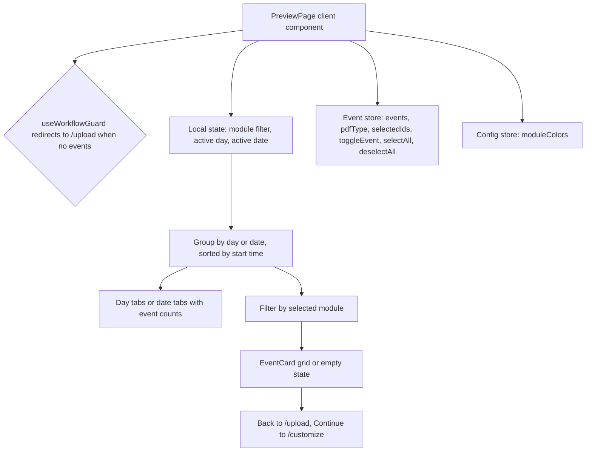

<!-- tyto-docs
tyto_docs: 1
kind: component
unit: frontend/src/app/preview
title: Preview
status: current
written_at_commit: f7f9b56f00529377e8b3ea0933b70acb535d8ff7
written_at: "2026-09-15T11:22:08.501Z"
research: frontend/src/app/preview/DOCS/Research.md
sources: []
accepted:
  at: "2026-09-15T11:27:57.143Z"
  commit: f7f9b56f00529377e8b3ea0933b70acb535d8ff7
  research_fingerprint: "sha256:c7f6566c59a98e76a52a5acbdeedb07bd061315fd014905afe662c7b3901a14d"
  research_findings:
    - research.frontend-src-app-preview.0850ea0f
    - research.frontend-src-app-preview.1c3166a2
    - research.frontend-src-app-preview.28e99b46
    - research.frontend-src-app-preview.297826ca
    - research.frontend-src-app-preview.5ec29b20
    - research.frontend-src-app-preview.61da71e8
    - research.frontend-src-app-preview.73ddce6d
    - research.frontend-src-app-preview.74e2c157
    - research.frontend-src-app-preview.a25a50c8
    - research.frontend-src-app-preview.a41bc9c7
    - research.frontend-src-app-preview.b3310fff
    - research.frontend-src-app-preview.c6ddee13
    - research.frontend-src-app-preview.d59f0bea
    - research.frontend-src-app-preview.eca02c9c
    - research.frontend-src-app-preview.ee0fd1d8
    - research.frontend-src-app-preview.f6e2cbdb
    - research.frontend-src-app-preview.f825922a
    - research.frontend-src-app-preview.fbdcc574
  critic_pass: critic.frontend-src-app-preview.1
  sources:
    - path: frontend/src/app/preview/page.tsx
      blob_sha: 4d167b8c1833e2c706bfa836435ace6d87217098
evidence: Preview.evidence.md
critic:
  attempts: 1
  findings: []
  review_complete: true
  sections_reviewed: 8
  sections_total: 8
  last_reviewed_document: "sha256:17bd220a1ebbde928c15812abc36842ae5a584500048f0ef5274f489b035b8a7"
  retired: []
-->

# Preview

<!-- tyto-docs:generated:status -->
<!-- /tyto-docs:generated:status -->

## [Summary](Preview.evidence.md#summary)

The preview unit owns the schedule review step of the Tuks Schedule Generator: a single client page that displays parsed events grouped by day or date, lets the user filter by module and select events, and hands the selection to the customize step. A dependant can rely on a guarded, mode-aware review surface backed by the shared event and config stores. <!-- ev:research.frontend-src-app-preview.fbdcc574 -->[1](Preview.evidence.md#research.frontend-src-app-preview.fbdcc574) <!-- ev:research.frontend-src-app-preview.74e2c157 -->[2](Preview.evidence.md#research.frontend-src-app-preview.74e2c157)

## [Purpose and boundaries](Preview.evidence.md#purpose-and-boundaries)

| | |
|---|---|
| Owns | The schedule review step of the Tuks Schedule Generator: the preview page that displays parsed events grouped by day or date, filters them by module, and manages the event selection that flows to the customize step. <!-- ev:research.frontend-src-app-preview.fbdcc574 -->[1](Preview.evidence.md#research.frontend-src-app-preview.fbdcc574) <!-- ev:research.frontend-src-app-preview.74e2c157 -->[2](Preview.evidence.md#research.frontend-src-app-preview.74e2c157) |
| Uses | The BulkActions, EventFilter, and EventCard components from '@/components/preview', the Button component from '@/components/common', the event and config stores, the useWorkflowGuard hook, and the ParsedEvent type. <!-- ev:research.frontend-src-app-preview.f6e2cbdb -->[3](Preview.evidence.md#research.frontend-src-app-preview.f6e2cbdb) |
| Does not own | The upload and customize steps, which live in sibling units under frontend/src/app and are not implemented here (inference: the unit holds only page.tsx). <!-- ev:research.frontend-src-app-preview.fbdcc574 -->[1](Preview.evidence.md#research.frontend-src-app-preview.fbdcc574) |

## [How it works](Preview.evidence.md#how-it-works)

PreviewPage, the default export of frontend/src/app/preview/page.tsx, is a client component that invokes useWorkflowGuard('preview'), which redirects to the upload page when there are no events. <!-- ev:research.frontend-src-app-preview.fbdcc574 -->[1](Preview.evidence.md#research.frontend-src-app-preview.fbdcc574) <!-- ev:research.frontend-src-app-preview.d59f0bea -->[4](Preview.evidence.md#research.frontend-src-app-preview.d59f0bea)

The page keeps local state for the module filter (defaulting to 'all'), the active day (defaulting to 'Monday'), and the active date (defaulting to an empty string), and reads events, pdfType, selectedIds, and the toggleEvent, selectAll, and deselectAll actions from the event store, and moduleColors from the config store. <!-- ev:research.frontend-src-app-preview.73ddce6d -->[5](Preview.evidence.md#research.frontend-src-app-preview.73ddce6d) <!-- ev:research.frontend-src-app-preview.74e2c157 -->[2](Preview.evidence.md#research.frontend-src-app-preview.74e2c157)

Events are grouped by day for lecture mode and by date for test and exam modes, with events within each group sorted by start time. <!-- ev:research.frontend-src-app-preview.ee0fd1d8 -->[6](Preview.evidence.md#research.frontend-src-app-preview.ee0fd1d8) The page computes a sorted list of date keys for test and exam modes and sets the active date to the first available date when the pdf type is not lecture and no date is active. <!-- ev:research.frontend-src-app-preview.297826ca -->[7](Preview.evidence.md#research.frontend-src-app-preview.297826ca)

The displayed events are selected from the active day's group in lecture mode or the active date's group in test and exam modes, and are further filtered by the selected module when a module other than 'all' is chosen. <!-- ev:research.frontend-src-app-preview.0850ea0f -->[8](Preview.evidence.md#research.frontend-src-app-preview.0850ea0f) The page derives summary statistics for the total number of events, the number of selected events, and the number of unique modules. <!-- ev:research.frontend-src-app-preview.eca02c9c -->[9](Preview.evidence.md#research.frontend-src-app-preview.eca02c9c)

The page maps each module's color id from the config store to a hex color, returning undefined when a module has no color id. <!-- ev:research.frontend-src-app-preview.1c3166a2 -->[10](Preview.evidence.md#research.frontend-src-app-preview.1c3166a2)

The page title depends on the pdf type: 'Lecture Schedule Preview' for lecture, 'Test Schedule Preview' for test, 'Exam Schedule Preview' for exam, and 'Preview Your Schedule' otherwise. <!-- ev:research.frontend-src-app-preview.c6ddee13 -->[11](Preview.evidence.md#research.frontend-src-app-preview.c6ddee13) The page renders a header containing the mode-dependent title, the subtitle 'Review and select events to include', and compact summary statistics for events, modules, and selected count. <!-- ev:research.frontend-src-app-preview.a25a50c8 -->[12](Preview.evidence.md#research.frontend-src-app-preview.a25a50c8)

The page renders BulkActions and EventFilter controls, and a row of day tabs in lecture mode or date tabs in test and exam modes, each tab showing the count of events in that group. <!-- ev:research.frontend-src-app-preview.f825922a -->[13](Preview.evidence.md#research.frontend-src-app-preview.f825922a) The page renders the filtered events as a grid of EventCard components showing selection state, module color, and pdf type, or an empty-state message naming the active day, date, or module when no events match. <!-- ev:research.frontend-src-app-preview.5ec29b20 -->[14](Preview.evidence.md#research.frontend-src-app-preview.5ec29b20)

The page renders Back and Continue navigation buttons, disables Continue when no events are selected, and shows a warning message asking the user to select at least one event when the selection is empty. <!-- ev:research.frontend-src-app-preview.a41bc9c7 -->[15](Preview.evidence.md#research.frontend-src-app-preview.a41bc9c7) The page navigates to /customize when the user clicks Continue and to /upload when the user clicks Back. <!-- ev:research.frontend-src-app-preview.28e99b46 -->[16](Preview.evidence.md#research.frontend-src-app-preview.28e99b46)

## [Interfaces](Preview.evidence.md#interfaces)

| Name | Input | Output | Guarantee |
|---|---|---|---|
| PreviewPage (default export of page.tsx) | none — the component takes no props (inference) | The schedule review page | Renders the mode-aware preview with filtering, selection, and Back/Continue navigation <!-- ev:research.frontend-src-app-preview.fbdcc574 -->[1](Preview.evidence.md#research.frontend-src-app-preview.fbdcc574) <!-- ev:research.frontend-src-app-preview.a41bc9c7 -->[15](Preview.evidence.md#research.frontend-src-app-preview.a41bc9c7) |

<!-- tyto-docs:generated:endpoints -->
<!-- /tyto-docs:generated:endpoints -->

## Source files

<!-- tyto-docs:generated:file-table -->
<!-- /tyto-docs:generated:file-table -->

## [Dependencies](Preview.evidence.md#dependencies)

The unit's imports are declared in frontend/src/app/preview/page.tsx, which pulls the preview controls, the shared button, the event and config stores, the workflow guard, and the ParsedEvent type. <!-- ev:research.frontend-src-app-preview.f6e2cbdb -->[3](Preview.evidence.md#research.frontend-src-app-preview.f6e2cbdb)

| Dependency | Capability used | Why |
|---|---|---|
| @/components/preview | BulkActions, EventFilter, EventCard | Provide the bulk selection controls, the filter controls, and the per-event cards <!-- ev:research.frontend-src-app-preview.f6e2cbdb -->[3](Preview.evidence.md#research.frontend-src-app-preview.f6e2cbdb) |
| @/components/common | Button component | Powers the Back and Continue navigation buttons <!-- ev:research.frontend-src-app-preview.f6e2cbdb -->[3](Preview.evidence.md#research.frontend-src-app-preview.f6e2cbdb) <!-- ev:research.frontend-src-app-preview.a41bc9c7 -->[15](Preview.evidence.md#research.frontend-src-app-preview.a41bc9c7) |
| event store | events, pdfType, selectedIds, toggleEvent, selectAll, deselectAll | Supplies the parsed events and the selection state the page renders and mutates <!-- ev:research.frontend-src-app-preview.74e2c157 -->[2](Preview.evidence.md#research.frontend-src-app-preview.74e2c157) |
| config store | moduleColors | Supplies the per-module color ids the page maps to hex colors <!-- ev:research.frontend-src-app-preview.74e2c157 -->[2](Preview.evidence.md#research.frontend-src-app-preview.74e2c157) |
| useWorkflowGuard | workflow guard | Redirects to the upload page when there are no events <!-- ev:research.frontend-src-app-preview.d59f0bea -->[4](Preview.evidence.md#research.frontend-src-app-preview.d59f0bea) |
| ParsedEvent type | event shape | Types the events the page groups, filters, and renders <!-- ev:research.frontend-src-app-preview.f6e2cbdb -->[3](Preview.evidence.md#research.frontend-src-app-preview.f6e2cbdb) |

<!-- tyto-docs:generated:module-graph -->
<!-- /tyto-docs:generated:module-graph -->

## [Data model](Preview.evidence.md#data-model)

The unit declares a DayOfWeek type restricted to the five weekdays Monday through Friday and a DAYS_ORDER constant listing those days in that order, and references the ParsedEvent type from the shared types. <!-- ev:research.frontend-src-app-preview.61da71e8 -->[17](Preview.evidence.md#research.frontend-src-app-preview.61da71e8) <!-- ev:research.frontend-src-app-preview.f6e2cbdb -->[3](Preview.evidence.md#research.frontend-src-app-preview.f6e2cbdb)

<!-- tyto-docs:generated:erd -->
<!-- /tyto-docs:generated:erd -->

## [Decisions and limitations](Preview.evidence.md#decisions-and-limitations)

The page is a single client component that keeps its filter and selection state locally and derives everything else from the shared stores, so the review step carries no server-side state of its own. <!-- ev:research.frontend-src-app-preview.73ddce6d -->[5](Preview.evidence.md#research.frontend-src-app-preview.73ddce6d) <!-- ev:research.frontend-src-app-preview.74e2c157 -->[2](Preview.evidence.md#research.frontend-src-app-preview.74e2c157)

The page is documented as 'Preview Page - Display parsed events with selection and filtering' and cites requirements 6.1, 6.2, 6.9, 1.1, 2.1, 3.1, 7.1, and 7.5. <!-- ev:research.frontend-src-app-preview.b3310fff -->[18](Preview.evidence.md#research.frontend-src-app-preview.b3310fff)

<!-- tyto-docs:generated:navigation -->
<!-- /tyto-docs:generated:navigation -->