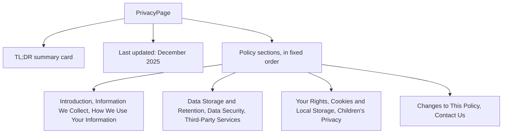

<!-- tyto-docs
tyto_docs: 1
kind: component
unit: frontend/src/app/privacy
title: Privacy
status: draft
written_at_commit: 54ff10ec3c1c30794b2631b06cb113f52787a575
written_at: "2026-09-15T03:08:19.085Z"
research: frontend/src/app/privacy/DOCS/Research.md
sources: []
accepted: null
evidence: Privacy.evidence.md
critic:
  attempts: 0
  findings: []
-->

# Privacy

<!-- tyto-docs:generated:status -->
<!-- /tyto-docs:generated:status -->

## [Summary](Privacy.evidence.md#summary)

The privacy unit owns the Privacy Policy page of the Tuks Schedule Generator: a static, presentational page that explains how the service collects, uses, stores, and protects personal data. A dependant can rely on a complete, self-contained policy document covering data collection, retention, security, third-party services, user rights, and contact details, with no runtime behaviour of its own. <!-- ev:research.frontend-src-app-privacy.06d54963 -->[1](Privacy.evidence.md#research.frontend-src-app-privacy.06d54963) <!-- ev:research.frontend-src-app-privacy.a786a279 -->[2](Privacy.evidence.md#research.frontend-src-app-privacy.a786a279)

## [Purpose and boundaries](Privacy.evidence.md#purpose-and-boundaries)

| | |
|---|---|
| Owns | The Privacy Policy page of the Tuks Schedule Generator service: a static, presentational page headed by the title 'Privacy Policy' that explains the service's data handling. <!-- ev:research.frontend-src-app-privacy.06d54963 -->[1](Privacy.evidence.md#research.frontend-src-app-privacy.06d54963) <!-- ev:research.frontend-src-app-privacy.a786a279 -->[2](Privacy.evidence.md#research.frontend-src-app-privacy.a786a279) |
| Uses | Nothing — the page is static content with no props, state, or data fetching. <!-- ev:research.frontend-src-app-privacy.a786a279 -->[2](Privacy.evidence.md#research.frontend-src-app-privacy.a786a279) |
| Does not own | The Tuks Schedule Generator service itself — PDF parsing, event extraction, and Google Calendar sync — which the page describes but does not implement (inference: the unit holds a single presentational page). <!-- ev:research.frontend-src-app-privacy.173cc638 -->[3](Privacy.evidence.md#research.frontend-src-app-privacy.173cc638) <!-- ev:research.frontend-src-app-privacy.a786a279 -->[2](Privacy.evidence.md#research.frontend-src-app-privacy.a786a279) |

## [How it works](Privacy.evidence.md#how-it-works)

PrivacyPage is a presentational component: it takes no props, holds no state, and performs no data fetching, and its body is a single JSX return of static content. <!-- ev:research.frontend-src-app-privacy.a786a279 -->[2](Privacy.evidence.md#research.frontend-src-app-privacy.a786a279) It renders a static Privacy Policy page for the Tuks Schedule Generator service, headed by the title 'Privacy Policy'. <!-- ev:research.frontend-src-app-privacy.06d54963 -->[1](Privacy.evidence.md#research.frontend-src-app-privacy.06d54963)

The page opens with a 'What you need to know (TL;DR)' summary card listing four key points: PDFs are deleted immediately after processing (zero data retention), email/name/profile picture are held only temporarily for the active session and never saved to a database, events live in the user's Google Calendar rather than on the service's servers, and data is not shared with anyone except Google for the calendar sync. <!-- ev:research.frontend-src-app-privacy.9b291345 -->[4](Privacy.evidence.md#research.frontend-src-app-privacy.9b291345) The text 'Last updated: December 2025' appears beneath the summary card. <!-- ev:research.frontend-src-app-privacy.828771e3 -->[5](Privacy.evidence.md#research.frontend-src-app-privacy.828771e3)

The 'Introduction' section identifies the service as Tuks Schedule Generator ("we", "our", "us") and states the page informs users of the policies regarding the collection, use, and disclosure of personal data when using the service. <!-- ev:research.frontend-src-app-privacy.a7c28641 -->[6](Privacy.evidence.md#research.frontend-src-app-privacy.a7c28641) The 'Information We Collect' section lists Google Account Information (email address, name, and profile picture when signing in with Google), Uploaded Files (PDF schedule files temporarily stored during processing), and Session Data (temporary session information stored in the browser). <!-- ev:research.frontend-src-app-privacy.08b22396 -->[7](Privacy.evidence.md#research.frontend-src-app-privacy.08b22396)

The 'How We Use Your Information' section states the collected information is used to authenticate the user's identity via Google OAuth, to process uploaded PDF schedule files, to create calendar events in the user's Google Calendar, and to provide and maintain the service. <!-- ev:research.frontend-src-app-privacy.ddc51185 -->[8](Privacy.evidence.md#research.frontend-src-app-privacy.ddc51185) The 'Data Storage and Retention' section states the service does not permanently store data after processing is complete: PDF files are deleted immediately after processing (typically within minutes), extracted events are stored temporarily in the browser session only, user account data is stored temporarily in the session for authentication, and calendar events are created directly in the user's Google Calendar and remain there until the user deletes them. <!-- ev:research.frontend-src-app-privacy.b0ee3492 -->[9](Privacy.evidence.md#research.frontend-src-app-privacy.b0ee3492)

The 'Data Security' section states the service implements industry-standard security measures: all data transmission uses HTTPS encryption, uploaded files are processed in isolated secure environments, files are automatically deleted after processing, and data is not shared with third parties except as required to provide the service (Google Calendar API). <!-- ev:research.frontend-src-app-privacy.29d65031 -->[10](Privacy.evidence.md#research.frontend-src-app-privacy.29d65031) The 'Third-Party Services' section lists Google OAuth & Calendar API as the third-party service used for authentication and creating calendar events, and links to Google's privacy policy at https://policies.google.com/privacy. <!-- ev:research.frontend-src-app-privacy.094bff10 -->[11](Privacy.evidence.md#research.frontend-src-app-privacy.094bff10)

The 'Your Rights' section states users can request information about any data the service holds (noting the service does not store any), that there is no account to delete since data is not stored, that Google Calendar access can be revoked at any time through Google Account settings, and that calendar events remain in the user's Google Calendar and can be exported using Google's tools. <!-- ev:research.frontend-src-app-privacy.1eafdc5c -->[12](Privacy.evidence.md#research.frontend-src-app-privacy.1eafdc5c) The 'Cookies and Local Storage' section states the service uses browser local storage to maintain the session and temporarily store extracted events, and that this data is stored only in the browser and is not transmitted to the service's servers except when the user explicitly chooses to sync events to the calendar. <!-- ev:research.frontend-src-app-privacy.2d3ab8cb -->[13](Privacy.evidence.md#research.frontend-src-app-privacy.2d3ab8cb)

The 'Children's Privacy' section states the service is intended for university students and does not knowingly collect information from children under 13, and asks users to contact the service immediately if they believe information from a child under 13 has been collected. <!-- ev:research.frontend-src-app-privacy.f5d5f7e7 -->[14](Privacy.evidence.md#research.frontend-src-app-privacy.f5d5f7e7) The 'Changes to This Policy' section states the Privacy Policy may be updated from time to time, and that users will be notified of any changes by posting the new Privacy Policy on the page and updating the 'Last updated' date. <!-- ev:research.frontend-src-app-privacy.f35515be -->[15](Privacy.evidence.md#research.frontend-src-app-privacy.f35515be) The 'Contact Us' section provides the email address michael@tomlinson.co.za for questions about the Privacy Policy. <!-- ev:research.frontend-src-app-privacy.b9a38460 -->[16](Privacy.evidence.md#research.frontend-src-app-privacy.b9a38460)

## [Interfaces](Privacy.evidence.md#interfaces)

| Name | Input | Output | Guarantee |
|---|---|---|---|
| PrivacyPage (default export) | none — takes no props | A static Privacy Policy page | Renders the complete Privacy Policy for Tuks Schedule Generator as static content, with no state and no data fetching <!-- ev:research.frontend-src-app-privacy.a786a279 -->[2](Privacy.evidence.md#research.frontend-src-app-privacy.a786a279) <!-- ev:research.frontend-src-app-privacy.06d54963 -->[1](Privacy.evidence.md#research.frontend-src-app-privacy.06d54963) |

<!-- tyto-docs:generated:endpoints -->
<!-- /tyto-docs:generated:endpoints -->

## Source files

<!-- tyto-docs:generated:file-table -->
<!-- /tyto-docs:generated:file-table -->

## [Dependencies](Privacy.evidence.md#dependencies)

The page declares no dependencies; it is a single presentational component rendering static content. <!-- ev:research.frontend-src-app-privacy.a786a279 -->[2](Privacy.evidence.md#research.frontend-src-app-privacy.a786a279)

<!-- tyto-docs:generated:module-graph -->
<!-- /tyto-docs:generated:module-graph -->

## [Data model](Privacy.evidence.md#data-model)

This page declares and references no entities (inference: the research records none for this unit). It renders static Privacy Policy text only. <!-- ev:research.frontend-src-app-privacy.a786a279 -->[2](Privacy.evidence.md#research.frontend-src-app-privacy.a786a279)

<!-- tyto-docs:generated:erd -->
<!-- /tyto-docs:generated:erd -->

## [Decisions and limitations](Privacy.evidence.md#decisions-and-limitations)

The page is static: any change to the policy means editing the page source directly, since it takes no props, holds no state, and performs no data fetching. <!-- ev:research.frontend-src-app-privacy.a786a279 -->[2](Privacy.evidence.md#research.frontend-src-app-privacy.a786a279) The 'Last updated: December 2025' date is hard-coded in the page. <!-- ev:research.frontend-src-app-privacy.828771e3 -->[5](Privacy.evidence.md#research.frontend-src-app-privacy.828771e3)

<!-- tyto-docs:generated:navigation -->
<!-- /tyto-docs:generated:navigation -->