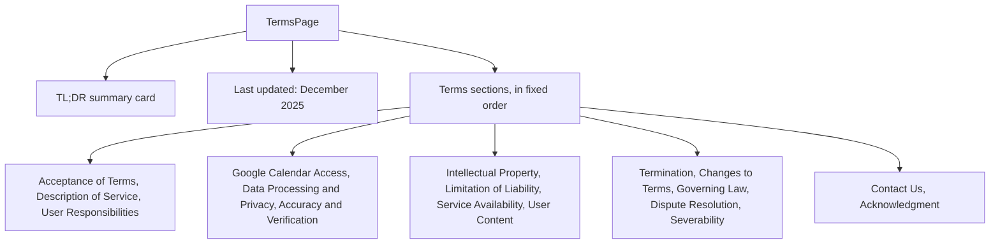

<!-- tyto-docs
tyto_docs: 1
kind: component
unit: frontend/src/app/terms
title: Terms
status: draft
written_at_commit: 28b66165d3e7f4122da1b0c3ef9e53148b75d0e1
written_at: "2026-09-14T18:33:21.181Z"
research: frontend/src/app/terms/DOCS/Research.md
sources: []
accepted: null
evidence: Terms.evidence.md
critic:
  attempts: 2
  findings: []
  review_complete: true
  sections_reviewed: 8
  sections_total: 8
  last_reviewed_document: "sha256:4ef9d03febbdece028dc14b419d4afaef4fdd2a9ec73aed40ea4bec9e78ba9ec"
  retired:
    - key: critic.frontend-src-app-terms.ebd3c353
      finding: "The research records no finding for the page's 'Acceptance of Terms' section (page.tsx L39-L46), which is the first section of the page; the document's 'How it works' prose and its behaviour diagram therefore enumerate the page's sections without it, so the document's claim of 'Terms sections, in fixed order' does not fully represent the page it documents."
      as: resolved
      at: "2026-09-14T18:30:37.195Z"
-->

# Terms

<!-- tyto-docs:generated:status -->
> **Status: Draft**
<!-- /tyto-docs:generated:status -->

## [Summary](Terms.evidence.md#summary)

The terms unit owns the Terms of Service page for the Tuks Schedule Generator service. It renders a static, presentational page that states the service's terms: what the tool does, user responsibilities, Google Calendar access, data processing and privacy, accuracy and verification, liability limits, and the remaining legal provisions. The page takes no props, holds no state, and performs no data fetching. <!-- ev:research.frontend-src-app-terms.118f95e7 -->[1](Terms.evidence.md#research.frontend-src-app-terms.118f95e7) <!-- ev:research.frontend-src-app-terms.709797fa -->[2](Terms.evidence.md#research.frontend-src-app-terms.709797fa)

## [Purpose and boundaries](Terms.evidence.md#purpose-and-boundaries)

| | |
|---|---|
| Owns | The Terms of Service page for the Tuks Schedule Generator service: a static, presentational page headed by the title 'Terms of Service' that presents the service's terms of use. <!-- ev:research.frontend-src-app-terms.118f95e7 -->[1](Terms.evidence.md#research.frontend-src-app-terms.118f95e7) <!-- ev:research.frontend-src-app-terms.709797fa -->[2](Terms.evidence.md#research.frontend-src-app-terms.709797fa) |
| Uses | Nothing — the page is static content with no props, state, or data fetching. <!-- ev:research.frontend-src-app-terms.709797fa -->[2](Terms.evidence.md#research.frontend-src-app-terms.709797fa) |
| Does not own | The Tuks Schedule Generator service itself — PDF parsing, event extraction, and Google Calendar sync — which the page describes but does not implement (inference: the unit holds a single presentational page). <!-- ev:research.frontend-src-app-terms.4cf7b838 -->[3](Terms.evidence.md#research.frontend-src-app-terms.4cf7b838) |

## [How it works](Terms.evidence.md#how-it-works)

TermsPage is a presentational component: it takes no props, holds no state, and performs no data fetching, and its body is a single JSX return of static content. <!-- ev:research.frontend-src-app-terms.709797fa -->[2](Terms.evidence.md#research.frontend-src-app-terms.709797fa) It renders a static Terms of Service page for the Tuks Schedule Generator service, headed by the title 'Terms of Service'. <!-- ev:research.frontend-src-app-terms.118f95e7 -->[1](Terms.evidence.md#research.frontend-src-app-terms.118f95e7)

The page opens with a 'What you need to know (TL;DR)' summary card listing three key points: the tool is accurate but not perfect and users should verify against their official PDF, users are responsible for ensuring their Google Calendar events are correct, and the tool is an unofficial convenience tool rather than an official university service. <!-- ev:research.frontend-src-app-terms.61b52fde -->[4](Terms.evidence.md#research.frontend-src-app-terms.61b52fde) The text 'Last updated: December 2025' appears beneath the summary card. <!-- ev:research.frontend-src-app-terms.6c7397f6 -->[5](Terms.evidence.md#research.frontend-src-app-terms.6c7397f6) The page's first section, 'Acceptance of Terms', states that by accessing and using the Service users accept and agree to be bound by the terms and provisions of the agreement, and that users who do not agree should not use the Service. <!-- ev:research.frontend-src-app-terms.cefb3743 -->[6](Terms.evidence.md#research.frontend-src-app-terms.cefb3743)

The 'Description of Service' section describes Tuks Schedule Generator as a web application that converts University of Pretoria class schedule PDF files into Google Calendar events, allowing users to upload PDF schedule files, extract and preview calendar events, customize event details, and sync events to Google Calendar. <!-- ev:research.frontend-src-app-terms.4cf7b838 -->[3](Terms.evidence.md#research.frontend-src-app-terms.4cf7b838) The 'User Responsibilities' section requires users to provide accurate information, use the Service only for lawful purposes, not attempt unauthorized access, not upload malicious files or content, not abuse, harass, or overload the Service, keep Google account credentials secure, and verify the accuracy of extracted calendar events before syncing. <!-- ev:research.frontend-src-app-terms.1cc14711 -->[7](Terms.evidence.md#research.frontend-src-app-terms.1cc14711)

The 'Google Calendar Access' section states that authorizing access permits the Service to create calendar events on the user's behalf, that events are created only when the user explicitly clicks 'Sync to Calendar', that access can be revoked through Google Account settings, that the user is responsible for managing and deleting events, and that the Service does not modify or delete existing calendar events. <!-- ev:research.frontend-src-app-terms.45748421 -->[8](Terms.evidence.md#research.frontend-src-app-terms.45748421) The 'Data Processing and Privacy' section states that uploaded PDF files are processed and deleted immediately after processing, that schedule data is not permanently stored, that extracted events are stored temporarily in the browser session only, and that calendar events are created directly in the user's Google Calendar. <!-- ev:research.frontend-src-app-terms.eab0bcab -->[9](Terms.evidence.md#research.frontend-src-app-terms.eab0bcab)

The 'Accuracy and Verification' section states that the Service uses automated PDF parsing which may not be 100% accurate, that users are responsible for verifying all extracted information before syncing, that the preview page should be reviewed carefully, and that the Service should not be the user's sole source of schedule information. <!-- ev:research.frontend-src-app-terms.f995cde4 -->[10](Terms.evidence.md#research.frontend-src-app-terms.f995cde4) The 'Intellectual Property' section states that the Service, including its original content, features, and functionality, is owned by the developer and protected by international copyright, trademark, and other intellectual property laws. <!-- ev:research.frontend-src-app-terms.a49db71f -->[11](Terms.evidence.md#research.frontend-src-app-terms.a49db71f)

The 'Limitation of Liability' section states that the Service is provided 'as is' without warranties of any kind, that the Service is not warranted to be uninterrupted or error-free, that the developer is not liable for damages arising from use of the Service, for errors in extracted schedule information, or for missed classes or events due to incorrect calendar entries, and that users use the Service at their own risk. <!-- ev:research.frontend-src-app-terms.ca35d021 -->[12](Terms.evidence.md#research.frontend-src-app-terms.ca35d021) The 'Service Availability' section states that the Service may be temporarily unavailable due to maintenance or technical issues, that the developer reserves the right to modify or discontinue the Service at any time, and that the developer is not liable for any interruption of service. <!-- ev:research.frontend-src-app-terms.c7778567 -->[13](Terms.evidence.md#research.frontend-src-app-terms.c7778567)

The 'User Content' section states that users retain all rights to their uploaded PDF files, grant a temporary license to process files for the purpose of providing the Service, that files are deleted immediately after processing, and that the developer does not claim ownership of user content. <!-- ev:research.frontend-src-app-terms.90d0b869 -->[14](Terms.evidence.md#research.frontend-src-app-terms.90d0b869) The 'Termination' section states that the developer may terminate or suspend access to the Service immediately, without prior notice or liability, for breach of the Terms, abusive or harmful behavior, or violation of applicable laws, and that users may terminate their use at any time by revoking Google Calendar access through their Google Account settings. <!-- ev:research.frontend-src-app-terms.a979360a -->[15](Terms.evidence.md#research.frontend-src-app-terms.a979360a)

The 'Changes to Terms' section states that the developer reserves the right to modify or replace the Terms at any time, and that material revisions will be preceded by at least 30 days' notice before the new terms take effect. <!-- ev:research.frontend-src-app-terms.46862965 -->[16](Terms.evidence.md#research.frontend-src-app-terms.46862965) The 'Governing Law' section states that the Terms are governed and construed in accordance with the laws of South Africa, without regard to its conflict of law provisions. <!-- ev:research.frontend-src-app-terms.bb0a9f1a -->[17](Terms.evidence.md#research.frontend-src-app-terms.bb0a9f1a) The 'Dispute Resolution' section states that disputes arising from the Terms or use of the Service are resolved through good faith negotiation, and if negotiation fails, in the courts of South Africa. <!-- ev:research.frontend-src-app-terms.6081186e -->[18](Terms.evidence.md#research.frontend-src-app-terms.6081186e)

The 'Severability' section states that if any provision of the Terms is held to be unenforceable or invalid, it will be changed and interpreted to accomplish its objectives to the greatest extent possible under applicable law, and the remaining provisions will continue in full force and effect. <!-- ev:research.frontend-src-app-terms.c7a790ee -->[19](Terms.evidence.md#research.frontend-src-app-terms.c7a790ee) The 'Contact Us' section provides the email address michael@tomlinson.co.za for questions about the Terms. <!-- ev:research.frontend-src-app-terms.1e4ef374 -->[20](Terms.evidence.md#research.frontend-src-app-terms.1e4ef374) The 'Acknowledgment' section states that by using the Service, users acknowledge that they have read the Terms of Service and agree to be bound by them. <!-- ev:research.frontend-src-app-terms.0d518f10 -->[21](Terms.evidence.md#research.frontend-src-app-terms.0d518f10)

## [Interfaces](Terms.evidence.md#interfaces)

| Name | Input | Output | Guarantee |
|---|---|---|---|
| TermsPage (default export) | none — takes no props | A static Terms of Service page | Renders the complete Terms of Service for Tuks Schedule Generator as static content, with no state and no data fetching <!-- ev:research.frontend-src-app-terms.f1357926 -->[22](Terms.evidence.md#research.frontend-src-app-terms.f1357926) <!-- ev:research.frontend-src-app-terms.709797fa -->[2](Terms.evidence.md#research.frontend-src-app-terms.709797fa) |

<!-- tyto-docs:generated:endpoints -->
<!-- No framework adapter is active, so no endpoints were extracted for this unit. -->
<!-- /tyto-docs:generated:endpoints -->

## Source files

<!-- tyto-docs:generated:file-table -->
<!-- This unit owns no source files. -->
<!-- /tyto-docs:generated:file-table -->

## [Dependencies](Terms.evidence.md#dependencies)

The page declares no dependencies; it is a single presentational component rendering static content. <!-- ev:research.frontend-src-app-terms.709797fa -->[2](Terms.evidence.md#research.frontend-src-app-terms.709797fa)

<!-- tyto-docs:generated:module-graph -->
<!-- No module dependency graph is available for this unit. -->
<!-- /tyto-docs:generated:module-graph -->

## [Data model](Terms.evidence.md#data-model)

This page declares and references no entities (inference: the research records none for this unit). It renders static Terms of Service text only. <!-- ev:research.frontend-src-app-terms.709797fa -->[2](Terms.evidence.md#research.frontend-src-app-terms.709797fa)

<!-- tyto-docs:generated:erd -->
<!-- This leaf unit has no descendant scope for a focused ERD. -->
<!-- /tyto-docs:generated:erd -->

## [Decisions and limitations](Terms.evidence.md#decisions-and-limitations)

The page is static: any change to the terms means editing the page source directly, since it takes no props, holds no state, and performs no data fetching. <!-- ev:research.frontend-src-app-terms.709797fa -->[2](Terms.evidence.md#research.frontend-src-app-terms.709797fa) The 'Last updated: December 2025' date is hard-coded in the page. <!-- ev:research.frontend-src-app-terms.6c7397f6 -->[5](Terms.evidence.md#research.frontend-src-app-terms.6c7397f6)

<!-- tyto-docs:generated:navigation -->
- **Schedule:** 25 of 30, wave 1
<!-- /tyto-docs:generated:navigation -->