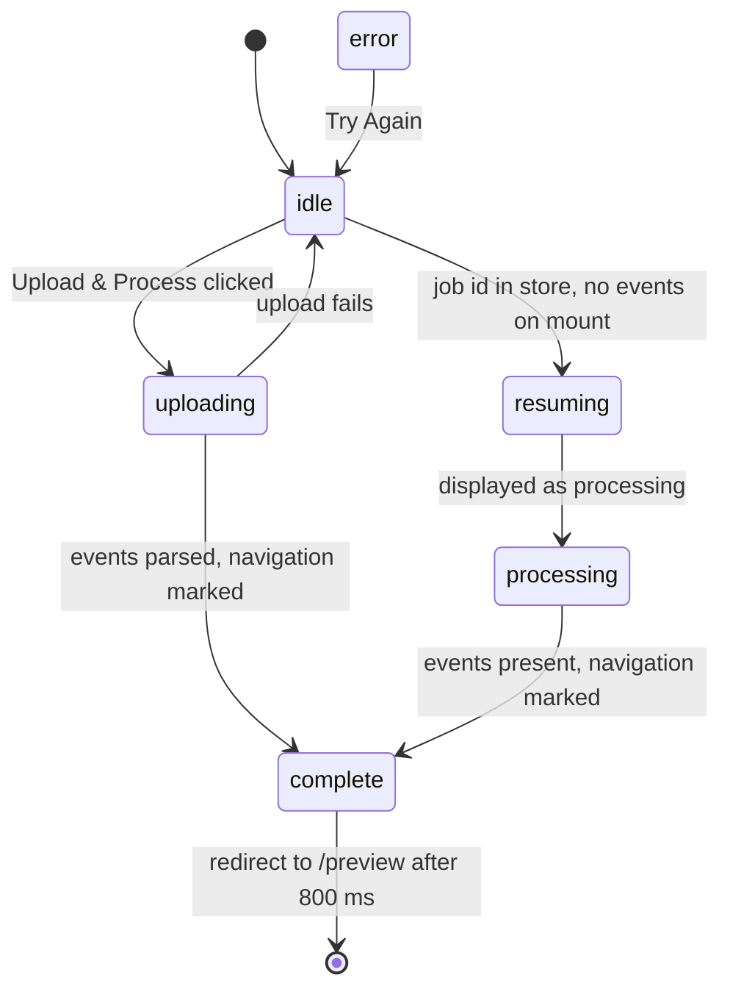

<!-- tyto-docs
tyto_docs: 1
kind: component
unit: frontend/src/app/upload
title: Upload
status: current
written_at_commit: a1e551c096bfc43280b9ef6e8899030fc5f001f5
written_at: "2026-09-15T01:47:50.229Z"
research: frontend/src/app/upload/DOCS/Research.md
sources: []
accepted:
  at: "2026-09-15T01:52:59.124Z"
  commit: a1e551c096bfc43280b9ef6e8899030fc5f001f5
  research_fingerprint: "sha256:86e50f741ec217eeb7d61b63d8a4391741fdbe7f312d3c2c621f063f1d01ff67"
  research_findings:
    - research.frontend-src-app-upload.1dfb9cdd
    - research.frontend-src-app-upload.20aa94bc
    - research.frontend-src-app-upload.4015880b
    - research.frontend-src-app-upload.4101c233
    - research.frontend-src-app-upload.4b13b959
    - research.frontend-src-app-upload.4e08417c
    - research.frontend-src-app-upload.52b1453f
    - research.frontend-src-app-upload.5c6de5b5
    - research.frontend-src-app-upload.8c5555ce
    - research.frontend-src-app-upload.974c9ab1
    - research.frontend-src-app-upload.9f594998
    - research.frontend-src-app-upload.e1e0b822
    - research.frontend-src-app-upload.ec70049a
    - research.frontend-src-app-upload.f55ff60a
    - research.frontend-src-app-upload.f6387d2a
  critic_pass: critic.frontend-src-app-upload.1
  sources:
    - path: frontend/src/app/upload/page.tsx
      blob_sha: c5d3211ce0125032cccaa6324fd2281e68845788
evidence: Upload.evidence.md
critic:
  attempts: 1
  findings: []
  review_complete: true
  sections_reviewed: 8
  sections_total: 8
  last_reviewed_document: "sha256:82bd9b4300ab82646a1573e71609e7262289273d24c9c1641e18f6b622a902e1"
  retired: []
-->

# Upload

<!-- tyto-docs:generated:status -->
<!-- /tyto-docs:generated:status -->

## [Summary](Upload.evidence.md#summary)

The upload unit owns the page where a user submits a UP PDF schedule: it collects the file, uploads it through the API, shows progress, and hands the parsed events to the preview step. A dependant can rely on a single page that drives the upload lifecycle from file selection through completion and redirects to /preview after a successful upload. <!-- ev:research.frontend-src-app-upload.1dfb9cdd -->[1](Upload.evidence.md#research.frontend-src-app-upload.1dfb9cdd) <!-- ev:research.frontend-src-app-upload.ec70049a -->[2](Upload.evidence.md#research.frontend-src-app-upload.ec70049a) <!-- ev:research.frontend-src-app-upload.e1e0b822 -->[3](Upload.evidence.md#research.frontend-src-app-upload.e1e0b822) <!-- ev:research.frontend-src-app-upload.4b13b959 -->[4](Upload.evidence.md#research.frontend-src-app-upload.4b13b959)

## [Purpose and boundaries](Upload.evidence.md#purpose-and-boundaries)

| | |
|---|---|
| Owns | The upload page, frontend/src/app/upload/page.tsx, a Next.js App Router client component that default-exports UploadPage. It owns the whole upload workflow: file selection, upload, progress display, and the redirect to /preview after a successful upload. <!-- ev:research.frontend-src-app-upload.1dfb9cdd -->[1](Upload.evidence.md#research.frontend-src-app-upload.1dfb9cdd) <!-- ev:research.frontend-src-app-upload.ec70049a -->[2](Upload.evidence.md#research.frontend-src-app-upload.ec70049a) <!-- ev:research.frontend-src-app-upload.e1e0b822 -->[3](Upload.evidence.md#research.frontend-src-app-upload.e1e0b822) |
| Uses | The useUpload and useJobStatus hooks from @/hooks, the useEventStore from @/stores/eventStore, the DropZone, FilePreview, and UploadProgress components from @/components/upload, the Button component from @/components/common, and useRouter from next/navigation. <!-- ev:research.frontend-src-app-upload.4015880b -->[5](Upload.evidence.md#research.frontend-src-app-upload.4015880b) <!-- ev:research.frontend-src-app-upload.4b13b959 -->[4](Upload.evidence.md#research.frontend-src-app-upload.4b13b959) |
| Does not own | The upload, job-status, and event-store logic itself, which lives in the hooks and store the page consumes, and the upload components it renders (inference: the unit holds only page.tsx). <!-- ev:research.frontend-src-app-upload.1dfb9cdd -->[1](Upload.evidence.md#research.frontend-src-app-upload.1dfb9cdd) |

## [How it works](Upload.evidence.md#how-it-works)

UploadPage models its workflow with an UploadPhase state machine whose values are 'idle', 'uploading', 'processing', and 'resuming', initialized to 'idle'. <!-- ev:research.frontend-src-app-upload.4e08417c -->[6](Upload.evidence.md#research.frontend-src-app-upload.4e08417c) On mount, when a job id exists in the event store but no events have been recorded, the page enters the 'resuming' phase so job-status polling can resume. <!-- ev:research.frontend-src-app-upload.f6387d2a -->[7](Upload.evidence.md#research.frontend-src-app-upload.f6387d2a) While in the 'processing' or 'resuming' phases the page polls job status through useJobStatus, using only the hook's error field for display. <!-- ev:research.frontend-src-app-upload.f55ff60a -->[8](Upload.evidence.md#research.frontend-src-app-upload.f55ff60a)

Selecting or removing a file resets the phase to 'idle', clears the navigation flag, prevents the mount-time resume check, and resets the upload hook. <!-- ev:research.frontend-src-app-upload.9f594998 -->[9](Upload.evidence.md#research.frontend-src-app-upload.9f594998) The upload flow sets the phase to 'uploading', calls the upload function from useUpload with the selected file, and on success with parsed events marks navigation and redirects to /preview after an 800 ms delay; on failure it resets the phase to 'idle' to allow a retry. <!-- ev:research.frontend-src-app-upload.e1e0b822 -->[3](Upload.evidence.md#research.frontend-src-app-upload.e1e0b822) The retry handler clears the job id and job status in the event store, resets the phase to 'idle', clears the navigation flag, prevents the resume check, and resets the upload hook. <!-- ev:research.frontend-src-app-upload.20aa94bc -->[10](Upload.evidence.md#research.frontend-src-app-upload.20aa94bc)

The page derives a display status and error message from upload errors, job-status errors, the event store, and the current phase: errors take priority, a completed navigation with events present maps to 'complete', and the 'resuming' phase is displayed as 'processing'. <!-- ev:research.frontend-src-app-upload.5c6de5b5 -->[11](Upload.evidence.md#research.frontend-src-app-upload.5c6de5b5) During the 'processing' phase the page simulates progress with a local processingProgress state that increments every 500 ms and is capped at 90%. <!-- ev:research.frontend-src-app-upload.52b1453f -->[12](Upload.evidence.md#research.frontend-src-app-upload.52b1453f) The display progress is the real upload progress while uploading, the simulated processing progress while processing, 100% when complete, and 0 otherwise. <!-- ev:research.frontend-src-app-upload.974c9ab1 -->[13](Upload.evidence.md#research.frontend-src-app-upload.974c9ab1)

The page shows 'Resuming job...' while resuming, 'Processing PDF... This may take up to a minute.' while uploading or processing, and otherwise the derived error message. <!-- ev:research.frontend-src-app-upload.8c5555ce -->[14](Upload.evidence.md#research.frontend-src-app-upload.8c5555ce) It renders a DropZone when no file is selected and a FilePreview otherwise, an UploadProgress indicator during uploading, processing, complete, and error states, a 'Try Again' button on error, and an 'Upload & Process' button when a file is selected and the status is idle. <!-- ev:research.frontend-src-app-upload.ec70049a -->[2](Upload.evidence.md#research.frontend-src-app-upload.ec70049a)

## [Interfaces](Upload.evidence.md#interfaces)

| Name | Input | Output | Guarantee |
|---|---|---|---|
| UploadPage (default export) | none — the component takes no props (inference) | The upload page | Drives the upload workflow from file selection through completion, showing progress and error states, and redirects to /preview after a successful upload <!-- ev:research.frontend-src-app-upload.1dfb9cdd -->[1](Upload.evidence.md#research.frontend-src-app-upload.1dfb9cdd) <!-- ev:research.frontend-src-app-upload.ec70049a -->[2](Upload.evidence.md#research.frontend-src-app-upload.ec70049a) <!-- ev:research.frontend-src-app-upload.e1e0b822 -->[3](Upload.evidence.md#research.frontend-src-app-upload.e1e0b822) |

<!-- tyto-docs:generated:endpoints -->
<!-- /tyto-docs:generated:endpoints -->

## Source files

<!-- tyto-docs:generated:file-table -->
<!-- /tyto-docs:generated:file-table -->

## [Dependencies](Upload.evidence.md#dependencies)

The page's imports are declared in frontend/src/app/upload/page.tsx. <!-- ev:research.frontend-src-app-upload.4015880b -->[5](Upload.evidence.md#research.frontend-src-app-upload.4015880b)

| Dependency | Capability used | Why |
|---|---|---|
| @/hooks (useUpload, useJobStatus) | File upload with progress and job-status polling | Uploads the selected file and reports progress and errors; polls job status during processing and resuming <!-- ev:research.frontend-src-app-upload.4015880b -->[5](Upload.evidence.md#research.frontend-src-app-upload.4015880b) <!-- ev:research.frontend-src-app-upload.f55ff60a -->[8](Upload.evidence.md#research.frontend-src-app-upload.f55ff60a) |
| @/stores/eventStore (useEventStore) | Job id, events, and job status persistence | Holds the job id and parsed events that drive resume, retry, and completion <!-- ev:research.frontend-src-app-upload.4015880b -->[5](Upload.evidence.md#research.frontend-src-app-upload.4015880b) <!-- ev:research.frontend-src-app-upload.f6387d2a -->[7](Upload.evidence.md#research.frontend-src-app-upload.f6387d2a) <!-- ev:research.frontend-src-app-upload.20aa94bc -->[10](Upload.evidence.md#research.frontend-src-app-upload.20aa94bc) |
| @/components/upload (DropZone, FilePreview, UploadProgress) | File selection, preview, and progress display | Renders the file drop zone, the selected file preview, and the progress indicator <!-- ev:research.frontend-src-app-upload.4015880b -->[5](Upload.evidence.md#research.frontend-src-app-upload.4015880b) <!-- ev:research.frontend-src-app-upload.ec70049a -->[2](Upload.evidence.md#research.frontend-src-app-upload.ec70049a) |
| @/components/common (Button) | Action buttons | Powers the 'Upload & Process' and 'Try Again' actions <!-- ev:research.frontend-src-app-upload.4015880b -->[5](Upload.evidence.md#research.frontend-src-app-upload.4015880b) <!-- ev:research.frontend-src-app-upload.ec70049a -->[2](Upload.evidence.md#research.frontend-src-app-upload.ec70049a) |
| next/navigation (useRouter) | Client-side routing | Navigates to /preview after a successful upload <!-- ev:research.frontend-src-app-upload.4b13b959 -->[4](Upload.evidence.md#research.frontend-src-app-upload.4b13b959) |

<!-- tyto-docs:generated:module-graph -->
<!-- /tyto-docs:generated:module-graph -->

## [Data model](Upload.evidence.md#data-model)

This unit declares no entities of its own; it reads and writes the event store's job id, events, and job status through useEventStore. <!-- ev:research.frontend-src-app-upload.4015880b -->[5](Upload.evidence.md#research.frontend-src-app-upload.4015880b) <!-- ev:research.frontend-src-app-upload.f6387d2a -->[7](Upload.evidence.md#research.frontend-src-app-upload.f6387d2a) <!-- ev:research.frontend-src-app-upload.20aa94bc -->[10](Upload.evidence.md#research.frontend-src-app-upload.20aa94bc)

<!-- tyto-docs:generated:erd -->
<!-- /tyto-docs:generated:erd -->

## [Decisions and limitations](Upload.evidence.md#decisions-and-limitations)

The page contains an effect that emulates progress during the 'processing' phase but never stores its computed value, making it dead code; the displayed simulated progress comes from a separate processingProgress state effect. <!-- ev:research.frontend-src-app-upload.4101c233 -->[15](Upload.evidence.md#research.frontend-src-app-upload.4101c233)

The page holds a completion state for 800 ms before redirecting to /preview, and simulates processing progress capped at 90% until completion. <!-- ev:research.frontend-src-app-upload.e1e0b822 -->[3](Upload.evidence.md#research.frontend-src-app-upload.e1e0b822) <!-- ev:research.frontend-src-app-upload.52b1453f -->[12](Upload.evidence.md#research.frontend-src-app-upload.52b1453f)

<!-- tyto-docs:generated:navigation -->
<!-- /tyto-docs:generated:navigation -->