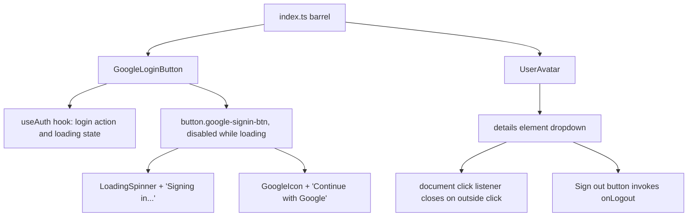

<!-- tyto-docs
tyto_docs: 1
kind: component
unit: frontend/src/components/auth
title: Auth
status: draft
written_at_commit: 0a54880da611d9c7e4ea67064b17ed0c465e1f7b
written_at: "2026-09-15T00:38:08.984Z"
research: frontend/src/components/auth/DOCS/Research.md
sources: []
accepted: null
evidence: Auth.evidence.md
critic:
  attempts: 0
  findings: []
-->

# Auth

<!-- tyto-docs:generated:status -->
> **Status: Draft**
<!-- /tyto-docs:generated:status -->

## [Summary](Auth.evidence.md#summary)

The auth components unit owns the sign-in and account UI of the Tuks Schedule Generator frontend: GoogleLoginButton, a Google OAuth sign-in button that delegates the login action and loading state to the useAuth hook, and UserAvatar, a user avatar with a logout dropdown, re-exported with their prop types from a single barrel module. A dependant can rely on a branded Google sign-in entry point and a user menu for signing out. <!-- ev:research.frontend-src-components-auth.303282e0 -->[1](Auth.evidence.md#research.frontend-src-components-auth.303282e0) <!-- ev:research.frontend-src-components-auth.bb264047 -->[2](Auth.evidence.md#research.frontend-src-components-auth.bb264047) <!-- ev:research.frontend-src-components-auth.3458c6e3 -->[3](Auth.evidence.md#research.frontend-src-components-auth.3458c6e3)

## [Purpose and boundaries](Auth.evidence.md#purpose-and-boundaries)

| | |
|---|---|
| Owns | The two auth UI components of the frontend — GoogleLoginButton and UserAvatar — implemented as client components in frontend/src/components/auth, together with the barrel module index.ts that re-exports each component and its prop types. <!-- ev:research.frontend-src-components-auth.303282e0 -->[1](Auth.evidence.md#research.frontend-src-components-auth.303282e0) <!-- ev:research.frontend-src-components-auth.bb264047 -->[2](Auth.evidence.md#research.frontend-src-components-auth.bb264047) <!-- ev:research.frontend-src-components-auth.3458c6e3 -->[3](Auth.evidence.md#research.frontend-src-components-auth.3458c6e3) |
| Uses | The useAuth hook for the login action and loading state behind GoogleLoginButton, and the AuthUser type for the user prop of UserAvatar. <!-- ev:research.frontend-src-components-auth.303282e0 -->[1](Auth.evidence.md#research.frontend-src-components-auth.303282e0) <!-- ev:research.frontend-src-components-auth.b59e649e -->[4](Auth.evidence.md#research.frontend-src-components-auth.b59e649e) |
| Does not own | The authentication logic itself, which lives in the useAuth hook outside this unit (inference: the findings record that GoogleLoginButton delegates to the hook, but no hook implementation is recorded in this unit). <!-- ev:research.frontend-src-components-auth.303282e0 -->[1](Auth.evidence.md#research.frontend-src-components-auth.303282e0) |

## [How it works](Auth.evidence.md#how-it-works)

GoogleLoginButton is a client component that renders a Google OAuth sign-in button and delegates the login action and loading state to the useAuth hook. <!-- ev:research.frontend-src-components-auth.303282e0 -->[1](Auth.evidence.md#research.frontend-src-components-auth.303282e0)

It renders a button with the CSS class 'google-signin-btn' plus any caller-supplied className, is disabled while the login is loading, and carries the aria-label 'Sign in with Google'. <!-- ev:research.frontend-src-components-auth.458794a1 -->[5](Auth.evidence.md#research.frontend-src-components-auth.458794a1)

While loading it shows a LoadingSpinner and the text 'Signing in...'; otherwise it shows a GoogleIcon and the text 'Continue with Google'. <!-- ev:research.frontend-src-components-auth.0d0488ed -->[6](Auth.evidence.md#research.frontend-src-components-auth.0d0488ed) GoogleIcon is a module-private SVG component rendering the official Google 'G' logo in the four brand colors, and LoadingSpinner is a module-private SVG component rendering an animated (animate-spin) loading spinner. <!-- ev:research.frontend-src-components-auth.17a055dc -->[7](Auth.evidence.md#research.frontend-src-components-auth.17a055dc) <!-- ev:research.frontend-src-components-auth.bf0ad798 -->[8](Auth.evidence.md#research.frontend-src-components-auth.bf0ad798)

UserAvatar is a client component that renders a user avatar with a dropdown menu built on the HTML 
 element. <!-- ev:research.frontend-src-components-auth.bb264047 -->[2](Auth.evidence.md#research.frontend-src-components-auth.bb264047) It closes the dropdown when a click occurs outside the details element, via a document-level click listener registered in a useEffect. <!-- ev:research.frontend-src-components-auth.84bd8abf -->[9](Auth.evidence.md#research.frontend-src-components-auth.84bd8abf)

Its handleLogout closes the dropdown and then invokes the onLogout prop. <!-- ev:research.frontend-src-components-auth.141f699a -->[10](Auth.evidence.md#research.frontend-src-components-auth.141f699a) The dropdown displays the user's picture, first and last name, and email, and includes a 'Sign out' button styled with the text-error class. <!-- ev:research.frontend-src-components-auth.182bea78 -->[11](Auth.evidence.md#research.frontend-src-components-auth.182bea78) LogoutIcon is a module-private SVG component that renders a logout arrow icon. <!-- ev:research.frontend-src-components-auth.fd99686a -->[12](Auth.evidence.md#research.frontend-src-components-auth.fd99686a)

index.ts re-exports GoogleLoginButton and its GoogleLoginButtonProps type, and UserAvatar and its UserAvatarProps type. <!-- ev:research.frontend-src-components-auth.3458c6e3 -->[3](Auth.evidence.md#research.frontend-src-components-auth.3458c6e3)

## [Interfaces](Auth.evidence.md#interfaces)

| Name | Input | Output | Guarantee |
|---|---|---|---|
| GoogleLoginButton | className?: string | A Google OAuth sign-in button | Renders a 'google-signin-btn' button that delegates login to the useAuth hook, is disabled while loading, and follows Google branding <!-- ev:research.frontend-src-components-auth.4e3c25c4 -->[13](Auth.evidence.md#research.frontend-src-components-auth.4e3c25c4) <!-- ev:research.frontend-src-components-auth.458794a1 -->[5](Auth.evidence.md#research.frontend-src-components-auth.458794a1) <!-- ev:research.frontend-src-components-auth.303282e0 -->[1](Auth.evidence.md#research.frontend-src-components-auth.303282e0) |
| UserAvatar | user: AuthUser, onLogout: () => void | A user avatar with a dropdown menu | Renders the user's picture, name, and email with a 'Sign out' button that invokes onLogout <!-- ev:research.frontend-src-components-auth.b59e649e -->[4](Auth.evidence.md#research.frontend-src-components-auth.b59e649e) <!-- ev:research.frontend-src-components-auth.182bea78 -->[11](Auth.evidence.md#research.frontend-src-components-auth.182bea78) <!-- ev:research.frontend-src-components-auth.141f699a -->[10](Auth.evidence.md#research.frontend-src-components-auth.141f699a) |
| index.ts (barrel) | — | Re-exports of the two components and their prop types | A single import point for the unit's public surface <!-- ev:research.frontend-src-components-auth.3458c6e3 -->[3](Auth.evidence.md#research.frontend-src-components-auth.3458c6e3) |

<!-- tyto-docs:generated:endpoints -->
<!-- No framework adapter is active, so no endpoints were extracted for this unit. -->
<!-- /tyto-docs:generated:endpoints -->

## Source files

<!-- tyto-docs:generated:file-table -->
<!-- This unit owns no source files. -->
<!-- /tyto-docs:generated:file-table -->

## [Dependencies](Auth.evidence.md#dependencies)

The unit's components are built on React and delegate authentication to the useAuth hook. <!-- ev:research.frontend-src-components-auth.303282e0 -->[1](Auth.evidence.md#research.frontend-src-components-auth.303282e0) <!-- ev:research.frontend-src-components-auth.bb264047 -->[2](Auth.evidence.md#research.frontend-src-components-auth.bb264047)

| Dependency | Capability used | Why |
|---|---|---|
| useAuth hook | Login action and loading state | GoogleLoginButton delegates the sign-in action and its loading state to the hook <!-- ev:research.frontend-src-components-auth.303282e0 -->[1](Auth.evidence.md#research.frontend-src-components-auth.303282e0) |
| AuthUser type | User identity | UserAvatar requires a user of type AuthUser to render the avatar and dropdown <!-- ev:research.frontend-src-components-auth.b59e649e -->[4](Auth.evidence.md#research.frontend-src-components-auth.b59e649e) |
| React | Component and hook primitives | Both components are client components, and UserAvatar registers a document-level click listener in a useEffect <!-- ev:research.frontend-src-components-auth.303282e0 -->[1](Auth.evidence.md#research.frontend-src-components-auth.303282e0) <!-- ev:research.frontend-src-components-auth.bb264047 -->[2](Auth.evidence.md#research.frontend-src-components-auth.bb264047) <!-- ev:research.frontend-src-components-auth.84bd8abf -->[9](Auth.evidence.md#research.frontend-src-components-auth.84bd8abf) |

<!-- tyto-docs:generated:module-graph -->
<!-- No module dependency graph is available for this unit. -->
<!-- /tyto-docs:generated:module-graph -->

## [Data model](Auth.evidence.md#data-model)

This unit declares no entities; the components render UI driven by their props, with UserAvatar's user prop typed as AuthUser, a type defined outside this unit (inference: the findings record the reference but no definition in this unit). <!-- ev:research.frontend-src-components-auth.b59e649e -->[4](Auth.evidence.md#research.frontend-src-components-auth.b59e649e)

<!-- tyto-docs:generated:erd -->
<!-- This leaf unit has no descendant scope for a focused ERD. -->
<!-- /tyto-docs:generated:erd -->

## [Decisions and limitations](Auth.evidence.md#decisions-and-limitations)

Both components are client components ('use client' directive), so they render and interact on the client; the unit exports no server components. <!-- ev:research.frontend-src-components-auth.303282e0 -->[1](Auth.evidence.md#research.frontend-src-components-auth.303282e0) <!-- ev:research.frontend-src-components-auth.bb264047 -->[2](Auth.evidence.md#research.frontend-src-components-auth.bb264047)

GoogleLoginButton is documented as following Google's branding guidelines and as satisfying requirements 3.1 and 7.1; UserAvatar is documented as satisfying requirements 3.3 and 3.4. <!-- ev:research.frontend-src-components-auth.9d828014 -->[14](Auth.evidence.md#research.frontend-src-components-auth.9d828014) <!-- ev:research.frontend-src-components-auth.5364eb81 -->[15](Auth.evidence.md#research.frontend-src-components-auth.5364eb81)

<!-- tyto-docs:generated:navigation -->
- **Schedule:** 27 of 30, wave 1
<!-- /tyto-docs:generated:navigation -->