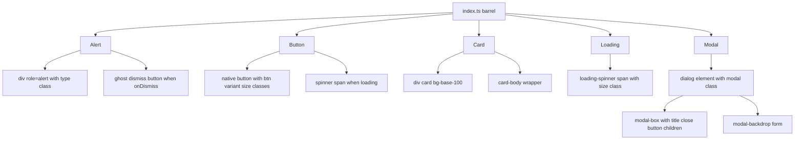

<!-- tyto-docs
tyto_docs: 1
kind: component
unit: frontend/src/components/common
title: Common
status: current
written_at_commit: cf47c9c68f3edce31993084b317f60401e8ff97f
written_at: "2026-09-15T06:10:34.022Z"
research: frontend/src/components/common/DOCS/Research.md
sources: []
accepted:
  at: "2026-09-15T06:13:39.837Z"
  commit: cf47c9c68f3edce31993084b317f60401e8ff97f
  research_fingerprint: "sha256:b38cbd8378e937e74773a42c611b60057fa2368a4a78b5f3de8f55240c9c5bbe"
  research_findings:
    - research.frontend-src-components-common.1da5943e
    - research.frontend-src-components-common.206ce3a0
    - research.frontend-src-components-common.3a868828
    - research.frontend-src-components-common.4c93d27b
    - research.frontend-src-components-common.50ccbeea
    - research.frontend-src-components-common.513b77f1
    - research.frontend-src-components-common.67d14761
    - research.frontend-src-components-common.71789013
    - research.frontend-src-components-common.80dbf7cf
    - research.frontend-src-components-common.8146bcfd
    - research.frontend-src-components-common.836f7ded
    - research.frontend-src-components-common.8fc44071
    - research.frontend-src-components-common.a2a4d929
    - research.frontend-src-components-common.d0e43f76
    - research.frontend-src-components-common.f9bbb9f7
  critic_pass: critic.frontend-src-components-common.2
  sources:
    - path: frontend/src/components/common/Alert.tsx
      blob_sha: 45e80dc3ab6d067e3e24f205d8f1db604e7b5925
    - path: frontend/src/components/common/Button.tsx
      blob_sha: 5bdd051ef172f715e08776a06c6358c5363991f9
    - path: frontend/src/components/common/Card.tsx
      blob_sha: cbbb554d5121e77c823f62c7eac16034fefc795c
    - path: frontend/src/components/common/Loading.tsx
      blob_sha: 84f7e41162ca3f5c35594a745ad4ec853b661ea1
    - path: frontend/src/components/common/Modal.tsx
      blob_sha: 2a680719d31ca6d04866104433510d35e22e1740
    - path: frontend/src/components/common/index.ts
      blob_sha: 4fab4baba5649f0f980d81be939b4d00c28030f0
evidence: Common.evidence.md
critic:
  attempts: 2
  findings: []
  review_complete: true
  sections_reviewed: 8
  sections_total: 8
  last_reviewed_document: "sha256:8a956ec5ffb50de3fa81589e63076c8630bf1f6b33e6eb7d78397c4f9ac08309"
  retired: []
-->

# Common

<!-- tyto-docs:generated:status -->
> **Status: Draft**
<!-- /tyto-docs:generated:status -->

## [Summary](Common.evidence.md#summary)

The common components unit owns the shared UI primitives of the Tuks Schedule Generator frontend: Alert, Button, Card, Loading, and Modal, re-exported with their prop types from a single barrel module. A dependant can rely on a consistent set of DaisyUI-styled building blocks for status messages, actions, content containers, loading states, and dialogs across the application. <!-- ev:research.frontend-src-components-common.4c93d27b -->[1](Common.evidence.md#research.frontend-src-components-common.4c93d27b) <!-- ev:research.frontend-src-components-common.71789013 -->[2](Common.evidence.md#research.frontend-src-components-common.71789013)

## [Purpose and boundaries](Common.evidence.md#purpose-and-boundaries)

| | |
|---|---|
| Owns | The five shared UI primitives of the frontend — Alert, Button, Card, Loading, and Modal — implemented as client components in frontend/src/components/common, together with the barrel module index.ts that re-exports each component and its prop types. <!-- ev:research.frontend-src-components-common.71789013 -->[2](Common.evidence.md#research.frontend-src-components-common.71789013) <!-- ev:research.frontend-src-components-common.4c93d27b -->[1](Common.evidence.md#research.frontend-src-components-common.4c93d27b) |
| Uses | React for component and hook types (React.ReactNode, React.ButtonHTMLAttributes, useEffect) and DaisyUI utility classes for styling. <!-- ev:research.frontend-src-components-common.8fc44071 -->[3](Common.evidence.md#research.frontend-src-components-common.8fc44071) <!-- ev:research.frontend-src-components-common.a2a4d929 -->[4](Common.evidence.md#research.frontend-src-components-common.a2a4d929) <!-- ev:research.frontend-src-components-common.1da5943e -->[5](Common.evidence.md#research.frontend-src-components-common.1da5943e) |
| Does not own | Feature-specific components and pages, which are not implemented in this unit (inference: the research records only Alert.tsx, Button.tsx, Card.tsx, Loading.tsx, Modal.tsx, and index.ts here). <!-- ev:research.frontend-src-components-common.71789013 -->[2](Common.evidence.md#research.frontend-src-components-common.71789013) |

## [How it works](Common.evidence.md#how-it-works)

All five components — Alert, Button, Card, Loading, and Modal — are client components, each file beginning with the 'use client' directive, and index.ts re-exports them together with their prop types as a single import point. <!-- ev:research.frontend-src-components-common.71789013 -->[2](Common.evidence.md#research.frontend-src-components-common.71789013) <!-- ev:research.frontend-src-components-common.4c93d27b -->[1](Common.evidence.md#research.frontend-src-components-common.4c93d27b)

Alert renders a dismissible status message: a div with role="alert" whose className combines the base 'alert' class with a type-specific class from typeClasses — alert-info, alert-success, alert-warning, or alert-error — containing the message text and, when onDismiss is provided, a ghost button with an X icon that invokes onDismiss. <!-- ev:research.frontend-src-components-common.d0e43f76 -->[6](Common.evidence.md#research.frontend-src-components-common.d0e43f76) <!-- ev:research.frontend-src-components-common.1da5943e -->[5](Common.evidence.md#research.frontend-src-components-common.1da5943e)

Button renders a native button element whose className is built from the base 'btn' class, the variant class, the size class, and any caller-supplied className joined with spaces; the button is disabled when either disabled or loading is true, and a spinner span is rendered before the children when loading is true. variantClasses maps each Button variant to a DaisyUI class (primary to btn-primary, secondary to btn-secondary, ghost to btn-ghost, outline to btn-outline) and sizeClasses maps each size (sm to btn-sm, md to btn-md, lg to btn-lg); Button defaults variant to 'primary', size to 'md', and loading to false. <!-- ev:research.frontend-src-components-common.80dbf7cf -->[7](Common.evidence.md#research.frontend-src-components-common.80dbf7cf) <!-- ev:research.frontend-src-components-common.206ce3a0 -->[8](Common.evidence.md#research.frontend-src-components-common.206ce3a0)

Card renders a div with the classes 'card' and 'bg-base-100', adding 'card-border' when bordered is true and any caller-supplied className, and wraps its children in a 'card-body' div. <!-- ev:research.frontend-src-components-common.513b77f1 -->[9](Common.evidence.md#research.frontend-src-components-common.513b77f1)

Loading renders a flex container with a spinner span carrying the 'loading loading-spinner' classes plus a size class (defaulting to 'md'), and an optional text span rendered when text is provided. <!-- ev:research.frontend-src-components-common.f9bbb9f7 -->[10](Common.evidence.md#research.frontend-src-components-common.f9bbb9f7)

Modal renders a native <dialog> element with the class 'modal'; a useEffect calls showModal() when isOpen becomes true and close() when it becomes false, and onClose is invoked both from the dialog's onClose event and when a click on the dialog element itself (the backdrop) is detected. Inside, a 'modal-box' div holds an optional title heading, a circular ghost close button labelled 'Close modal' that invokes onClose, and the children, followed by a 'modal-backdrop' form whose close button also invokes onClose. <!-- ev:research.frontend-src-components-common.a2a4d929 -->[4](Common.evidence.md#research.frontend-src-components-common.a2a4d929) <!-- ev:research.frontend-src-components-common.67d14761 -->[11](Common.evidence.md#research.frontend-src-components-common.67d14761)

## [Interfaces](Common.evidence.md#interfaces)

| Name | Input | Output | Guarantee |
|---|---|---|---|
| Alert | type: 'info' \| 'success' \| 'warning' \| 'error', message: string, onDismiss?: () => void | A dismissible status message | Renders a role="alert" div with the type-specific DaisyUI class and an optional dismiss button that invokes onDismiss <!-- ev:research.frontend-src-components-common.50ccbeea -->[12](Common.evidence.md#research.frontend-src-components-common.50ccbeea) <!-- ev:research.frontend-src-components-common.d0e43f76 -->[6](Common.evidence.md#research.frontend-src-components-common.d0e43f76) |
| Button | variant?, size?, loading?, children, plus native button attributes | A native button element | Applies the btn, variant, and size classes, disables when disabled or loading, and shows a spinner when loading <!-- ev:research.frontend-src-components-common.8fc44071 -->[3](Common.evidence.md#research.frontend-src-components-common.8fc44071) <!-- ev:research.frontend-src-components-common.80dbf7cf -->[7](Common.evidence.md#research.frontend-src-components-common.80dbf7cf) |
| Card | children, bordered?, className? | A card container | Renders a 'card' div with 'bg-base-100', optional 'card-border', and a 'card-body' wrapper <!-- ev:research.frontend-src-components-common.8146bcfd -->[13](Common.evidence.md#research.frontend-src-components-common.8146bcfd) <!-- ev:research.frontend-src-components-common.513b77f1 -->[9](Common.evidence.md#research.frontend-src-components-common.513b77f1) |
| Loading | size?, text? | A spinner with optional label | Renders a 'loading loading-spinner' span with the size class and optional text <!-- ev:research.frontend-src-components-common.836f7ded -->[14](Common.evidence.md#research.frontend-src-components-common.836f7ded) <!-- ev:research.frontend-src-components-common.f9bbb9f7 -->[10](Common.evidence.md#research.frontend-src-components-common.f9bbb9f7) |
| Modal | isOpen, onClose, title?, children | A modal dialog | Opens and closes the native <dialog> with isOpen and invokes onClose on close and backdrop click <!-- ev:research.frontend-src-components-common.3a868828 -->[15](Common.evidence.md#research.frontend-src-components-common.3a868828) <!-- ev:research.frontend-src-components-common.a2a4d929 -->[4](Common.evidence.md#research.frontend-src-components-common.a2a4d929) |
| index.ts (barrel) | — | Re-exports of the five components and their prop types | A single import point for the unit's public surface <!-- ev:research.frontend-src-components-common.4c93d27b -->[1](Common.evidence.md#research.frontend-src-components-common.4c93d27b) |

<!-- tyto-docs:generated:endpoints -->
<!-- No framework adapter is active, so no endpoints were extracted for this unit. -->
<!-- /tyto-docs:generated:endpoints -->

## Source files

<!-- tyto-docs:generated:file-table -->
<!-- This unit owns no source files. -->
<!-- /tyto-docs:generated:file-table -->

## [Dependencies](Common.evidence.md#dependencies)

The unit's components are built on React and styled with DaisyUI utility classes. <!-- ev:research.frontend-src-components-common.8fc44071 -->[3](Common.evidence.md#research.frontend-src-components-common.8fc44071) <!-- ev:research.frontend-src-components-common.a2a4d929 -->[4](Common.evidence.md#research.frontend-src-components-common.a2a4d929) <!-- ev:research.frontend-src-components-common.1da5943e -->[5](Common.evidence.md#research.frontend-src-components-common.1da5943e)

| Dependency | Capability used | Why |
|---|---|---|
| React | Component and hook types | ButtonProps extends React.ButtonHTMLAttributes and Modal drives the dialog with useEffect <!-- ev:research.frontend-src-components-common.8fc44071 -->[3](Common.evidence.md#research.frontend-src-components-common.8fc44071) <!-- ev:research.frontend-src-components-common.a2a4d929 -->[4](Common.evidence.md#research.frontend-src-components-common.a2a4d929) |
| DaisyUI / Tailwind | Utility classes for styling | Provides the alert, button, card, loading, and modal classes the components compose <!-- ev:research.frontend-src-components-common.1da5943e -->[5](Common.evidence.md#research.frontend-src-components-common.1da5943e) <!-- ev:research.frontend-src-components-common.206ce3a0 -->[8](Common.evidence.md#research.frontend-src-components-common.206ce3a0) <!-- ev:research.frontend-src-components-common.513b77f1 -->[9](Common.evidence.md#research.frontend-src-components-common.513b77f1) <!-- ev:research.frontend-src-components-common.f9bbb9f7 -->[10](Common.evidence.md#research.frontend-src-components-common.f9bbb9f7) <!-- ev:research.frontend-src-components-common.a2a4d929 -->[4](Common.evidence.md#research.frontend-src-components-common.a2a4d929) |

<!-- tyto-docs:generated:module-graph -->
<!-- No module dependency graph is available for this unit. -->
<!-- /tyto-docs:generated:module-graph -->

## [Data model](Common.evidence.md#data-model)

This unit declares and references no entities (inference: the research records none for this unit). The components render presentational UI only, driven by their props. <!-- ev:research.frontend-src-components-common.50ccbeea -->[12](Common.evidence.md#research.frontend-src-components-common.50ccbeea) <!-- ev:research.frontend-src-components-common.8146bcfd -->[13](Common.evidence.md#research.frontend-src-components-common.8146bcfd)

<!-- tyto-docs:generated:erd -->
<!-- This leaf unit has no descendant scope for a focused ERD. -->
<!-- /tyto-docs:generated:erd -->

## [Decisions and limitations](Common.evidence.md#decisions-and-limitations)

All five components are client components ('use client' directive), so they render and interact on the client; the unit exports no server components. <!-- ev:research.frontend-src-components-common.71789013 -->[2](Common.evidence.md#research.frontend-src-components-common.71789013)

Modal is a controlled dialog: it drives the native <dialog> element's showModal() and close() from the isOpen prop via useEffect, and treats a click on the dialog element itself as a backdrop click that invokes onClose. <!-- ev:research.frontend-src-components-common.a2a4d929 -->[4](Common.evidence.md#research.frontend-src-components-common.a2a4d929)

<!-- tyto-docs:generated:navigation -->
- **Schedule:** 28 of 30, wave 1
<!-- /tyto-docs:generated:navigation -->