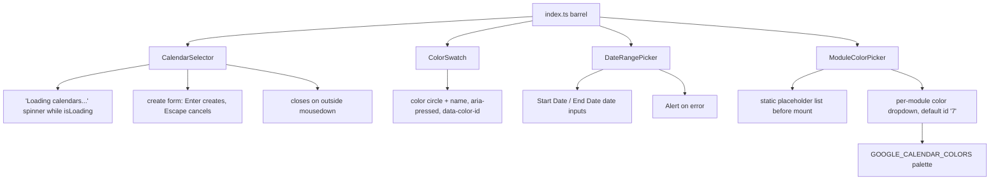

<!-- tyto-docs
tyto_docs: 1
kind: component
unit: frontend/src/components/customize
title: Customize
status: draft
written_at_commit: 6e6a951789ba34349561146becbd1ba18540f239
written_at: "2026-09-15T09:00:34.429Z"
research: frontend/src/components/customize/DOCS/Research.md
sources: []
accepted: null
evidence: Customize.evidence.md
critic:
  attempts: 0
  findings: []
-->

# Customize

<!-- tyto-docs:generated:status -->
<!-- /tyto-docs:generated:status -->

## [Summary](Customize.evidence.md#summary)

The customize components unit owns the calendar customization UI of the Schedule Generator frontend: CalendarSelector, a dropdown for choosing or creating a calendar; ColorSwatch, a selectable color chip; DateRangePicker, a semester date range input; and ModuleColorPicker, per-module color assignment, re-exported with their prop types from a single barrel module. A dependant can rely on a complete set of controls for customizing a generated schedule. <!-- ev:research.frontend-src-components-customize.f035b397 -->[1](Customize.evidence.md#research.frontend-src-components-customize.f035b397) <!-- ev:research.frontend-src-components-customize.68b3ae8e -->[2](Customize.evidence.md#research.frontend-src-components-customize.68b3ae8e)

## [Purpose and boundaries](Customize.evidence.md#purpose-and-boundaries)

| | |
|---|---|
| Owns | The four customize UI components — CalendarSelector, ColorSwatch, DateRangePicker, and ModuleColorPicker — implemented in frontend/src/components/customize, together with the barrel module index.ts that re-exports each component and its props interface. <!-- ev:research.frontend-src-components-customize.f035b397 -->[1](Customize.evidence.md#research.frontend-src-components-customize.f035b397) <!-- ev:research.frontend-src-components-customize.68b3ae8e -->[2](Customize.evidence.md#research.frontend-src-components-customize.68b3ae8e) |
| Uses | The Calendar type from @/services/calendarService for CalendarSelector's calendars prop, the Alert component from @/components/common for DateRangePicker's error display, and GOOGLE_CALENDAR_COLORS with getColorById from @/utils/colors for ModuleColorPicker's palette. <!-- ev:research.frontend-src-components-customize.320c84c5 -->[3](Customize.evidence.md#research.frontend-src-components-customize.320c84c5) <!-- ev:research.frontend-src-components-customize.e3c37fa6 -->[4](Customize.evidence.md#research.frontend-src-components-customize.e3c37fa6) <!-- ev:research.frontend-src-components-customize.4f3a0599 -->[5](Customize.evidence.md#research.frontend-src-components-customize.4f3a0599) |
| Does not own | The calendar service, common components, and color utilities themselves, which live outside this unit (inference: the findings record the imports but no definitions in this unit). <!-- ev:research.frontend-src-components-customize.320c84c5 -->[3](Customize.evidence.md#research.frontend-src-components-customize.320c84c5) <!-- ev:research.frontend-src-components-customize.e3c37fa6 -->[4](Customize.evidence.md#research.frontend-src-components-customize.e3c37fa6) <!-- ev:research.frontend-src-components-customize.4f3a0599 -->[5](Customize.evidence.md#research.frontend-src-components-customize.4f3a0599) |

## [How it works](Customize.evidence.md#how-it-works)

CalendarSelector is a calendar selector dropdown with an option to create a new calendar, documented as covering requirements 4.2, 4.3, and 4.4. <!-- ev:research.frontend-src-components-customize.88aa4669 -->[6](Customize.evidence.md#research.frontend-src-components-customize.88aa4669) It renders a loading spinner with the text 'Loading calendars...' while the isLoading prop is true. <!-- ev:research.frontend-src-components-customize.3a2d9382 -->[7](Customize.evidence.md#research.frontend-src-components-customize.3a2d9382) It closes its dropdown and resets its create form state when a mousedown occurs outside the dropdown element. <!-- ev:research.frontend-src-components-customize.9a1474d2 -->[8](Customize.evidence.md#research.frontend-src-components-customize.9a1474d2)

Its create form trims the entered name, requires it to be non-empty, calls onCreate, and surfaces an error message on failure. <!-- ev:research.frontend-src-components-customize.a89cc314 -->[9](Customize.evidence.md#research.frontend-src-components-customize.a89cc314) In the create form, pressing Enter triggers calendar creation and pressing Escape cancels it. <!-- ev:research.frontend-src-components-customize.a70392c2 -->[10](Customize.evidence.md#research.frontend-src-components-customize.a70392c2)

ColorSwatch renders a button showing a color circle and name, with a selected ring style, aria-pressed state, and a data-color-id attribute. <!-- ev:research.frontend-src-components-customize.62d4f05d -->[11](Customize.evidence.md#research.frontend-src-components-customize.62d4f05d)

DateRangePicker renders labeled Start Date and End Date inputs of type date for a semester date range, and shows an Alert when an error is provided. <!-- ev:research.frontend-src-components-customize.ba4a1499 -->[12](Customize.evidence.md#research.frontend-src-components-customize.ba4a1499) It converts Date values to yyyy-mm-dd strings for its date inputs via the formatDateForInput helper, and parses input values back into Date objects on change. <!-- ev:research.frontend-src-components-customize.ded4055e -->[13](Customize.evidence.md#research.frontend-src-components-customize.ded4055e)

ModuleColorPicker assigns a color to each module for identification in the calendar, rendering a color dropdown per module. <!-- ev:research.frontend-src-components-customize.d7088822 -->[14](Customize.evidence.md#research.frontend-src-components-customize.d7088822) It resolves a module's color from the colors prop, defaulting to color id '7' (Peacock, blue) when a module has no assigned color. <!-- ev:research.frontend-src-components-customize.ced95b58 -->[15](Customize.evidence.md#research.frontend-src-components-customize.ced95b58)

It defers rendering the interactive color dropdowns until after mount, showing a static placeholder list first to avoid hydration mismatch. <!-- ev:research.frontend-src-components-customize.4a705995 -->[16](Customize.evidence.md#research.frontend-src-components-customize.4a705995) ColorDropdown lists every Google Calendar color, marks the currently assigned one as active, and closes when a color is selected or a click occurs outside it. <!-- ev:research.frontend-src-components-customize.486aad9d -->[17](Customize.evidence.md#research.frontend-src-components-customize.486aad9d)

## [Interfaces](Customize.evidence.md#interfaces)

| Name | Input | Output | Guarantee |
|---|---|---|---|
| CalendarSelector | calendars: Calendar[], selectedId, onSelect, onCreate, isLoading, error? | A calendar selector dropdown with a create option | Covers requirements 4.2–4.4, shows a loading state, closes on outside mousedown <!-- ev:research.frontend-src-components-customize.0a3898eb -->[18](Customize.evidence.md#research.frontend-src-components-customize.0a3898eb) <!-- ev:research.frontend-src-components-customize.88aa4669 -->[6](Customize.evidence.md#research.frontend-src-components-customize.88aa4669) <!-- ev:research.frontend-src-components-customize.3a2d9382 -->[7](Customize.evidence.md#research.frontend-src-components-customize.3a2d9382) <!-- ev:research.frontend-src-components-customize.9a1474d2 -->[8](Customize.evidence.md#research.frontend-src-components-customize.9a1474d2) |
| ColorSwatch | colorId, name, hex, selected?, onClick? | A selectable color button | Renders a color circle with name, selected ring, aria-pressed, and data-color-id <!-- ev:research.frontend-src-components-customize.c9b5358c -->[19](Customize.evidence.md#research.frontend-src-components-customize.c9b5358c) <!-- ev:research.frontend-src-components-customize.62d4f05d -->[11](Customize.evidence.md#research.frontend-src-components-customize.62d4f05d) |
| DateRangePicker | startDate, endDate, onStartChange, onEndChange, error? | Labeled date inputs with an optional Alert | Converts Date values to yyyy-mm-dd and back <!-- ev:research.frontend-src-components-customize.9bdddf81 -->[20](Customize.evidence.md#research.frontend-src-components-customize.9bdddf81) <!-- ev:research.frontend-src-components-customize.ba4a1499 -->[12](Customize.evidence.md#research.frontend-src-components-customize.ba4a1499) <!-- ev:research.frontend-src-components-customize.ded4055e -->[13](Customize.evidence.md#research.frontend-src-components-customize.ded4055e) |
| ModuleColorPicker | modules, colors, onChange | Per-module color dropdowns assigning a color to each module | Defaults unassigned modules to color id '7' and defers dropdowns until after mount <!-- ev:research.frontend-src-components-customize.fe945b7b -->[21](Customize.evidence.md#research.frontend-src-components-customize.fe945b7b) <!-- ev:research.frontend-src-components-customize.d7088822 -->[14](Customize.evidence.md#research.frontend-src-components-customize.d7088822) <!-- ev:research.frontend-src-components-customize.ced95b58 -->[15](Customize.evidence.md#research.frontend-src-components-customize.ced95b58) <!-- ev:research.frontend-src-components-customize.4a705995 -->[16](Customize.evidence.md#research.frontend-src-components-customize.4a705995) |
| index.ts (barrel) | — | Re-exports of the four components and their prop types | A single import point for the unit's public surface <!-- ev:research.frontend-src-components-customize.68b3ae8e -->[2](Customize.evidence.md#research.frontend-src-components-customize.68b3ae8e) |

<!-- tyto-docs:generated:endpoints -->
<!-- /tyto-docs:generated:endpoints -->

## Source files

<!-- tyto-docs:generated:file-table -->
<!-- /tyto-docs:generated:file-table -->

## [Dependencies](Customize.evidence.md#dependencies)

The unit's components draw on the calendar service, common components, and color utilities. <!-- ev:research.frontend-src-components-customize.320c84c5 -->[3](Customize.evidence.md#research.frontend-src-components-customize.320c84c5) <!-- ev:research.frontend-src-components-customize.e3c37fa6 -->[4](Customize.evidence.md#research.frontend-src-components-customize.e3c37fa6) <!-- ev:research.frontend-src-components-customize.4f3a0599 -->[5](Customize.evidence.md#research.frontend-src-components-customize.4f3a0599)

| Dependency | Capability used | Why |
|---|---|---|
| Calendar type (@/services/calendarService) | Calendar data | CalendarSelector requires a calendars array of Calendar for its dropdown <!-- ev:research.frontend-src-components-customize.320c84c5 -->[3](Customize.evidence.md#research.frontend-src-components-customize.320c84c5) |
| Alert (@/components/common) | Error display | DateRangePicker shows an Alert when an error is provided <!-- ev:research.frontend-src-components-customize.e3c37fa6 -->[4](Customize.evidence.md#research.frontend-src-components-customize.e3c37fa6) |
| GOOGLE_CALENDAR_COLORS, getColorById (@/utils/colors) | Color palette | ModuleColorPicker builds its palette and resolves colors by id <!-- ev:research.frontend-src-components-customize.4f3a0599 -->[5](Customize.evidence.md#research.frontend-src-components-customize.4f3a0599) |

<!-- tyto-docs:generated:module-graph -->
<!-- /tyto-docs:generated:module-graph -->

## [Data model](Customize.evidence.md#data-model)

This unit declares no entities; the components render UI driven by their props, with CalendarSelector's calendars prop typed as Calendar, a type defined outside this unit (inference: the findings record the reference but no definition in this unit). <!-- ev:research.frontend-src-components-customize.320c84c5 -->[3](Customize.evidence.md#research.frontend-src-components-customize.320c84c5)

<!-- tyto-docs:generated:erd -->
<!-- /tyto-docs:generated:erd -->

## [Decisions and limitations](Customize.evidence.md#decisions-and-limitations)

ModuleColorPicker defers rendering its interactive color dropdowns until after mount, showing a static placeholder list first, to avoid hydration mismatch. <!-- ev:research.frontend-src-components-customize.4a705995 -->[16](Customize.evidence.md#research.frontend-src-components-customize.4a705995) CalendarSelector is documented as covering requirements 4.2, 4.3, and 4.4. <!-- ev:research.frontend-src-components-customize.88aa4669 -->[6](Customize.evidence.md#research.frontend-src-components-customize.88aa4669)

<!-- tyto-docs:generated:navigation -->
<!-- /tyto-docs:generated:navigation -->