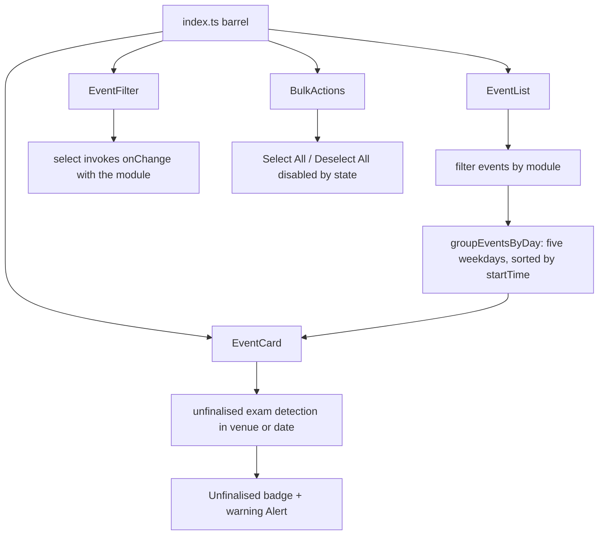

<!-- tyto-docs
tyto_docs: 1
kind: component
unit: frontend/src/components/preview
title: Preview
status: draft
written_at_commit: 06b8256dc758063007c43d842b98af24bf60c3ec
written_at: "2026-09-15T02:05:10.689Z"
research: frontend/src/components/preview/DOCS/Research.md
sources: []
accepted: null
evidence: Preview.evidence.md
critic:
  attempts: 1
  findings:
    - key: critic.frontend-src-components-preview.2ad0bb5c
      owner: writer
      claim: "The Summary sentence 'The preview components unit owns the schedule preview UI of the Tuks Schedule Generator frontend' names the application 'Tuks Schedule Generator', a claim no research finding supports (the cited findings research.frontend-src-components-preview.28920490, .97fd0b5a, .67168661, .7c45d4cc and .8d2e31a0 record only that the four components are client components importing from '@/types' and '@/components/common') and is not marked as inference, violating the contract's inference convention ('A claim no finding supports is written as inference and says so in the sentence, or it is left out')."
      locus:
        document_section: Summary
      severity: blocking
      raised_at: "2026-09-15T04:05:00+02:00"
      raised_in_pass: critic-078
    - key: critic.frontend-src-components-preview.878b799e
      owner: writer
      claim: "The Dependencies sentence 'The unit's components are built on React and share the ParsedEvent type and the common Button and Alert components' claims the components are built on React, a claim no research finding supports (the cited findings research.frontend-src-components-preview.7c45d4cc, .97fd0b5a and .28920490 record the 'use client' directive and imports from '@/types' and '@/components/common' but never mention React) and is not marked as inference, violating the contract's inference convention ('A claim no finding supports is written as inference and says so in the sentence, or it is left out')."
      locus:
        document_section: Dependencies
      severity: blocking
      raised_at: "2026-09-15T04:05:00+02:00"
      raised_in_pass: critic-078
  review_complete: true
  sections_reviewed: 8
  sections_total: 8
  last_reviewed_document: "sha256:b685a4dfd804773ca06f4b36935fc3a2db266d6081f6dc10730c2024793369e7"
-->

# Preview

<!-- tyto-docs:generated:status -->
<!-- /tyto-docs:generated:status -->

## [Summary](Preview.evidence.md#summary)

The preview components unit owns the schedule preview UI of the Tuks Schedule Generator frontend: EventList, a day-grouped, filterable list of selectable event cards, EventFilter, a module filter dropdown, and BulkActions, a Select All / Deselect All control with a selection count, re-exported with their prop types from a single barrel module. A dependant can rely on a filterable, selectable schedule preview with bulk selection and unfinalised-exam warnings. <!-- ev:research.frontend-src-components-preview.28920490 -->[1](Preview.evidence.md#research.frontend-src-components-preview.28920490) <!-- ev:research.frontend-src-components-preview.97fd0b5a -->[2](Preview.evidence.md#research.frontend-src-components-preview.97fd0b5a) <!-- ev:research.frontend-src-components-preview.67168661 -->[3](Preview.evidence.md#research.frontend-src-components-preview.67168661) <!-- ev:research.frontend-src-components-preview.7c45d4cc -->[4](Preview.evidence.md#research.frontend-src-components-preview.7c45d4cc) <!-- ev:research.frontend-src-components-preview.8d2e31a0 -->[5](Preview.evidence.md#research.frontend-src-components-preview.8d2e31a0)

## [Purpose and boundaries](Preview.evidence.md#purpose-and-boundaries)

| | |
|---|---|
| Owns | The four preview UI components of the frontend — EventList, EventCard, EventFilter and BulkActions — implemented as client components in frontend/src/components/preview, together with the barrel module index.ts that re-exports each component and its prop types. <!-- ev:research.frontend-src-components-preview.28920490 -->[1](Preview.evidence.md#research.frontend-src-components-preview.28920490) <!-- ev:research.frontend-src-components-preview.97fd0b5a -->[2](Preview.evidence.md#research.frontend-src-components-preview.97fd0b5a) <!-- ev:research.frontend-src-components-preview.67168661 -->[3](Preview.evidence.md#research.frontend-src-components-preview.67168661) <!-- ev:research.frontend-src-components-preview.7c45d4cc -->[4](Preview.evidence.md#research.frontend-src-components-preview.7c45d4cc) <!-- ev:research.frontend-src-components-preview.8d2e31a0 -->[5](Preview.evidence.md#research.frontend-src-components-preview.8d2e31a0) |
| Uses | The ParsedEvent type from '@/types' for the event data the components render, the Button and Alert components from '@/components/common' for the bulk action buttons and the unfinalised-exam warning, and EventCard from './EventCard' within EventList. <!-- ev:research.frontend-src-components-preview.97fd0b5a -->[2](Preview.evidence.md#research.frontend-src-components-preview.97fd0b5a) <!-- ev:research.frontend-src-components-preview.7c45d4cc -->[4](Preview.evidence.md#research.frontend-src-components-preview.7c45d4cc) <!-- ev:research.frontend-src-components-preview.28920490 -->[1](Preview.evidence.md#research.frontend-src-components-preview.28920490) |
| Does not own | The ParsedEvent type itself, which is defined in '@/types' outside this unit (inference: the findings record that the components import the type, but no definition is recorded in this unit). <!-- ev:research.frontend-src-components-preview.97fd0b5a -->[2](Preview.evidence.md#research.frontend-src-components-preview.97fd0b5a) |

## [How it works](Preview.evidence.md#how-it-works)

EventList is a client component that filters events by module when filterModule is set and not 'all', groups the remaining events by weekday, and renders, for each day that has events, a heading with the day name and event count and a responsive grid of EventCard components whose selected state comes from selectedIds and whose onToggle invokes onToggle with the event id. <!-- ev:research.frontend-src-components-preview.28920490 -->[1](Preview.evidence.md#research.frontend-src-components-preview.28920490) <!-- ev:research.frontend-src-components-preview.3ba49e5e -->[6](Preview.evidence.md#research.frontend-src-components-preview.3ba49e5e) <!-- ev:research.frontend-src-components-preview.ad3ce1c1 -->[7](Preview.evidence.md#research.frontend-src-components-preview.ad3ce1c1) <!-- ev:research.frontend-src-components-preview.59d4ce8e -->[8](Preview.evidence.md#research.frontend-src-components-preview.59d4ce8e)

groupEventsByDay keeps only events whose day is one of the five weekdays and sorts each day's events by startTime using localeCompare. <!-- ev:research.frontend-src-components-preview.ad3ce1c1 -->[7](Preview.evidence.md#research.frontend-src-components-preview.ad3ce1c1)

EventCard renders a card div with a left border coloured by colorHex when provided, a selection checkbox checked by selected that invokes onToggle, the module code, an event type badge, an optional group badge, the time range, and the venue prefixed with a location pin. <!-- ev:research.frontend-src-components-preview.88e9c7e7 -->[9](Preview.evidence.md#research.frontend-src-components-preview.88e9c7e7)

It detects an unfinalised exam by checking, case-insensitively, whether the event venue or date contains 'unfinalised' or 'tba'; when isUnfinalised and pdfType is 'exam' it shows a '⚠️ Unfinalised' warning badge, and when isUnfinalised it shows a warning Alert. <!-- ev:research.frontend-src-components-preview.a7bf4a97 -->[10](Preview.evidence.md#research.frontend-src-components-preview.a7bf4a97) <!-- ev:research.frontend-src-components-preview.88e9c7e7 -->[9](Preview.evidence.md#research.frontend-src-components-preview.88e9c7e7)

EventFilter renders a form-control div with a label 'Filter by Module' and a select whose value is selectedModule, whose onChange invokes onChange with the new value, and which lists an 'All Modules' option followed by one option per module. <!-- ev:research.frontend-src-components-preview.37b32c6a -->[11](Preview.evidence.md#research.frontend-src-components-preview.37b32c6a)

BulkActions computes allSelected as selectedCount equal to totalCount with totalCount greater than zero, and noneSelected as selectedCount equal to zero; it renders a flex container with a 'Select All' outline small Button that invokes onSelectAll and is disabled when allSelected, a 'Deselect All' ghost small Button that invokes onDeselectAll and is disabled when noneSelected, and a span displaying '{selectedCount} of {totalCount} selected'. <!-- ev:research.frontend-src-components-preview.affb8b6d -->[12](Preview.evidence.md#research.frontend-src-components-preview.affb8b6d) <!-- ev:research.frontend-src-components-preview.ab636713 -->[13](Preview.evidence.md#research.frontend-src-components-preview.ab636713)

index.ts re-exports EventCard, BulkActions, EventFilter and EventList together with their prop types. <!-- ev:research.frontend-src-components-preview.8d2e31a0 -->[5](Preview.evidence.md#research.frontend-src-components-preview.8d2e31a0)

## [Interfaces](Preview.evidence.md#interfaces)

| Name | Input | Output | Guarantee |
|---|---|---|---|
| EventList | events: ParsedEvent[], selectedIds: Set<string>, onToggle: (id: string) => void, filterModule?: string, moduleColors?: Record<string, string> | A day-grouped, filterable grid of selectable event cards | Groups events by weekday, filters by module, reports selection via onToggle, and shows 'No events found' when empty <!-- ev:research.frontend-src-components-preview.d7adc797 -->[14](Preview.evidence.md#research.frontend-src-components-preview.d7adc797) <!-- ev:research.frontend-src-components-preview.59d4ce8e -->[8](Preview.evidence.md#research.frontend-src-components-preview.59d4ce8e) <!-- ev:research.frontend-src-components-preview.3ba49e5e -->[6](Preview.evidence.md#research.frontend-src-components-preview.3ba49e5e) <!-- ev:research.frontend-src-components-preview.acd583f5 -->[15](Preview.evidence.md#research.frontend-src-components-preview.acd583f5) |
| EventCard | event: ParsedEvent, selected: boolean, onToggle: () => void, colorHex?: string, pdfType?: 'lecture' \| 'test' \| 'exam' | A single selectable event card | Renders the event details with a selection checkbox and an unfinalised-exam warning when detected <!-- ev:research.frontend-src-components-preview.5ea63197 -->[16](Preview.evidence.md#research.frontend-src-components-preview.5ea63197) <!-- ev:research.frontend-src-components-preview.88e9c7e7 -->[9](Preview.evidence.md#research.frontend-src-components-preview.88e9c7e7) |
| EventFilter | modules: string[], selectedModule: string, onChange: (module: string) => void | A module filter dropdown | Lists an 'All Modules' option plus one option per module and reports the chosen module via onChange <!-- ev:research.frontend-src-components-preview.17a645a9 -->[17](Preview.evidence.md#research.frontend-src-components-preview.17a645a9) <!-- ev:research.frontend-src-components-preview.37b32c6a -->[11](Preview.evidence.md#research.frontend-src-components-preview.37b32c6a) |
| BulkActions | totalCount: number, selectedCount: number, onSelectAll: () => void, onDeselectAll: () => void | Select All / Deselect All buttons with a selection count | Disables each button when its state is already reached <!-- ev:research.frontend-src-components-preview.e0c5eaae -->[18](Preview.evidence.md#research.frontend-src-components-preview.e0c5eaae) <!-- ev:research.frontend-src-components-preview.ab636713 -->[13](Preview.evidence.md#research.frontend-src-components-preview.ab636713) |
| index.ts (barrel) | — | Re-exports of the four components and their prop types | A single import point for the unit's public surface <!-- ev:research.frontend-src-components-preview.8d2e31a0 -->[5](Preview.evidence.md#research.frontend-src-components-preview.8d2e31a0) |

<!-- tyto-docs:generated:endpoints -->
<!-- /tyto-docs:generated:endpoints -->

## Source files

<!-- tyto-docs:generated:file-table -->
<!-- /tyto-docs:generated:file-table -->

## [Dependencies](Preview.evidence.md#dependencies)

The unit's components are built on React and share the ParsedEvent type and the common Button and Alert components. <!-- ev:research.frontend-src-components-preview.7c45d4cc -->[4](Preview.evidence.md#research.frontend-src-components-preview.7c45d4cc) <!-- ev:research.frontend-src-components-preview.97fd0b5a -->[2](Preview.evidence.md#research.frontend-src-components-preview.97fd0b5a) <!-- ev:research.frontend-src-components-preview.28920490 -->[1](Preview.evidence.md#research.frontend-src-components-preview.28920490)

| Dependency | Capability used | Why |
|---|---|---|
| ParsedEvent type ('@/types') | Event data shape | EventList and EventCard require events of type ParsedEvent to render the schedule <!-- ev:research.frontend-src-components-preview.28920490 -->[1](Preview.evidence.md#research.frontend-src-components-preview.28920490) <!-- ev:research.frontend-src-components-preview.97fd0b5a -->[2](Preview.evidence.md#research.frontend-src-components-preview.97fd0b5a) |
| Button ('@/components/common') | Styled action buttons | BulkActions renders its Select All and Deselect All buttons with the shared Button component <!-- ev:research.frontend-src-components-preview.7c45d4cc -->[4](Preview.evidence.md#research.frontend-src-components-preview.7c45d4cc) |
| Alert ('@/components/common') | Warning message | EventCard shows a warning Alert when an event is unfinalised <!-- ev:research.frontend-src-components-preview.97fd0b5a -->[2](Preview.evidence.md#research.frontend-src-components-preview.97fd0b5a) |
| EventCard ('./EventCard') | Single event card | EventList renders each event as an EventCard in its day grid <!-- ev:research.frontend-src-components-preview.28920490 -->[1](Preview.evidence.md#research.frontend-src-components-preview.28920490) |

<!-- tyto-docs:generated:module-graph -->
<!-- /tyto-docs:generated:module-graph -->

## [Data model](Preview.evidence.md#data-model)

This unit declares no entities; the components render UI driven by their props, with event data typed as ParsedEvent, a type defined outside this unit (inference: the findings record the import but no definition in this unit). <!-- ev:research.frontend-src-components-preview.28920490 -->[1](Preview.evidence.md#research.frontend-src-components-preview.28920490) <!-- ev:research.frontend-src-components-preview.97fd0b5a -->[2](Preview.evidence.md#research.frontend-src-components-preview.97fd0b5a)

<!-- tyto-docs:generated:erd -->
<!-- /tyto-docs:generated:erd -->

## [Decisions and limitations](Preview.evidence.md#decisions-and-limitations)

All four components are client components ('use client' directive), so they render and interact on the client; the unit exports no server components. <!-- ev:research.frontend-src-components-preview.28920490 -->[1](Preview.evidence.md#research.frontend-src-components-preview.28920490) <!-- ev:research.frontend-src-components-preview.97fd0b5a -->[2](Preview.evidence.md#research.frontend-src-components-preview.97fd0b5a) <!-- ev:research.frontend-src-components-preview.67168661 -->[3](Preview.evidence.md#research.frontend-src-components-preview.67168661) <!-- ev:research.frontend-src-components-preview.7c45d4cc -->[4](Preview.evidence.md#research.frontend-src-components-preview.7c45d4cc)

EventCard's unfinalised-exam detection depends on the event venue or date containing the text 'unfinalised' or 'tba', so an event that spells the marker differently is not flagged. <!-- ev:research.frontend-src-components-preview.a7bf4a97 -->[10](Preview.evidence.md#research.frontend-src-components-preview.a7bf4a97)

<!-- tyto-docs:generated:navigation -->
<!-- /tyto-docs:generated:navigation -->