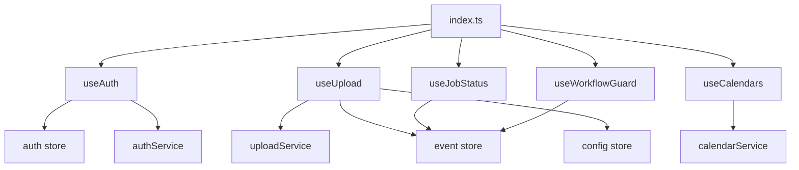

<!-- tyto-docs
tyto_docs: 1
kind: component
unit: frontend/src/hooks
title: Hooks
status: draft
written_at_commit: 7e5ae2f99594266a7e7e740b473abbbffcff0588
written_at: "2026-09-15T03:56:01.876Z"
research: frontend/src/hooks/DOCS/Research.md
sources: []
accepted: null
evidence: Hooks.evidence.md
critic:
  attempts: 0
  findings: []
-->

# Hooks

<!-- tyto-docs:generated:status -->
<!-- /tyto-docs:generated:status -->

## [Summary](Hooks.evidence.md#summary)

The frontend/src/hooks unit owns the React hooks that connect the Tuks Schedule Generator's pages to its state stores and services: authentication, PDF upload, job status, Google Calendar management, and workflow guarding. A dependant can rely on a consistent, store-backed interface for these concerns without reaching into the stores or services directly. <!-- ev:research.frontend-src-hooks.4201f24c -->[1](Hooks.evidence.md#research.frontend-src-hooks.4201f24c)

## [Purpose and boundaries](Hooks.evidence.md#purpose-and-boundaries)

| | |
|---|---|
| Owns | The five React hooks of the Tuks Schedule Generator frontend — useAuth, useUpload, useJobStatus, useCalendars, and useWorkflowGuard — re-exported from index.ts along with the WorkflowPage type. <!-- ev:research.frontend-src-hooks.4201f24c -->[1](Hooks.evidence.md#research.frontend-src-hooks.4201f24c) |
| Uses | The auth store, which backs useAuth's state and actions; authService, which builds the Google OAuth login URL; the event store, which holds the job status and parsed events; the config store, which holds semester dates; calendarService, which lists and creates calendars; and uploadService, which uploads PDFs with progress tracking. <!-- ev:research.frontend-src-hooks.113c0f9b -->[2](Hooks.evidence.md#research.frontend-src-hooks.113c0f9b) <!-- ev:research.frontend-src-hooks.ebfd4865 -->[3](Hooks.evidence.md#research.frontend-src-hooks.ebfd4865) <!-- ev:research.frontend-src-hooks.435fd042 -->[4](Hooks.evidence.md#research.frontend-src-hooks.435fd042) <!-- ev:research.frontend-src-hooks.7014decc -->[5](Hooks.evidence.md#research.frontend-src-hooks.7014decc) <!-- ev:research.frontend-src-hooks.b9e53794 -->[6](Hooks.evidence.md#research.frontend-src-hooks.b9e53794) <!-- ev:research.frontend-src-hooks.18de8ea5 -->[7](Hooks.evidence.md#research.frontend-src-hooks.18de8ea5) |
| Does not own | The state stores and services the hooks call into, which are not implemented in this unit (inference: the unit's sources are index.ts and the five hook files). <!-- ev:research.frontend-src-hooks.4201f24c -->[1](Hooks.evidence.md#research.frontend-src-hooks.4201f24c) |

## [How it works](Hooks.evidence.md#how-it-works)

index.ts is the unit's public surface, re-exporting the five hooks and the WorkflowPage type. <!-- ev:research.frontend-src-hooks.4201f24c -->[1](Hooks.evidence.md#research.frontend-src-hooks.4201f24c)

useAuth sources its state and actions from the auth store, returning isAuthenticated, user, isLoading, error, login, logout, and setError. <!-- ev:research.frontend-src-hooks.113c0f9b -->[2](Hooks.evidence.md#research.frontend-src-hooks.113c0f9b) On mount it checks the authentication status exactly once, guarded by a hasChecked ref. <!-- ev:research.frontend-src-hooks.d56cd0d3 -->[8](Hooks.evidence.md#research.frontend-src-hooks.d56cd0d3) Its login action redirects the browser to the Google OAuth login URL built by authService.getLoginUrl, defaulting to the current page path when no return URL is provided. <!-- ev:research.frontend-src-hooks.ebfd4865 -->[3](Hooks.evidence.md#research.frontend-src-hooks.ebfd4865)

useCalendars returns the calendar list, loading state, error, and the fetchCalendars and createCalendar actions. <!-- ev:research.frontend-src-hooks.cb57a817 -->[9](Hooks.evidence.md#research.frontend-src-hooks.cb57a817) fetchCalendars loads all calendars for the authenticated user through calendarService.listCalendars and updates local state, setting an error message on failure. <!-- ev:research.frontend-src-hooks.b9e53794 -->[6](Hooks.evidence.md#research.frontend-src-hooks.b9e53794) createCalendar creates a calendar through calendarService.createCalendar, appends it to the local list, and re-throws any error after recording it. <!-- ev:research.frontend-src-hooks.18de8ea5 -->[7](Hooks.evidence.md#research.frontend-src-hooks.18de8ea5)

useJobStatus returns the stored job status from the event store, mapping the store's 'complete' value to 'completed' for backward compatibility, and always reports isPolling as false. <!-- ev:research.frontend-src-hooks.435fd042 -->[4](Hooks.evidence.md#research.frontend-src-hooks.435fd042)

useUpload returns upload, progress, isUploading, error, and reset for managing PDF file uploads. <!-- ev:research.frontend-src-hooks.2e418d97 -->[10](Hooks.evidence.md#research.frontend-src-hooks.2e418d97) Its upload action uploads a PDF through uploadService.uploadPdf with progress tracking, stores the returned job ID, and on completion stores the parsed events and job status and updates semester dates in the config store. <!-- ev:research.frontend-src-hooks.7014decc -->[5](Hooks.evidence.md#research.frontend-src-hooks.7014decc) Its reset action clears the progress, isUploading, and error state. <!-- ev:research.frontend-src-hooks.189679a3 -->[11](Hooks.evidence.md#research.frontend-src-hooks.189679a3)

useWorkflowGuard guards a workflow page and redirects to another page when the page's requirements are not met, waiting for store hydration before evaluating them. <!-- ev:research.frontend-src-hooks.dee1cbf0 -->[12](Hooks.evidence.md#research.frontend-src-hooks.dee1cbf0) It requires events to be loaded for the preview page, and events plus at least one selected event for the customize and generate pages. <!-- ev:research.frontend-src-hooks.c7935c6d -->[13](Hooks.evidence.md#research.frontend-src-hooks.c7935c6d) It redirects to /upload from preview, /preview from customize, and /customize from generate when requirements are not met. <!-- ev:research.frontend-src-hooks.10b5cdd4 -->[14](Hooks.evidence.md#research.frontend-src-hooks.10b5cdd4)

## [Interfaces](Hooks.evidence.md#interfaces)

| Name | Input | Output | Guarantee |
|---|---|---|---|
| useAuth | none | Authentication state and actions | Returns isAuthenticated, user, isLoading, error, and login, logout, setError sourced from the auth store; checks the authentication status once on mount <!-- ev:research.frontend-src-hooks.113c0f9b -->[2](Hooks.evidence.md#research.frontend-src-hooks.113c0f9b) <!-- ev:research.frontend-src-hooks.d56cd0d3 -->[8](Hooks.evidence.md#research.frontend-src-hooks.d56cd0d3) |
| useUpload | none | Upload state and actions | Returns upload, progress, isUploading, error, and reset; upload sends the PDF through uploadService.uploadPdf with progress tracking and stores the job and parsed events on completion <!-- ev:research.frontend-src-hooks.2e418d97 -->[10](Hooks.evidence.md#research.frontend-src-hooks.2e418d97) <!-- ev:research.frontend-src-hooks.7014decc -->[5](Hooks.evidence.md#research.frontend-src-hooks.7014decc) |
| useJobStatus | none | Job status | Returns the stored job status from the event store, mapping 'complete' to 'completed', with isPolling always false <!-- ev:research.frontend-src-hooks.435fd042 -->[4](Hooks.evidence.md#research.frontend-src-hooks.435fd042) |
| useCalendars | none | Calendar state and actions | Returns the calendar list, loading state, error, and fetchCalendars and createCalendar backed by calendarService <!-- ev:research.frontend-src-hooks.cb57a817 -->[9](Hooks.evidence.md#research.frontend-src-hooks.cb57a817) <!-- ev:research.frontend-src-hooks.b9e53794 -->[6](Hooks.evidence.md#research.frontend-src-hooks.b9e53794) <!-- ev:research.frontend-src-hooks.18de8ea5 -->[7](Hooks.evidence.md#research.frontend-src-hooks.18de8ea5) |
| useWorkflowGuard | the workflow page to guard | A redirect when requirements are unmet | Waits for store hydration, then redirects to the previous workflow step when the page's requirements are not met <!-- ev:research.frontend-src-hooks.dee1cbf0 -->[12](Hooks.evidence.md#research.frontend-src-hooks.dee1cbf0) <!-- ev:research.frontend-src-hooks.c7935c6d -->[13](Hooks.evidence.md#research.frontend-src-hooks.c7935c6d) <!-- ev:research.frontend-src-hooks.10b5cdd4 -->[14](Hooks.evidence.md#research.frontend-src-hooks.10b5cdd4) |

<!-- tyto-docs:generated:endpoints -->
<!-- /tyto-docs:generated:endpoints -->

## Source files

<!-- tyto-docs:generated:file-table -->
<!-- /tyto-docs:generated:file-table -->

## [Dependencies](Hooks.evidence.md#dependencies)

The unit's hooks are backed by the application's state stores and services rather than by external packages. <!-- ev:research.frontend-src-hooks.113c0f9b -->[2](Hooks.evidence.md#research.frontend-src-hooks.113c0f9b) <!-- ev:research.frontend-src-hooks.ebfd4865 -->[3](Hooks.evidence.md#research.frontend-src-hooks.ebfd4865) <!-- ev:research.frontend-src-hooks.435fd042 -->[4](Hooks.evidence.md#research.frontend-src-hooks.435fd042) <!-- ev:research.frontend-src-hooks.7014decc -->[5](Hooks.evidence.md#research.frontend-src-hooks.7014decc) <!-- ev:research.frontend-src-hooks.b9e53794 -->[6](Hooks.evidence.md#research.frontend-src-hooks.b9e53794) <!-- ev:research.frontend-src-hooks.18de8ea5 -->[7](Hooks.evidence.md#research.frontend-src-hooks.18de8ea5)

| Dependency | Capability used | Why |
|---|---|---|
| auth store | Authentication state and actions | useAuth sources isAuthenticated, user, isLoading, error, login, logout, and setError from it <!-- ev:research.frontend-src-hooks.113c0f9b -->[2](Hooks.evidence.md#research.frontend-src-hooks.113c0f9b) |
| authService | Google OAuth login URL | useAuth's login redirects to the URL built by authService.getLoginUrl <!-- ev:research.frontend-src-hooks.ebfd4865 -->[3](Hooks.evidence.md#research.frontend-src-hooks.ebfd4865) |
| event store | Job status and parsed events | useJobStatus reads the stored job status; useUpload stores the parsed events and job status on completion <!-- ev:research.frontend-src-hooks.435fd042 -->[4](Hooks.evidence.md#research.frontend-src-hooks.435fd042) <!-- ev:research.frontend-src-hooks.7014decc -->[5](Hooks.evidence.md#research.frontend-src-hooks.7014decc) |
| config store | Semester dates | useUpload updates semester dates on upload completion <!-- ev:research.frontend-src-hooks.7014decc -->[5](Hooks.evidence.md#research.frontend-src-hooks.7014decc) |
| calendarService | Google Calendar operations | useCalendars lists and creates calendars through it <!-- ev:research.frontend-src-hooks.b9e53794 -->[6](Hooks.evidence.md#research.frontend-src-hooks.b9e53794) <!-- ev:research.frontend-src-hooks.18de8ea5 -->[7](Hooks.evidence.md#research.frontend-src-hooks.18de8ea5) |
| uploadService | PDF upload with progress | useUpload uploads PDFs through uploadService.uploadPdf with progress tracking <!-- ev:research.frontend-src-hooks.7014decc -->[5](Hooks.evidence.md#research.frontend-src-hooks.7014decc) |

<!-- tyto-docs:generated:module-graph -->
<!-- /tyto-docs:generated:module-graph -->

## [Data model](Hooks.evidence.md#data-model)

This unit declares no data entities of its own; its only type-level surface is the WorkflowPage type re-exported from index.ts, and the state it exposes is held by the stores it wraps. <!-- ev:research.frontend-src-hooks.4201f24c -->[1](Hooks.evidence.md#research.frontend-src-hooks.4201f24c)

<!-- tyto-docs:generated:erd -->
<!-- /tyto-docs:generated:erd -->

## [Decisions and limitations](Hooks.evidence.md#decisions-and-limitations)

useJobStatus always reports isPolling as false, so the hook exposes the stored job status without a polling loop; the 'complete' to 'completed' mapping keeps its output compatible with callers that expect the newer value. <!-- ev:research.frontend-src-hooks.435fd042 -->[4](Hooks.evidence.md#research.frontend-src-hooks.435fd042)

useWorkflowGuard encodes the workflow order — upload, preview, customize, generate — by redirecting to /upload from preview, /preview from customize, and /customize from generate when requirements are unmet. <!-- ev:research.frontend-src-hooks.10b5cdd4 -->[14](Hooks.evidence.md#research.frontend-src-hooks.10b5cdd4)

useAuth checks the authentication status once on mount, guarded by a hasChecked ref so the check runs only a single time. <!-- ev:research.frontend-src-hooks.d56cd0d3 -->[8](Hooks.evidence.md#research.frontend-src-hooks.d56cd0d3)

<!-- tyto-docs:generated:navigation -->
<!-- /tyto-docs:generated:navigation -->