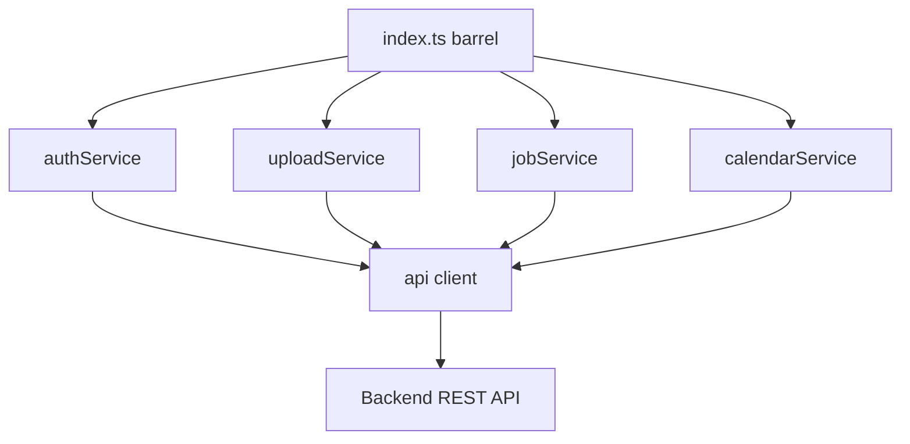

<!-- tyto-docs
tyto_docs: 1
kind: component
unit: frontend/src/services
title: Services
status: draft
written_at_commit: 2094a5a7c6e67f555648b512ceb011ce833f87f1
written_at: "2026-09-15T10:46:49.802Z"
research: frontend/src/services/DOCS/Research.md
sources: []
accepted: null
evidence: Services.evidence.md
critic:
  attempts: 1
  findings:
    - key: critic.frontend-src-services.b4833bbd
      owner: writer
      claim: "The Interfaces table lists parseApiError's input as 'unknown error', but the cited evidence (frontend/src/services/api.ts L15) declares the parameter as `error: AxiosError<ApiError>`. The Input column does not accurately represent the evidence: the function's parameter is typed AxiosError<ApiError>, not an unknown error, so a dependant reading the table would not learn the actual input contract."
      locus:
        document_section: Interfaces
      severity: blocking
      raised_at: "2026-09-15T12:46:00+02:00"
      raised_in_pass: w0
  review_complete: true
  sections_reviewed: 8
  sections_total: 8
  last_reviewed_document: "sha256:e3d0d85f89392e1c588983ce7d59d242d2908e8587126a49bae4c30d1deeb493"
-->

# Services

<!-- tyto-docs:generated:status -->
<!-- /tyto-docs:generated:status -->

## [Summary](Services.evidence.md#summary)

The services unit owns the frontend's HTTP layer for the Tuks Schedule Generator: the shared API client, the Google OAuth, upload, job, and calendar services, and the domain types exchanged with the backend. <!-- ev:research.frontend-src-services.f6d9e0f0 -->[1](Services.evidence.md#research.frontend-src-services.f6d9e0f0) <!-- ev:research.frontend-src-services.451b12b7 -->[2](Services.evidence.md#research.frontend-src-services.451b12b7) A dependant can rely on a single barrel import, session-based authentication, and consistent error normalization for every backend interaction. <!-- ev:research.frontend-src-services.8f53350e -->[3](Services.evidence.md#research.frontend-src-services.8f53350e) <!-- ev:research.frontend-src-services.7ed6782a -->[4](Services.evidence.md#research.frontend-src-services.7ed6782a) <!-- ev:research.frontend-src-services.159b31d8 -->[5](Services.evidence.md#research.frontend-src-services.159b31d8)

## [Purpose and boundaries](Services.evidence.md#purpose-and-boundaries)

| | |
|---|---|
| Owns | The frontend HTTP layer of the Tuks Schedule Generator: the shared Axios client configured for the backend, the Google OAuth, upload, job, and calendar services, the barrel export, and the domain types exchanged with the backend. <!-- ev:research.frontend-src-services.f6d9e0f0 -->[1](Services.evidence.md#research.frontend-src-services.f6d9e0f0) <!-- ev:research.frontend-src-services.8f53350e -->[3](Services.evidence.md#research.frontend-src-services.8f53350e) <!-- ev:research.frontend-src-services.451b12b7 -->[2](Services.evidence.md#research.frontend-src-services.451b12b7) |
| Uses | The backend REST API at the NEXT_PUBLIC_API_URL base URL (defaulting to http://localhost:3001), reached with session-based authentication via withCredentials and a JSON content-type header. <!-- ev:research.frontend-src-services.f6d9e0f0 -->[1](Services.evidence.md#research.frontend-src-services.f6d9e0f0) |
| Does not own | The backend implementation of the auth, upload, job, and calendar endpoints, and the UI components that consume these services (inference: the unit holds only the service modules and the domain types they declare). <!-- ev:research.frontend-src-services.451b12b7 -->[2](Services.evidence.md#research.frontend-src-services.451b12b7) |

## [How it works](Services.evidence.md#how-it-works)

Every service in the unit routes its HTTP calls through the shared api instance imported from ./api. <!-- ev:research.frontend-src-services.7ed6782a -->[4](Services.evidence.md#research.frontend-src-services.7ed6782a) The client is configured with a base URL from the NEXT_PUBLIC_API_URL environment variable (defaulting to http://localhost:3001), session-based authentication via withCredentials, and a JSON content-type header. <!-- ev:research.frontend-src-services.f6d9e0f0 -->[1](Services.evidence.md#research.frontend-src-services.f6d9e0f0)

api.ts normalizes API and network errors: parseApiError returns the response body's message when present, otherwise the Axios error message, otherwise 'An error occurred', and a response interceptor throws a plain Error carrying that message. <!-- ev:research.frontend-src-services.159b31d8 -->[5](Services.evidence.md#research.frontend-src-services.159b31d8)

authService provides Google OAuth operations: getLoginUrl builds the backend Google login URL from the api base URL, optionally appending a returnUrl query parameter, getStatus fetches the current authentication status from /api/auth/status, and logout posts to /api/auth/logout. <!-- ev:research.frontend-src-services.d62fd990 -->[6](Services.evidence.md#research.frontend-src-services.d62fd990)

uploadService.uploadPdf uploads a PDF file to /api/upload as multipart/form-data, reports upload progress through an optional onProgress callback, and returns parsed events directly in the response, so the upload flow is synchronous rather than poll-based. <!-- ev:research.frontend-src-services.1c57fcaf -->[7](Services.evidence.md#research.frontend-src-services.1c57fcaf)

jobService provides job polling operations: getStatus fetches /api/jobs/{jobId} and getResult fetches /api/jobs/{jobId}/result. <!-- ev:research.frontend-src-services.534cf769 -->[8](Services.evidence.md#research.frontend-src-services.534cf769)

calendarService provides Google Calendar operations: listCalendars fetches /api/calendars, createCalendar posts a new calendar with a name and optional description, addEvents posts events to /api/calendars/events, and generateIcs posts to /api/generate/ics requesting a blob response for download. <!-- ev:research.frontend-src-services.41cf2849 -->[9](Services.evidence.md#research.frontend-src-services.41cf2849)

index.ts is the unit's barrel export, re-exporting api, the service modules, parseApiError, and their public types. <!-- ev:research.frontend-src-services.8f53350e -->[3](Services.evidence.md#research.frontend-src-services.8f53350e)

## [Interfaces](Services.evidence.md#interfaces)

| Name | Input | Output | Guarantee |
|---|---|---|---|
| api (export) | HTTP request | Axios response | Shared client with base URL from NEXT_PUBLIC_API_URL (default http://localhost:3001), withCredentials, and a JSON content-type header <!-- ev:research.frontend-src-services.f6d9e0f0 -->[1](Services.evidence.md#research.frontend-src-services.f6d9e0f0) |
| parseApiError (export) | unknown error | string | Returns the response body's message, else the Axios error message, else 'An error occurred' <!-- ev:research.frontend-src-services.159b31d8 -->[5](Services.evidence.md#research.frontend-src-services.159b31d8) |
| authService.getLoginUrl | optional returnUrl | string URL | Builds the backend Google login URL from the api base URL <!-- ev:research.frontend-src-services.d62fd990 -->[6](Services.evidence.md#research.frontend-src-services.d62fd990) |
| authService.getStatus | none | auth status | Fetches the current authentication status from /api/auth/status <!-- ev:research.frontend-src-services.d62fd990 -->[6](Services.evidence.md#research.frontend-src-services.d62fd990) |
| authService.logout | none | response | Posts to /api/auth/logout <!-- ev:research.frontend-src-services.d62fd990 -->[6](Services.evidence.md#research.frontend-src-services.d62fd990) |
| uploadService.uploadPdf | PDF file, optional onProgress | parsed events | Uploads to /api/upload as multipart/form-data and returns parsed events directly, so the flow is synchronous <!-- ev:research.frontend-src-services.1c57fcaf -->[7](Services.evidence.md#research.frontend-src-services.1c57fcaf) |
| jobService.getStatus | jobId | job status | Fetches /api/jobs/{jobId} <!-- ev:research.frontend-src-services.534cf769 -->[8](Services.evidence.md#research.frontend-src-services.534cf769) |
| jobService.getResult | jobId | job result | Fetches /api/jobs/{jobId}/result <!-- ev:research.frontend-src-services.534cf769 -->[8](Services.evidence.md#research.frontend-src-services.534cf769) |
| calendarService.listCalendars | none | calendars | Fetches /api/calendars <!-- ev:research.frontend-src-services.41cf2849 -->[9](Services.evidence.md#research.frontend-src-services.41cf2849) |
| calendarService.createCalendar | name, optional description | calendar | Posts a new calendar to /api/calendars <!-- ev:research.frontend-src-services.41cf2849 -->[9](Services.evidence.md#research.frontend-src-services.41cf2849) |
| calendarService.addEvents | events | response | Posts events to /api/calendars/events <!-- ev:research.frontend-src-services.41cf2849 -->[9](Services.evidence.md#research.frontend-src-services.41cf2849) |
| calendarService.generateIcs | request | blob | Posts to /api/generate/ics requesting a blob response for download <!-- ev:research.frontend-src-services.41cf2849 -->[9](Services.evidence.md#research.frontend-src-services.41cf2849) |

<!-- tyto-docs:generated:endpoints -->
<!-- /tyto-docs:generated:endpoints -->

## Source files

<!-- tyto-docs:generated:file-table -->
<!-- /tyto-docs:generated:file-table -->

## [Dependencies](Services.evidence.md#dependencies)

The unit's HTTP calls are made through the shared api instance, which is built on Axios and targets the backend REST API. <!-- ev:research.frontend-src-services.f6d9e0f0 -->[1](Services.evidence.md#research.frontend-src-services.f6d9e0f0) <!-- ev:research.frontend-src-services.7ed6782a -->[4](Services.evidence.md#research.frontend-src-services.7ed6782a)

| Dependency | Capability used | Why |
|---|---|---|
| axios | HTTP client with session credentials and JSON content type | The shared api instance every service routes through is built on it <!-- ev:research.frontend-src-services.f6d9e0f0 -->[1](Services.evidence.md#research.frontend-src-services.f6d9e0f0) <!-- ev:research.frontend-src-services.7ed6782a -->[4](Services.evidence.md#research.frontend-src-services.7ed6782a) |
| Backend REST API (NEXT_PUBLIC_API_URL) | Auth, upload, job, and calendar endpoints | The services exist to call these endpoints <!-- ev:research.frontend-src-services.d62fd990 -->[6](Services.evidence.md#research.frontend-src-services.d62fd990) <!-- ev:research.frontend-src-services.1c57fcaf -->[7](Services.evidence.md#research.frontend-src-services.1c57fcaf) <!-- ev:research.frontend-src-services.534cf769 -->[8](Services.evidence.md#research.frontend-src-services.534cf769) <!-- ev:research.frontend-src-services.41cf2849 -->[9](Services.evidence.md#research.frontend-src-services.41cf2849) |
| '@/types' path alias | ParsedEvent type | uploadService imports the event shape from it <!-- ev:research.frontend-src-services.288f5df7 -->[10](Services.evidence.md#research.frontend-src-services.288f5df7) |

<!-- tyto-docs:generated:module-graph -->
<!-- /tyto-docs:generated:module-graph -->

## [Data model](Services.evidence.md#data-model)

The unit declares the domain types it exchanges with the backend: ApiError, AuthUser, AuthStatus, Calendar, CalendarListResponse, EventConfig, PdfType, GenerateIcsRequest, AddEventsRequest, AddEventsResponse, ParsedEvent, JobStatus, JobResult, and UploadResponse. <!-- ev:research.frontend-src-services.451b12b7 -->[2](Services.evidence.md#research.frontend-src-services.451b12b7)

<!-- tyto-docs:generated:erd -->
<!-- /tyto-docs:generated:erd -->

## [Decisions and limitations](Services.evidence.md#decisions-and-limitations)

uploadService.ts imports ParsedEvent from the '@/types' path alias while jobService.ts declares its own structurally identical ParsedEvent interface, so the event shape is defined in two places. <!-- ev:research.frontend-src-services.288f5df7 -->[10](Services.evidence.md#research.frontend-src-services.288f5df7)

The upload flow is synchronous: uploadPdf returns parsed events directly in the response rather than creating a job to poll, unlike the job-based flow jobService supports. <!-- ev:research.frontend-src-services.1c57fcaf -->[7](Services.evidence.md#research.frontend-src-services.1c57fcaf) <!-- ev:research.frontend-src-services.534cf769 -->[8](Services.evidence.md#research.frontend-src-services.534cf769)

<!-- tyto-docs:generated:navigation -->
<!-- /tyto-docs:generated:navigation -->