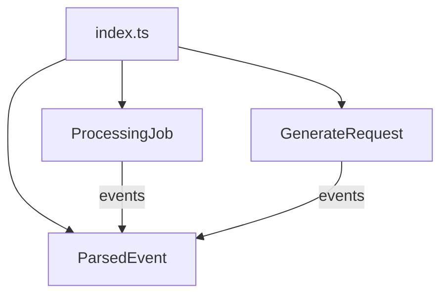

<!-- tyto-docs
tyto_docs: 1
kind: component
unit: frontend/src/types
title: Types
status: current
written_at_commit: 9ca3eb69fb522403c4218a3f8a34bd33ccad0aef
written_at: "2026-09-15T10:05:49.888Z"
research: frontend/src/types/DOCS/Research.md
sources: []
accepted:
  at: "2026-09-15T10:10:03.803Z"
  commit: 9ca3eb69fb522403c4218a3f8a34bd33ccad0aef
  research_fingerprint: "sha256:baf2a47a714457d26cf8a5062b9bf655e5a6bc95b8c1ba09398ef32d4e0f9ef6"
  research_findings:
    - research.frontend-src-types.1d3fd492
    - research.frontend-src-types.214c5ea9
    - research.frontend-src-types.7abb8e7e
    - research.frontend-src-types.7ceb4e79
    - research.frontend-src-types.b97d18d1
    - research.frontend-src-types.d64a8d5e
    - research.frontend-src-types.e2134e2a
    - research.frontend-src-types.fef98377
  critic_pass: critic.frontend-src-types.1
  sources:
    - path: frontend/src/types/index.ts
      blob_sha: 99473a2d1736bbd2183fae91b28eb1cf84523e07
evidence: Types.evidence.md
critic:
  attempts: 1
  findings: []
  review_complete: true
  sections_reviewed: 8
  sections_total: 8
  last_reviewed_document: "sha256:86d4fb4197024e7c74cc9bb5885bf5ad2dbfd0f56540315a97f397f23a72ab19"
  retired: []
-->

# Types

<!-- tyto-docs:generated:status -->
<!-- /tyto-docs:generated:status -->

## [Summary](Types.evidence.md#summary)

The frontend/src/types unit owns the shared TypeScript type definitions for the UP Schedule Generator V3 frontend: the ParsedEvent, ProcessingJob, and GenerateRequest interfaces that describe schedule events, backend processing jobs, and calendar generation requests. A dependant can rely on these types matching the backend's structures when exchanging data with it. <!-- ev:research.frontend-src-types.1d3fd492 -->[1](Types.evidence.md#research.frontend-src-types.1d3fd492)

## [Purpose and boundaries](Types.evidence.md#purpose-and-boundaries)

| | |
|---|---|
| Owns | The shared TypeScript type definitions for the UP Schedule Generator V3 frontend, declared in frontend/src/types/index.ts: the ParsedEvent, ProcessingJob, and GenerateRequest interfaces. <!-- ev:research.frontend-src-types.1d3fd492 -->[1](Types.evidence.md#research.frontend-src-types.1d3fd492) <!-- ev:research.frontend-src-types.b97d18d1 -->[2](Types.evidence.md#research.frontend-src-types.b97d18d1) <!-- ev:research.frontend-src-types.7abb8e7e -->[3](Types.evidence.md#research.frontend-src-types.7abb8e7e) <!-- ev:research.frontend-src-types.d64a8d5e -->[4](Types.evidence.md#research.frontend-src-types.d64a8d5e) |
| Uses | Nothing at runtime — index.ts declares interfaces only and imports no modules (inference: the research records no imports for this unit). |
| Does not own | The backend's ParsedEvent structure and processing job reporting, which these interfaces mirror rather than implement — ParsedEvent is documented as matching the backend structure and ProcessingJob as reporting the backend's job status. <!-- ev:research.frontend-src-types.b97d18d1 -->[2](Types.evidence.md#research.frontend-src-types.b97d18d1) <!-- ev:research.frontend-src-types.7abb8e7e -->[3](Types.evidence.md#research.frontend-src-types.7abb8e7e) |

## [How it works](Types.evidence.md#how-it-works)

frontend/src/types/index.ts is the unit's only TypeScript source file; the only other file in the unit is the empty .gitkeep placeholder. <!-- ev:research.frontend-src-types.7ceb4e79 -->[5](Types.evidence.md#research.frontend-src-types.7ceb4e79) It declares the shared type definitions for the UP Schedule Generator V3 frontend. <!-- ev:research.frontend-src-types.1d3fd492 -->[1](Types.evidence.md#research.frontend-src-types.1d3fd492)

ParsedEvent describes a schedule event extracted from the PDF and is documented as matching the backend ParsedEvent structure. <!-- ev:research.frontend-src-types.b97d18d1 -->[2](Types.evidence.md#research.frontend-src-types.b97d18d1) It declares id, module, activity, startTime, endTime and venue as required string fields, isRecurring as a required boolean field, and group, day and date as optional string fields. <!-- ev:research.frontend-src-types.fef98377 -->[6](Types.evidence.md#research.frontend-src-types.fef98377)

ProcessingJob describes the processing job status reported by the backend. <!-- ev:research.frontend-src-types.7abb8e7e -->[3](Types.evidence.md#research.frontend-src-types.7abb8e7e) It declares jobId and createdAt as required string fields, status as a union of the literals 'pending', 'processing', 'complete' and 'failed', progress as an optional number field, events as an optional array of ParsedEvent, error as an optional string field, and completedAt as an optional string field. <!-- ev:research.frontend-src-types.e2134e2a -->[7](Types.evidence.md#research.frontend-src-types.e2134e2a)

GenerateRequest describes the request payload for generating calendar output. <!-- ev:research.frontend-src-types.d64a8d5e -->[4](Types.evidence.md#research.frontend-src-types.d64a8d5e) It declares events as an array of ParsedEvent, moduleColors as a Record mapping strings to strings, semesterStart and semesterEnd as required string fields, outputType as a union of the literals 'ics' and 'google', and calendarId as an optional string field. <!-- ev:research.frontend-src-types.214c5ea9 -->[8](Types.evidence.md#research.frontend-src-types.214c5ea9)

## [Interfaces](Types.evidence.md#interfaces)

| Name | Input | Output | Guarantee |
|---|---|---|---|
| ParsedEvent (exported interface) | none — a type declaration | A schedule event shape | Declares id, module, activity, startTime, endTime and venue as required strings, isRecurring as a required boolean, and group, day and date as optional strings <!-- ev:research.frontend-src-types.fef98377 -->[6](Types.evidence.md#research.frontend-src-types.fef98377) |
| ProcessingJob (exported interface) | none — a type declaration | A processing job status shape | Declares jobId and createdAt as required strings, status as a union of 'pending', 'processing', 'complete' and 'failed', and progress, events, error and completedAt as optional fields <!-- ev:research.frontend-src-types.e2134e2a -->[7](Types.evidence.md#research.frontend-src-types.e2134e2a) |
| GenerateRequest (exported interface) | none — a type declaration | A calendar generation request shape | Declares events, moduleColors, semesterStart, semesterEnd and outputType, with calendarId optional <!-- ev:research.frontend-src-types.214c5ea9 -->[8](Types.evidence.md#research.frontend-src-types.214c5ea9) |

<!-- tyto-docs:generated:endpoints -->
<!-- /tyto-docs:generated:endpoints -->

## Source files

<!-- tyto-docs:generated:file-table -->
<!-- /tyto-docs:generated:file-table -->

## [Dependencies](Types.evidence.md#dependencies)

The unit declares no imports: index.ts is a pure type module with no runtime dependencies (inference: the research records no imports for this unit). <!-- ev:research.frontend-src-types.7ceb4e79 -->[5](Types.evidence.md#research.frontend-src-types.7ceb4e79)

<!-- tyto-docs:generated:module-graph -->
<!-- /tyto-docs:generated:module-graph -->

## [Data model](Types.evidence.md#data-model)

The unit's data model is the three interfaces it declares: ParsedEvent, ProcessingJob, and GenerateRequest. ParsedEvent is the event shape that ProcessingJob's events field and GenerateRequest's events field both reference. <!-- ev:research.frontend-src-types.e2134e2a -->[7](Types.evidence.md#research.frontend-src-types.e2134e2a) <!-- ev:research.frontend-src-types.214c5ea9 -->[8](Types.evidence.md#research.frontend-src-types.214c5ea9)

<!-- tyto-docs:generated:erd -->
<!-- /tyto-docs:generated:erd -->

## [Decisions and limitations](Types.evidence.md#decisions-and-limitations)

The interfaces are documented as mirroring the backend's structures — ParsedEvent matches the backend ParsedEvent structure and ProcessingJob reports the backend's job status — so the frontend's type definitions must stay in sync with the backend's API. <!-- ev:research.frontend-src-types.b97d18d1 -->[2](Types.evidence.md#research.frontend-src-types.b97d18d1) <!-- ev:research.frontend-src-types.7abb8e7e -->[3](Types.evidence.md#research.frontend-src-types.7abb8e7e)

<!-- tyto-docs:generated:navigation -->
<!-- /tyto-docs:generated:navigation -->