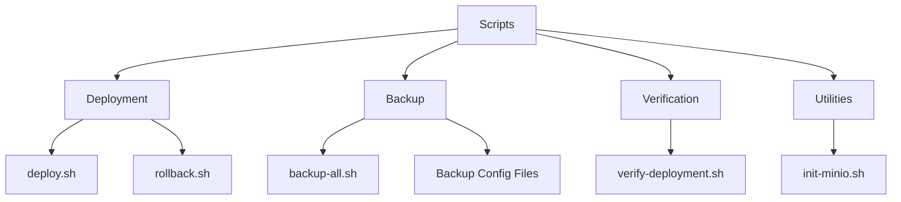
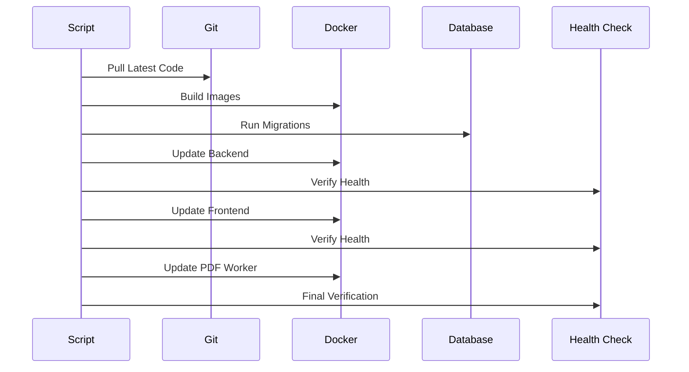
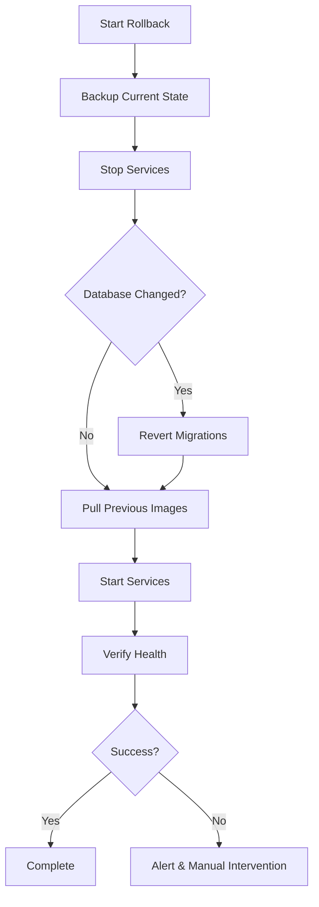

# Scripts Documentation

Operational scripts for deployment, backup, and maintenance.



## Quick Reference

### Deployment
```bash
# Standard deployment
./scripts/deploy.sh

# Deploy with automatic rollback on failure
./scripts/deploy.sh --with-rollback

# Rollback to previous version
./scripts/rollback.sh
```

### Backup
```bash
# Manual backup
./scripts/backup-all.sh

# Get last backup filename
./scripts/backup-all.sh --last

# Restore from backup
./scripts/backup-all.sh --restore <backup-file>
```

### Verification
```bash
# Full deployment verification
./scripts/verify-deployment.sh

# Quick health check
./scripts/verify-deployment.sh --quick
```

## Scripts Overview

### deploy.sh
**Purpose**: Zero-downtime deployment with rolling updates

**Features**:
- Pulls latest code from git
- Builds Docker images
- Runs database migrations
- Rolling service updates with health checks
- Optional automatic rollback on failure

**Usage**:
```bash
# Standard deployment
./scripts/deploy.sh

# With automatic rollback
./scripts/deploy.sh --with-rollback

# Specify branch
GIT_BRANCH=develop ./scripts/deploy.sh
```

**Process Flow**:


### rollback.sh
**Purpose**: Rollback failed deployments

**Features**:
- Automatic backup before rollback
- Revert to previous Docker images
- Database migration rollback
- Service health verification

**Usage**:
```bash
# Interactive rollback
./scripts/rollback.sh

# Rollback to specific version
./scripts/rollback.sh --version v1.2.3

# Rollback database only
./scripts/rollback.sh --database-only
```

**Process Flow**:


### backup-all.sh
**Purpose**: Comprehensive backup of database and files

**Features**:
- PostgreSQL database backup (compressed)
- MinIO volume backup (all PDFs)
- Automatic 7-day retention
- Backup verification
- Alert notifications on failure
- Restore functionality

**Usage**:
```bash
# Create backup
./scripts/backup-all.sh

# Get last backup filename
./scripts/backup-all.sh --last

# List all backups
./scripts/backup-all.sh --list

# Restore from backup
./scripts/backup-all.sh --restore backups/db_schedgen_20241130_020000.sql.gz

# Verify backup integrity
./scripts/backup-all.sh --verify backups/db_schedgen_20241130_020000.sql.gz
```

**Backup Structure**:
```
backups/
├── db_schedgen_YYYYMMDD_HHMMSS.sql.gz      # Database
└── minio_schedgen-pdfs_YYYYMMDD_HHMMSS.tar.gz  # Files
```

### verify-deployment.sh
**Purpose**: Comprehensive deployment verification

**Features**:
- Service health checks
- API endpoint testing
- Database connectivity
- SSL certificate validation
- Performance baseline checks

**Usage**:
```bash
# Full verification
./scripts/verify-deployment.sh

# Quick health check only
./scripts/verify-deployment.sh --quick

# Specific service
./scripts/verify-deployment.sh --service backend
```

**Checks Performed**:
- ✅ All containers running
- ✅ Health endpoints responding
- ✅ Database connections working
- ✅ Redis connectivity
- ✅ MinIO accessible
- ✅ SSL certificates valid
- ✅ API endpoints functional

### init-minio.sh
**Purpose**: Initialize MinIO object storage

**Features**:
- Create storage buckets
- Set access policies
- Configure retention policies

**Usage**:
```bash
# Initialize MinIO
./scripts/init-minio.sh

# Reinitialize (recreate buckets)
./scripts/init-minio.sh --force
```

## Backup Configuration Files

### backup-cron
**Purpose**: Cron-based backup scheduling

**Installation**:
```bash
sudo cp scripts/backup-cron /etc/cron.d/schedgen-backup
sudo chmod 644 /etc/cron.d/schedgen-backup
```

**Schedule**: Daily at 2:00 AM

### backup.service & backup.timer
**Purpose**: Systemd-based backup scheduling

**Installation**:
```bash
sudo cp scripts/backup.service /etc/systemd/system/
sudo cp scripts/backup.timer /etc/systemd/system/
sudo systemctl daemon-reload
sudo systemctl enable backup.timer
sudo systemctl start backup.timer
```

**Check Status**:
```bash
sudo systemctl status backup.timer
sudo journalctl -u backup.service -f
```

## Environment Variables

Scripts use these environment variables:

```bash
# Deployment
GIT_BRANCH=main                    # Git branch to deploy
COMPOSE_FILE=docker-compose.yml    # Base compose file
COMPOSE_PROD_FILE=docker-compose.prod.yml  # Production overrides

# Backup
BACKUP_RETENTION_DAYS=7            # Days to keep backups
BACKUP_ALERT_WEBHOOK_URL=<url>    # Slack/Discord webhook
BACKUP_ALERT_EMAIL=<email>        # Email for alerts

# Database
POSTGRES_PASSWORD=<password>       # Database password
POSTGRES_USER=schedgen             # Database user
POSTGRES_DB=schedgen               # Database name
```

## Common Workflows

### Initial Deployment
```bash
# 1. Clone repository
git clone <repo-url>
cd ScheduleGenerator

# 2. Configure environment
cp .env.example .env
nano .env  # Edit configuration

# 3. Initialize MinIO
./scripts/init-minio.sh

# 4. Deploy
./scripts/deploy.sh

# 5. Verify
./scripts/verify-deployment.sh
```

### Update Deployment
```bash
# 1. Deploy with rollback protection
./scripts/deploy.sh --with-rollback

# 2. Verify
./scripts/verify-deployment.sh

# 3. If issues, rollback
./scripts/rollback.sh
```

### Backup & Restore
```bash
# 1. Create backup
./scripts/backup-all.sh

# 2. List backups
ls -lh backups/

# 3. Restore if needed
./scripts/backup-all.sh --restore backups/db_schedgen_20241130_020000.sql.gz
```

## Troubleshooting

### Deployment Fails
```bash
# Check logs
docker compose logs -f

# Verify services
docker compose ps

# Check health
./scripts/verify-deployment.sh

# Rollback if needed
./scripts/rollback.sh
```

### Backup Fails
```bash
# Check backup logs
docker logs schedgen-backup

# Verify disk space
df -h

# Check permissions
ls -la backups/

# Manual backup
./scripts/backup-all.sh
```

### Verification Fails
```bash
# Check specific service
docker compose logs backend

# Test health endpoint
curl http://localhost:3001/health

# Check database
docker exec -it schedgen-postgres psql -U schedgen -d schedgen -c "SELECT 1;"
```

## Best Practices

1. **Always backup before deployment**
   ```bash
   ./scripts/backup-all.sh && ./scripts/deploy.sh
   ```

2. **Use rollback protection for critical updates**
   ```bash
   ./scripts/deploy.sh --with-rollback
   ```

3. **Verify after every deployment**
   ```bash
   ./scripts/verify-deployment.sh
   ```

4. **Test backups regularly**
   ```bash
   ./scripts/backup-all.sh --verify backups/latest.sql.gz
   ```

5. **Monitor backup automation**
   ```bash
   # Cron
   tail -f /var/log/schedgen-backup.log
   
   # Systemd
   sudo journalctl -u backup.service -f
   ```

## Related Documentation

- [Deployment Guide](../docs/production/deployment/README.md)
- [Backup Guide](../docs/production/backup/README.md)
- [Rollback Guide](../docs/production/rollback/README.md)
- [Verification Guide](../docs/production/deployment/verification.md)

## Script Maintenance

### Adding New Scripts
1. Create script in `scripts/` directory
2. Make executable: `chmod +x scripts/new-script.sh`
3. Add documentation to this README
4. Update related documentation

### Modifying Scripts
1. Test changes in development
2. Update documentation
3. Commit with clear message
4. Deploy to production

### Script Standards
- Use `#!/bin/bash` shebang
- Set `set -e` for error handling
- Add comments for complex logic
- Use color codes for output
- Include usage instructions
- Validate prerequisites
- Provide meaningful error messages
